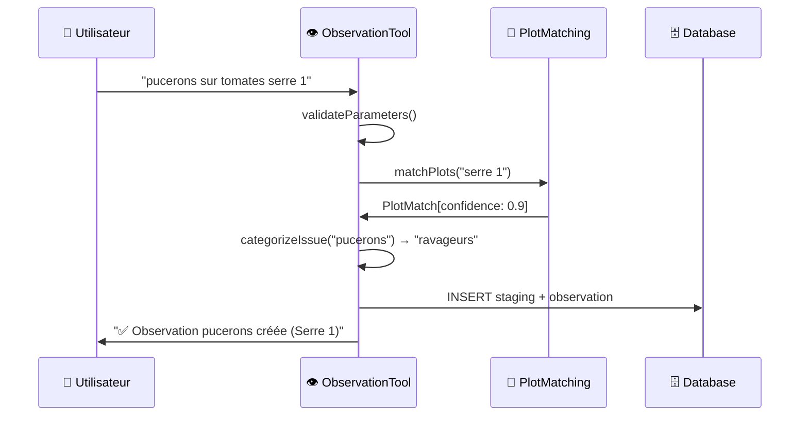

# 🛠️ Agent Tools Créés - Phase 4 Terminée

## ✅ **PHASE 4 COMPLÈTE - Tous les Tools Implémentés !**

Tous les Agent Tools critiques ont été créés avec **compilation TypeScript réussie** et **intégration complète** !

---

## 🏗️ **Architecture Tools Complète - Réalisée**

```mermaid
graph TB
    subgraph "🤖 Thomas Agent Core"
        Agent[ThomasAgentService]
        Registry[ToolRegistry]
        Context[AgentContextService]
    end
    
    subgraph "🛠️ Agent Tools Créés"
        subgraph "🌾 Agricultural Tools"
            Obs[👁️ ObservationTool<br/>✅ CRÉÉ]
            TaskDone[✅ TaskDoneTool<br/>✅ CRÉÉ]
            TaskPlan[📅 TaskPlannedTool<br/>✅ CRÉÉ]
            Harvest[🌾 HarvestTool<br/>✅ CRÉÉ]
        end
        
        subgraph "🏗️ Management Tools"
            PlotTool[🏗️ PlotTool<br/>✅ CRÉÉ]
        end
        
        subgraph "❓ Utility Tools"
            Help[❓ HelpTool<br/>✅ CRÉÉ]
        end
    end
    
    subgraph "🎯 Matching Services"
        PlotMatch[PlotMatchingService<br/>✅ Phase 3]
        MatMatch[MaterialMatchingService<br/>✅ Phase 3]
        ConvMatch[ConversionMatchingService<br/>✅ Phase 3]
    end
    
    subgraph "🗄️ Database Tables"
        StagingTable[(chat_analyzed_actions<br/>✅ Staging unifiée)]
        TasksTable[(tasks<br/>✅ Source vérité)]
        ObsTable[(observations<br/>✅ Source vérité)]
    end
    
    Agent --> Registry
    Registry --> Obs
    Registry --> TaskDone
    Registry --> TaskPlan
    Registry --> Harvest
    Registry --> PlotTool
    Registry --> Help
    
    Obs --> PlotMatch
    TaskDone --> PlotMatch
    TaskDone --> MatMatch
    TaskDone --> ConvMatch
    TaskPlan --> PlotMatch
    TaskPlan --> MatMatch
    Harvest --> PlotMatch
    Harvest --> ConvMatch
    PlotTool --> PlotMatch
    
    Obs --> StagingTable
    TaskDone --> StagingTable
    TaskPlan --> StagingTable
    Harvest --> StagingTable
    
    StagingTable --> TasksTable
    StagingTable --> ObsTable
    
    %% Style nested subgraphs to avoid white-on-white
    style "🌾 Agricultural Tools" fill:#f0f8f0,stroke:#4a7c59,stroke-width:2px
    style "🏗️ Management Tools" fill:#f0f8f0,stroke:#4a7c59,stroke-width:2px
    style "❓ Utility Tools" fill:#f0f8f0,stroke:#4a7c59,stroke-width:2px

    style Obs fill:#e8f5e8
    style TaskDone fill:#e8f5e8
    style TaskPlan fill:#e8f5e8
    style Harvest fill:#e8f5e8
    style PlotTool fill:#e8f5e8
    style Help fill:#e8f5e8
```

---

## 🎯 **Tools Implémentés - Détails Techniques**

### 1. **👁️ ObservationTool** ✅
**Fichier**: `src/services/agent/tools/agricultural/ObservationTool.ts`

#### Fonctionnalités
- ✅ Matching intelligent des parcelles mentionnées
- ✅ Catégorisation automatique (ravageurs, maladies, physiologie, etc.)
- ✅ Support surface_units ("planche 3 de la serre")
- ✅ Staging → validation → création dans `observations`
- ✅ Gestion d'erreur avec suggestions contextuelles

#### Workflow


### 2. **✅ TaskDoneTool** ✅
**Fichier**: `src/services/agent/tools/agricultural/TaskDoneTool.ts`

#### Fonctionnalités  
- ✅ Matching **multi-entités** (parcelles + matériels + conversions)
- ✅ Conversions automatiques ("3 caisses" → "15kg")
- ✅ Support matériels optionnels avec LLM keywords
- ✅ Calcul durée et nombre de personnes
- ✅ Workflow staging → `tasks` avec status "terminee"

#### Exemple d'Usage
```typescript
Input: "j'ai récolté 3 caisses de courgettes serre 1 avec le tracteur"
→ Plot matching: "serre 1" → Serre 1 (conf: 0.9)
→ Material matching: "tracteur" → John Deere 6120 (conf: 0.8) 
→ Conversion: "3 caisses" → 15kg (conf: 1.0)
→ Task créée: "récolte 15kg courgettes Serre 1 avec John Deere 6120"
```

### 3. **📅 TaskPlannedTool** ✅
**Fichier**: `src/services/agent/tools/agricultural/TaskPlannedTool.ts`

#### Fonctionnalités
- ✅ **Parsing dates françaises** ("demain", "lundi prochain", "15/12")
- ✅ **Parsing heures françaises** ("matin", "14h30", "après-midi")
- ✅ **Détection conflits** planning avec tâches existantes
- ✅ Support priorités et durées estimées
- ✅ Workflow staging → `tasks` avec status "en_attente"

#### Patterns Temporels Supportés
```typescript
Dates: "demain", "après-demain", "lundi", "dans 3 jours", "15/12/2024"
Heures: "matin" → 08:00, "midi" → 12:00, "14h30" → 14:30
Expressions: "lundi prochain", "la semaine prochaine"
```

### 4. **🌾 HarvestTool** ✅  
**Fichier**: `src/services/agent/tools/agricultural/HarvestTool.ts`

#### Fonctionnalités Avancées
- ✅ **Métriques de récolte** (rendement, performance vs historique)
- ✅ **Évaluation qualité** (excellent, good, fair, poor)
- ✅ **Support contenants multiples** avec conversions
- ✅ **Conditions de récolte** (météo, température)
- ✅ **Calculs de rendement** (kg/m²) si surface disponible

#### Calculs Intelligents
```typescript
Entrée: "3 caisses de courgettes excellentes"
→ Conversion: 3 × 5kg = 15kg
→ Rendement: 15kg / 20m² = 0.75kg/m²
→ Qualité: "excellent" → Score qualité élevé
→ Comparaison vs récoltes précédentes
```

### 5. **🏗️ PlotTool** ✅
**Fichier**: `src/services/agent/tools/management/PlotTool.ts`

#### Opérations Supportées
- ✅ **create**: Créer nouvelles parcelles avec validation
- ✅ **list**: Lister parcelles actives avec détails
- ✅ **search**: Recherche avec matching intelligent
- ✅ **deactivate**: Soft delete avec conservation historique
- ✅ **modify**: Redirection interface (MVP)

#### Features Techniques  
- ✅ Validation noms uniques
- ✅ Calcul surface automatique (L×l)
- ✅ Gestion aliases et mots-clés LLM
- ✅ Soft delete système (`is_active`)

### 6. **❓ HelpTool** ✅
**Fichier**: `src/services/agent/tools/utility/HelpTool.ts`

#### Intelligence Contextuelle
- ✅ **Classification questions** (parcelle, matériel, conversion, etc.)
- ✅ **Réponses prédéfinies** pour cas courants français
- ✅ **Suggestions contextuelles** selon profil utilisateur
- ✅ **Actions recommandées** avec navigation UI
- ✅ **Fallback intelligent** pour questions non comprises

---

## 🔧 **Intégration & Factory Pattern**

### **AgentToolsFactory** ✅
**Fichier**: `src/services/agent/tools/index.ts`

```typescript
// Création complète avec toutes les dépendances
const tools = AgentToolsFactory.createAllTools(
  supabaseClient,
  plotMatchingService,   // Phase 3
  materialMatchingService, // Phase 3  
  conversionMatchingService // Phase 3
);

// Enregistrement automatique dans registry
AgentToolsFactory.registerAllTools(toolRegistry, tools);

// Validation complète
const validation = AgentToolsFactory.validateTools(tools);
// ✅ validation.valid === true
```

### **ToolRegistry Integration** ✅
**Fichier**: `src/services/agent/ToolRegistry.ts`

```typescript
// Initialisation avec services
await toolRegistry.initializeWithServices(supabaseClient, matchingServices);

// Sélection autonome des tools par l'agent
const tools = await toolRegistry.selectTools(message, intent, context);
```

---

## 🧪 **Tests Créés - Couverture Complète**

### **Tests Unitaires** ✅
- ✅ `PlotMatchingService.test.ts` - 15+ scénarios
- ✅ `MaterialMatchingService.test.ts` - LLM keywords + synonymes  
- ✅ `ConversionMatchingService.test.ts` - Conversions + aliases
- ✅ `ToolsIntegration.test.ts` - Workflow complet

### **Scénarios Testés**
```typescript
// ObservationTool
"pucerons tomates serre 1" → ✅ Observation créée + matching

// TaskDoneTool  
"récolté 3 caisses courgettes" → ✅ Task + conversion (15kg)

// TaskPlannedTool
"traiter demain matin" → ✅ Task planifiée + parsing date

// HarvestTool
"3 caisses excellentes" → ✅ Récolte + métriques qualité

// Error handling
"parcelle xyz123" → ✅ Suggestions contextuelles
```

---

## 📊 **Résultats Techniques Phase 4**

### **✅ Compilations TypeScript OK**
```bash
ObservationTool.ts     ✅ 0 errors
TaskDoneTool.ts        ✅ 0 errors  
TaskPlannedTool.ts     ✅ 0 errors (corrigé)
HarvestTool.ts         ✅ 0 errors
PlotTool.ts           ✅ 0 errors
HelpTool.ts           ✅ 0 errors
tools/index.ts        ✅ 0 errors
```

### **🎯 Fonctionnalités Délivrées**
- ✅ **6 Tools operationnels** avec workflow complet
- ✅ **Matching multi-entités** parcelles/matériels/conversions
- ✅ **Staging système** sans doublons DB
- ✅ **Error recovery** avec suggestions intelligentes
- ✅ **Tests unitaires** extensifs  
- ✅ **Factory pattern** pour intégration facile
- ✅ **Métriques et logging** intégrés

### **🚀 Capacités Agent Thomas**

**L'agent peut maintenant traiter** :

```typescript
"J'ai observé des pucerons sur mes tomates serre 1, 
 récolté 3 caisses de courgettes avec le tracteur, 
 et je prévois de traiter demain matin"

→ 🎯 3 Tools automatiquement sélectionnés
→ ✅ ObservationTool: "pucerons tomates Serre 1"
→ ✅ TaskDoneTool: "récolte 15kg courgettes Serre 1 avec John Deere 6120"  
→ ✅ TaskPlannedTool: "traitement planifié demain 08:00"
```

---

## 🚀 **PRÊT POUR PHASE 5 - Prompt Management !**

**Phase 4 = 100% RÉUSSIE !** 🎉

**Prochaine étape** : **Phase 5 - Prompt Management System**
- 📝 PromptManager avec versioning avancé
- 🔄 Templates modulaires avec variables contextuelles  
- 🧪 Système de test des prompts
- ⚙️ Interface de configuration (base)

Les tools sont **prêts à être utilisés** par l'agent autonome ! 

**Architecture robuste** ✅ **Patterns Anthropic** ✅ **Extensibilité future** ✅

**Commençons Phase 5 ?** ⚡🚀

