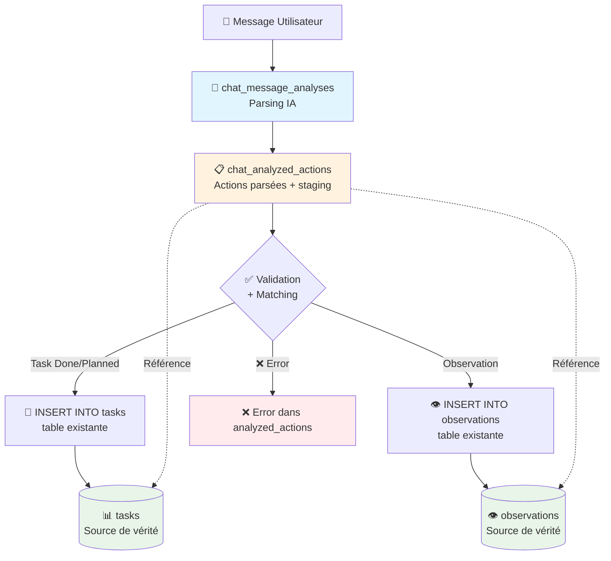
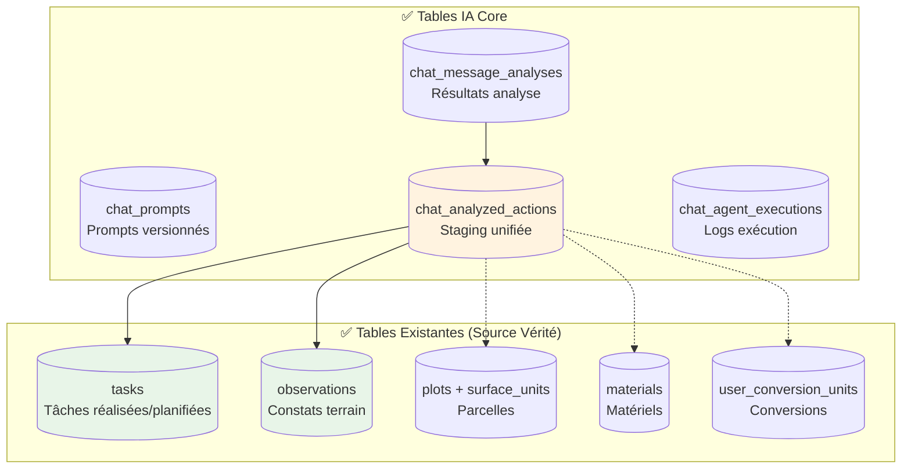
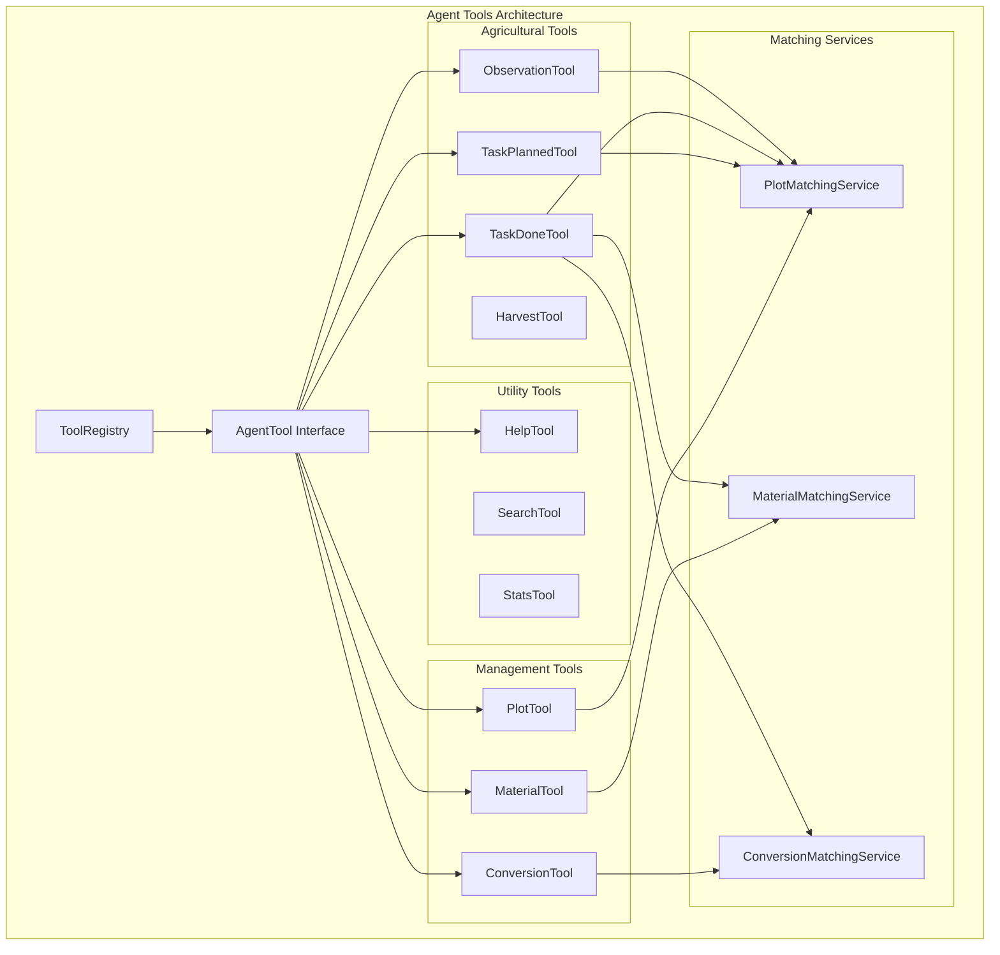
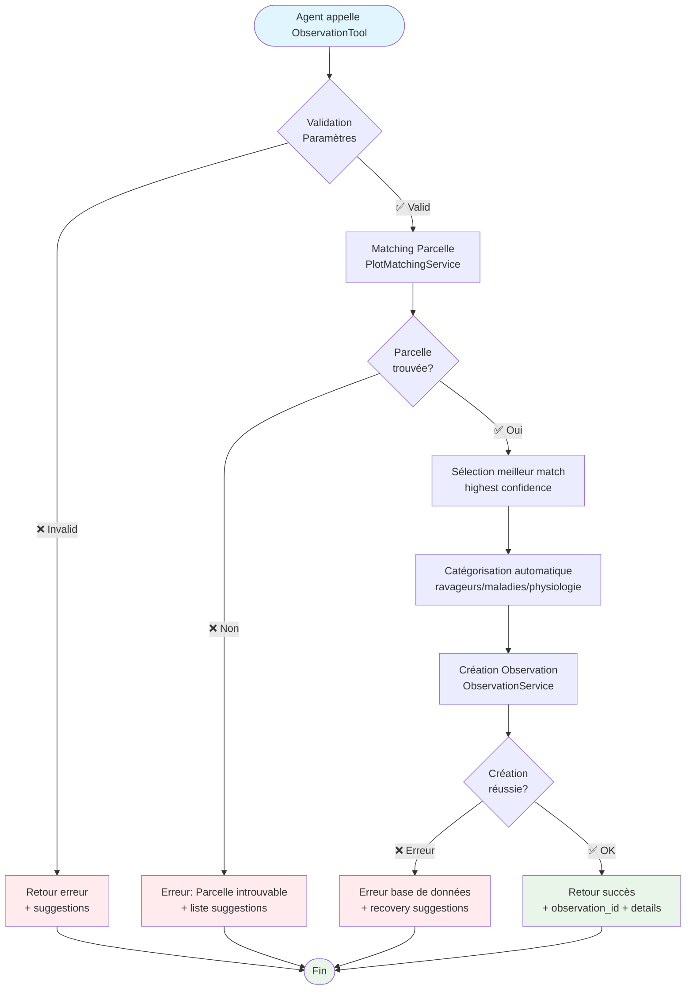
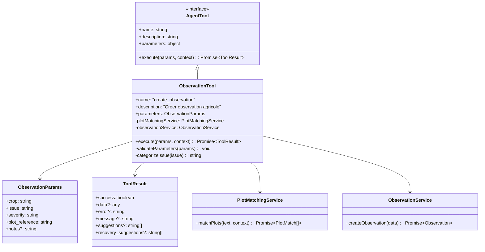
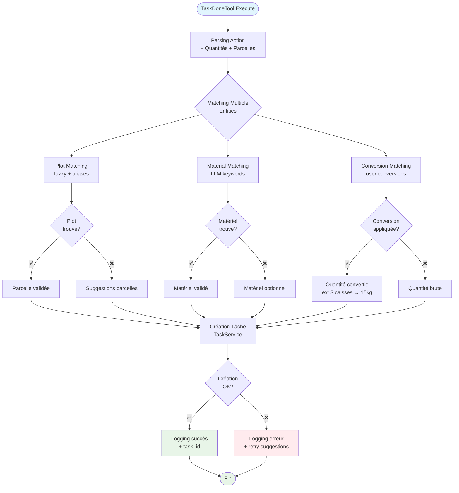
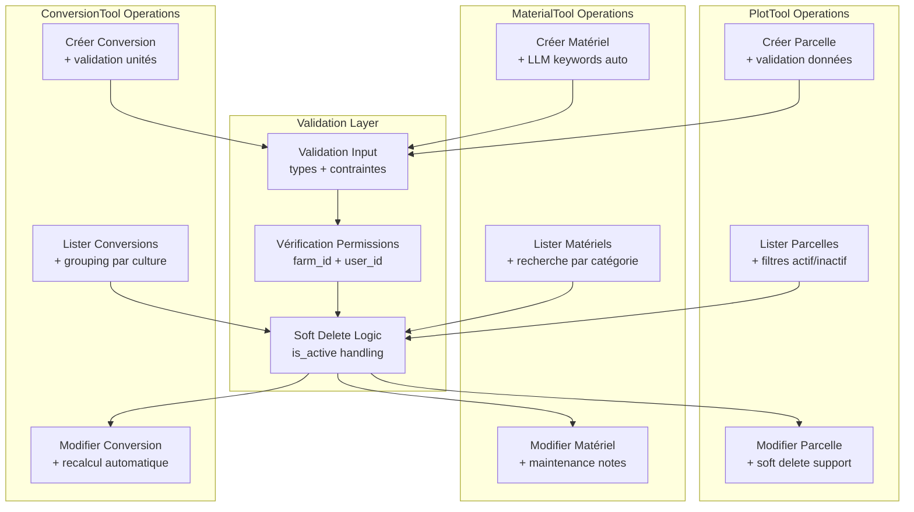
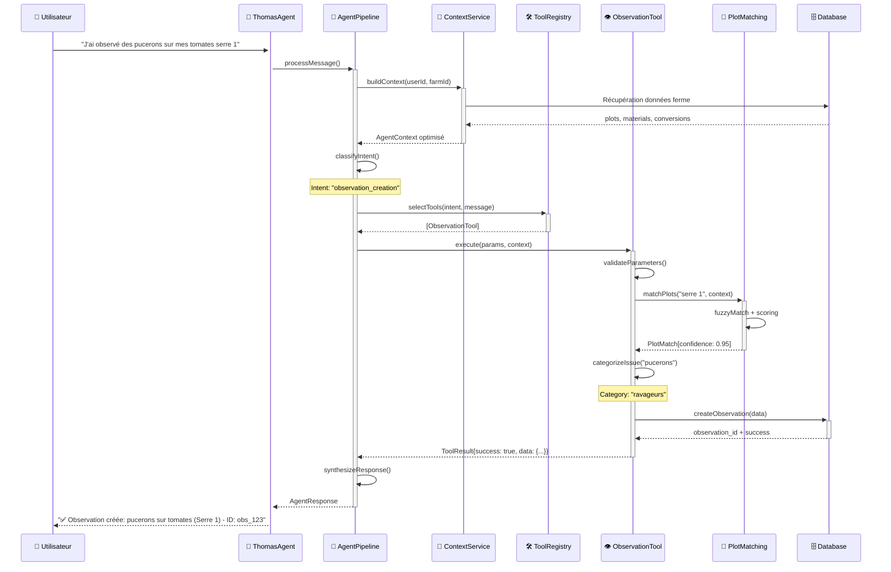
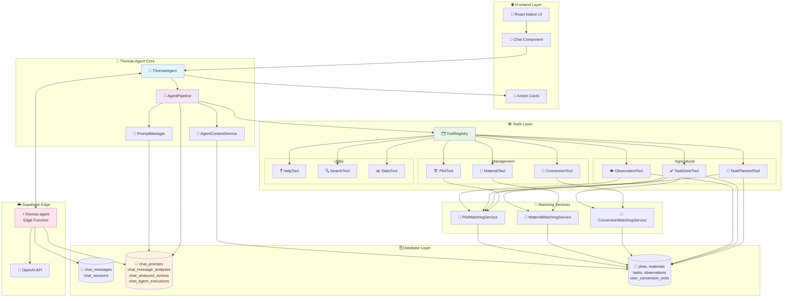

# 🤖 ROADMAP THOMAS AGENT IA - Architecture Fondatrice

## 📋 Vue d'Ensemble

**Objectif**: Transformer le système de chat existant en véritable agent IA suivant les patterns Anthropic avec architecture tools-based extensible.

**Durée Totale**: 8 jours ouvrés  
**Approche**: Agent IA avec tools spécialisés, context engineering optimisé, et pipeline d'analyse structuré

✅ **TABLES IA CRÉÉES** : L'architecture DB est corrigée et optimisée sans doublons ! Migration 019 appliquée.

---

## 📊 État Actuel vs Vision Cible

### ✅ **Existant (Bien implémenté)**
- Base de données complète avec soft delete (`@docs/SOFT_DELETE_SYSTEM_GUIDE.md`)
- Système chat temps réel (Supabase) - tables `chat_messages` et `chat_sessions`
- Champs `ai_confidence` dans tables `chat_messages` et `tasks` 
- Edge function analyze-message basique (à restructurer)
- Composants UI (ActionCard, ActionCarousel, AIMessage)
- Services de base (ChatService, aiChatService)

### ❌ **Manquant (À construire selon guides Anthropic)**
- ✅ **Tables IA créées** : `chat_prompts`, `chat_message_analyses`, `chat_analyzed_actions`, `chat_agent_executions`
- **Architecture Agent** avec tools loop autonome
- **Services de matching** contextualisés (parcelles, matériels, conversions)
- **Tools spécialisés** par type d'action agricole
- **Prompts management** modifiable et versionné
- **Context engineering** optimisé pour performance
- **Pipeline d'analyse** structuré selon patterns agents

---

## 🏗️ PHASE 1: Architecture Agent IA Core

**Durée**: 2 jours | **Priorité**: Critique

### Étape 1.1: Agent Core Service

**Fichier**: `src/services/ThomasAgentService.ts`

#### Architecture Basée sur Patterns Anthropic

```typescript
/**
 * Agent IA principal suivant le pattern Anthropic:
 * LLMs autonomously using tools in a loop
 */
class ThomasAgent {
  private tools: Map<string, AgentTool>;
  private contextService: AgentContextService;
  private promptManager: PromptManager;
  private toolRegistry: ToolRegistry;
  
  async processMessage(message: string, context: FarmContext): Promise<AgentResponse> {
    // 1. Context Engineering - préparer le contexte minimal optimal
    const agentContext = await this.contextService.buildContext(context);
    
    // 2. Intent Analysis - classifier l'intention
    const intent = await this.classifyIntent(message, agentContext);
    
    // 3. Tool Selection - identifier les tools nécessaires
    const selectedTools = await this.selectTools(intent, message);
    
    // 4. Execution Loop - exécuter les tools de façon autonome
    const toolResults = await this.executeToolsLoop(selectedTools, message, agentContext);
    
    // 5. Response Synthesis - synthétiser la réponse finale
    return this.synthesizeResponse(toolResults, agentContext);
  }
  
  private async executeToolsLoop(tools: AgentTool[], message: string, context: AgentContext): Promise<ToolResult[]> {
    // Loop agent avec error recovery et fallbacks
    // Implémentation du pattern "agents maintain control over how they accomplish tasks"
  }
}
```

#### Fonctionnalités Clés
- **Autonomous tool usage**: L'agent décide quels tools utiliser
- **Error recovery**: Gestion des échecs avec fallbacks
- **Context maintenance**: Conservation du contexte entre tools
- **Performance monitoring**: Métriques d'usage et performance

### Étape 1.2: Agent Context Service

**Fichier**: `src/services/AgentContextService.ts`

#### Context Engineering Optimisé

```typescript
/**
 * Service de context engineering selon les guides Anthropic:
 * "Finding the smallest possible set of high-signal tokens"
 */
class AgentContextService {
  async buildContext(userId: string, farmId: number): Promise<AgentContext> {
    // Context minimal mais complet selon Anthropic
    const context = {
      // Données essentielles seulement
      plots: await this.getActivePlots(farmId), // Avec aliases optimisés
      materials: await this.getMaterialsByCategory(farmId), // Groupés par catégorie
      conversions: await this.getUserConversions(userId, farmId), // Conversions actives
      preferences: await this.getAIPreferences(userId, farmId), // Préférences IA
    };
    
    // Compaction du contexte selon la taille
    return this.compactContext(context);
  }
  
  private compactContext(context: RawContext): AgentContext {
    // Implémentation de la compaction selon guides Anthropic
    // Garder les informations high-signal, éliminer le superflu
  }
}
```

#### Stratégies Context Engineering
- **Minimal viable context**: Seulement les données nécessaires
- **Progressive disclosure**: Chargement des détails à la demande
- **Context compaction**: Résumé intelligent pour les gros contextes
- **Token efficiency**: Optimisation du nombre de tokens

---

## 🗄️ PHASE 2: Tables IA Manquantes (CRITIQUE)

**Durée**: 0.5 jour | **Priorité**: BLOQUANT

### ⚠️ **CONSTAT CRITIQUE**
L'analyse du schéma DB actuel révèle que **TOUTES les tables IA** mentionnées dans la roadmap sont **MANQUANTES** ! 

Le système actuel n'a que :
- ✅ `chat_messages` avec `ai_confidence`
- ✅ `chat_sessions` 
- ✅ `tasks` avec `ai_confidence`

### 🚨 **Tables à Créer IMMÉDIATEMENT**

#### Migration SQL Urgente

```sql
-- 1. TABLE AI_PROMPTS - Stockage des prompts versionnés
CREATE TABLE public.ai_prompts (
  id uuid NOT NULL DEFAULT gen_random_uuid(),
  name character varying NOT NULL, -- 'thomas_agent_system', 'tool_selection', etc.
  content text NOT NULL,
  examples jsonb DEFAULT '[]'::jsonb,
  version character varying DEFAULT '1.0',
  is_active boolean DEFAULT true,
  metadata jsonb DEFAULT '{}'::jsonb,
  created_at timestamp with time zone DEFAULT now(),
  updated_at timestamp with time zone DEFAULT now(),
  CONSTRAINT ai_prompts_pkey PRIMARY KEY (id),
  CONSTRAINT ai_prompts_name_version_unique UNIQUE (name, version)
);

-- 2. TABLE MESSAGE_ANALYSES - Résultats analyse messages
CREATE TABLE public.message_analyses (
  id uuid NOT NULL DEFAULT gen_random_uuid(),
  session_id uuid NOT NULL,
  message_id uuid NOT NULL,
  user_message text NOT NULL,
  analysis_result jsonb NOT NULL, -- Intent, tools sélectionnés, etc.
  confidence_score numeric,
  processing_time_ms integer,
  model_used character varying DEFAULT 'gpt-4o-mini',
  created_at timestamp with time zone DEFAULT now(),
  CONSTRAINT message_analyses_pkey PRIMARY KEY (id),
  CONSTRAINT message_analyses_session_id_fkey FOREIGN KEY (session_id) REFERENCES public.chat_sessions(id),
  CONSTRAINT message_analyses_message_id_fkey FOREIGN KEY (message_id) REFERENCES public.chat_messages(id)
);

-- 3. TABLE ANALYZED_ACTIONS - Actions agricoles extraites
CREATE TABLE public.analyzed_actions (
  id uuid NOT NULL DEFAULT gen_random_uuid(),
  analysis_id uuid NOT NULL,
  action_type character varying NOT NULL, -- 'observation', 'task_done', 'task_planned'
  action_data jsonb NOT NULL,
  matched_entities jsonb DEFAULT '{}'::jsonb, -- Parcelles, matériels matchés
  confidence_score numeric,
  status character varying DEFAULT 'pending', -- 'pending', 'executed', 'failed'
  error_message text,
  created_at timestamp with time zone DEFAULT now(),
  executed_at timestamp with time zone,
  CONSTRAINT analyzed_actions_pkey PRIMARY KEY (id),
  CONSTRAINT analyzed_actions_analysis_id_fkey FOREIGN KEY (analysis_id) REFERENCES public.message_analyses(id)
);

-- 4. TABLE AGENT_EXECUTIONS - Logs d'exécution agent
CREATE TABLE public.agent_executions (
  id uuid NOT NULL DEFAULT gen_random_uuid(),
  session_id uuid NOT NULL,
  user_id uuid NOT NULL,
  farm_id integer NOT NULL,
  message text NOT NULL,
  intent_detected character varying,
  tools_used character varying[] DEFAULT '{}',
  execution_steps jsonb DEFAULT '[]'::jsonb,
  final_response text,
  processing_time_ms integer,
  success boolean DEFAULT true,
  error_message text,
  created_at timestamp with time zone DEFAULT now(),
  CONSTRAINT agent_executions_pkey PRIMARY KEY (id),
  CONSTRAINT agent_executions_session_id_fkey FOREIGN KEY (session_id) REFERENCES public.chat_sessions(id),
  CONSTRAINT agent_executions_farm_id_fkey FOREIGN KEY (farm_id) REFERENCES public.farms(id)
);

-- 5. INDEX pour performance
CREATE INDEX idx_ai_prompts_name_active ON public.ai_prompts(name, is_active);
CREATE INDEX idx_message_analyses_session ON public.message_analyses(session_id);
CREATE INDEX idx_analyzed_actions_analysis ON public.analyzed_actions(analysis_id);
CREATE INDEX idx_agent_executions_farm_user ON public.agent_executions(farm_id, user_id);
```

#### Architecture Sans Doublons



**Avantages** :
- ✅ **Pas de doublons** avec tables existantes
- ✅ **Staging area** pour validation IA
- ✅ **Source de vérité unique** (tasks/observations existantes)
- ✅ **Workflow de validation** avant création finale

#### Données Initiales

```sql 
-- 3 Prompts système inclus dans la migration
-- thomas_agent_system, tool_selection, intent_classification
```

### 🔄 **Correction Architecture DB (Migration 019)**

**Problème Identifié** : Tables doublons créées lors de la première migration
- ❌ `analyzed_tasks_done` → doublon avec `tasks`
- ❌ `analyzed_tasks_planned` → doublon avec `tasks`  
- ❌ `analyzed_observations` → doublon avec `observations`
- ❌ `analyzed_harvests` → doublon avec `tasks`

**Solution Appliquée** : Architecture unifiée sans doublons
- ✅ **Suppression** des 4 tables doublons
- ✅ **Création** de `chat_analyzed_actions` (table staging unifiée)
- ✅ **Conservation** des tables existantes comme source de vérité
- ✅ **Workflow optimisé** : Message → Analyse → Staging → Validation → Tables finales

#### 🏗️ **Architecture DB Finale - Sans Doublons**



---

## 🔧 PHASE 3: Services de Matching Intelligents

**Durée**: 1.5 jours | **Priorité**: Critique

### Étape 3.1: Plot Matching Service

**Fichier**: `src/services/matching/PlotMatchingService.ts`

#### 🎯 **PlotMatchingService - Algorithm Flow**

```mermaid
flowchart TD
    Start([Input: "serre 1", "planche 3 du tunnel"]) --> Extract[Extraction Mentions<br/>Regex patterns français]
    
    Extract --> Patterns{Types de<br/>patterns?}
    
    Patterns -->|Type 1| SerrePattern["serre|tunnel N"<br/>+ direction]
    Patterns -->|Type 2| PlanchePattern["planche N du/de la X"]
    Patterns -->|Type 3| CustomPattern[Patterns personnalisés<br/>basés aliases]
    
    SerrePattern --> FuzzyMatch1[Fuzzy Matching<br/>Levenshtein distance]
    PlanchePattern --> HierarchyMatch[Matching hiérarchique<br/>plot → surface_unit]
    CustomPattern --> ExactMatch[Exact matching<br/>sur aliases]
    
    FuzzyMatch1 --> Scoring1[Scoring confiance<br/>0.0 → 1.0]
    HierarchyMatch --> Scoring2[Scoring confiance<br/>+ hierarchy bonus]
    ExactMatch --> Scoring3[Scoring confiance<br/>perfect match = 1.0]
    
    Scoring1 --> Consolidate[Consolidation résultats<br/>tri par confidence]
    Scoring2 --> Consolidate
    Scoring3 --> Consolidate
    
    Consolidate --> Filter{Confidence ><br/>threshold?}
    
    Filter -->|❌ < 0.6| NoMatch[Aucun match<br/>return suggestions]
    Filter -->|✅ ≥ 0.6| ValidMatches[Matches valides<br/>ordonnés par score]
    
    NoMatch --> End([Return PlotMatch[]])
    ValidMatches --> Return([Return PlotMatch[]<br/>avec confidence scores])
    
    style Start fill:#e1f5fe
    style End fill:#fff3e0
    style Return fill:#e8f5e8
    style NoMatch fill:#ffebee
```

#### 🏗️ **Matching Services - Class Relationships**

```mermaid
classDiagram
    class PlotMatchingService {
        +matchPlots(text, context): Promise~PlotMatch[]~
        -extractPlotMentions(text): PlotMention[]
        -fuzzyMatchPlots(mention, plots): PlotMatch[]
        -resolveHierarchy(matches): PlotMatch[]
    }
    
    class MaterialMatchingService {
        +matchMaterials(text, context): Promise~MaterialMatch[]~
        -extractMaterialMentions(text): string[]
        -exactMatch(mention, materials): MaterialMatch[]
        -llmKeywordMatch(mention, materials): Promise~MaterialMatch[]~
        -suggestMaterials(mention, materials): MaterialMatch[]
    }
    
    class ConversionMatchingService {
        +resolveConversions(quantities, context): Promise~ConvertedQuantity[]~
        -findUserConversion(unit, conversions): UserConversion
        -applyConversion(quantity, conversion): ConvertedQuantity
    }
    
    class PlotMatch {
        +plot: Plot
        +surface_units?: SurfaceUnit[]
        +confidence: number
        +match_type: string
    }
    
    class MaterialMatch {
        +material: Material
        +confidence: number
        +match_method: string
    }
    
    class ConvertedQuantity {
        +original: QuantityMention
        +converted: {value: number, unit: string}
        +confidence: number
        +source: string
    }
    
    PlotMatchingService --> PlotMatch
    MaterialMatchingService --> MaterialMatch
    ConversionMatchingService --> ConvertedQuantity
```

#### Matching Intelligent des Parcelles

```typescript
class PlotMatchingService {
  /**
   * Matching intelligent des parcelles mentionnées
   * Support expressions naturelles françaises
   */
  async matchPlots(text: string, farmContext: FarmContext): Promise<PlotMatch[]> {
    const matches: PlotMatch[] = [];
    
    // 1. Extraction des mentions de parcelles
    const plotMentions = this.extractPlotMentions(text);
    
    // 2. Fuzzy matching avec scoring
    for (const mention of plotMentions) {
      const plotMatches = await this.fuzzyMatchPlots(mention, farmContext.plots);
      matches.push(...plotMatches);
    }
    
    // 3. Résolution hiérarchique (plots > surface_units)
    return this.resolveHierarchy(matches);
  }
  
  private extractPlotMentions(text: string): PlotMention[] {
    // Patterns français: "serre 1", "planche 3 de la serre", "tunnel nord"
    const patterns = [
      /(?:serre|tunnel|plein\s+champ|pépinière)\s*(\d+|nord|sud|est|ouest)/gi,
      /planche\s*(\d+)(?:\s+(?:de\s+la\s+|du\s+)(serre|tunnel))?/gi,
      /rang\s*(\d+)/gi,
      // Patterns personnalisés basés sur les aliases
    ];
    
    // Extraction avec scoring de confiance
  }
  
  private async fuzzyMatchPlots(mention: PlotMention, plots: Plot[]): Promise<PlotMatch[]> {
    // Algorithme de matching:
    // 1. Exact match sur nom
    // 2. Fuzzy match sur aliases avec Levenshtein
    // 3. Partial match sur mots-clés LLM
    // 4. Scoring de confiance (0-1)
  }
}
```

#### Fonctionnalités Avancées
- **Support expressions naturelles**: "serre 1", "planche 3 du tunnel"
- **Fuzzy matching**: Tolérance aux fautes de frappe
- **Scoring de confiance**: Probabilité de match correct
- **Hiérarchie plots/surface_units**: Résolution automatique

### Étape 3.2: Material Matching Service

**Fichier**: `src/services/matching/MaterialMatchingService.ts`

#### Matching Matériels avec LLM Keywords

```typescript
class MaterialMatchingService {
  async matchMaterials(text: string, farmContext: FarmContext): Promise<MaterialMatch[]> {
    // 1. Extraction mentions matériel
    const materialMentions = this.extractMaterialMentions(text);
    
    // 2. Matching par catégorie et mots-clés LLM
    const matches: MaterialMatch[] = [];
    for (const mention of materialMentions) {
      // Match exact sur nom
      let exactMatches = this.exactMatch(mention, farmContext.materials);
      
      // Match sur keywords LLM si pas de match exact
      if (exactMatches.length === 0) {
        exactMatches = await this.llmKeywordMatch(mention, farmContext.materials);
      }
      
      // Suggestions si pas de match
      if (exactMatches.length === 0) {
        exactMatches = this.suggestMaterials(mention, farmContext.materials);
      }
      
      matches.push(...exactMatches);
    }
    
    return matches;
  }
  
  private async llmKeywordMatch(mention: string, materials: Material[]): Promise<MaterialMatch[]> {
    // Utilisation des llm_keywords pour matching intelligent
    // Support synonymes: "tracteur" → "John Deere 6120"
    // Matching par catégorie: "pulvérisateur" → category "outils_tracteur"
  }
}
```

### Étape 3.3: Conversion Matching Service

**Fichier**: `src/services/matching/ConversionMatchingService.ts`

#### Conversions Personnalisées Utilisateur

```typescript
class ConversionMatchingService {
  async resolveConversions(
    quantities: QuantityMention[], 
    farmContext: FarmContext
  ): Promise<ConvertedQuantity[]> {
    
    const converted: ConvertedQuantity[] = [];
    
    for (const quantity of quantities) {
      // 1. Recherche conversion utilisateur personnalisée
      const userConversion = this.findUserConversion(quantity.unit, farmContext.conversions);
      
      if (userConversion) {
        // Application conversion: "3 caisses" → "15 kg" 
        converted.push({
          original: quantity,
          converted: {
            value: quantity.value * userConversion.factor,
            unit: userConversion.to_unit
          },
          confidence: 1.0,
          source: 'user_conversion'
        });
      } else {
        // Unités standards si pas de conversion
        converted.push({
          original: quantity,
          converted: quantity, // Pas de conversion
          confidence: 0.8,
          source: 'standard'
        });
      }
    }
    
    return converted;
  }
  
  private findUserConversion(unit: string, conversions: UserConversion[]): UserConversion | null {
    // Matching avec aliases: "caisse", "caisses", "casier" → même conversion
    return conversions.find(conv => 
      conv.from_unit === unit || 
      conv.aliases.includes(unit.toLowerCase())
    );
  }
}
```

---

## ⚙️ PHASE 4: Agent Tools Spécialisés

**Durée**: 2 jours | **Priorité**: Critique

### Étape 4.1: Architecture Tools Pattern

**Structure**: `src/services/agent/tools/`

```
tools/
├── base/
│   ├── AgentTool.ts          # Interface base des tools
│   └── ToolResult.ts         # Types de retour standardisés
├── agricultural/
│   ├── ObservationTool.ts    # Créer observations terrain
│   ├── TaskDoneTool.ts       # Tâches réalisées
│   ├── TaskPlannedTool.ts    # Tâches à planifier
│   └── HarvestTool.ts        # Récoltes spécialisées
├── management/
│   ├── PlotTool.ts           # Gérer parcelles
│   ├── MaterialTool.ts       # Gérer matériel
│   └── ConversionTool.ts     # Gérer conversions
├── utility/
│   ├── HelpTool.ts           # Réponses d'aide
│   ├── SearchTool.ts         # Recherche dans données
│   └── StatsTool.ts          # Statistiques exploitation
└── future/
    ├── FeedbackTool.ts       # Feedback app (futur)
    └── WeatherTool.ts        # Intégration météo (futur)
```

#### 🎯 **Architecture Générale des Tools**



### Étape 4.2: Tool Implementation Pattern

**Exemple**: `src/services/agent/tools/agricultural/ObservationTool.ts`

#### 🔍 **ObservationTool - Flow d'Exécution**



#### 🏗️ **ObservationTool - Structure de Classe**



```typescript
export class ObservationTool implements AgentTool {
  name = "create_observation";
  description = "Créer une observation agricole basée sur un constat terrain (maladie, ravageur, problème)";
  
  parameters = {
    type: "object",
    properties: {
      crop: { 
        type: "string", 
        description: "Culture concernée par l'observation" 
      },
      issue: { 
        type: "string", 
        description: "Problème ou constat observé" 
      },
      severity: { 
        type: "string", 
        enum: ["low", "medium", "high"],
        description: "Gravité du problème" 
      },
      plot_reference: { 
        type: "string", 
        description: "Référence de la parcelle mentionnée" 
      },
      notes: { 
        type: "string", 
        description: "Notes complémentaires" 
      }
    },
    required: ["crop", "issue", "plot_reference"]
  };

  constructor(
    private plotMatchingService: PlotMatchingService,
    private observationService: ObservationService
  ) {}

  async execute(params: ObservationParams, context: AgentContext): Promise<ToolResult> {
    try {
      // 1. Validation des paramètres
      this.validateParameters(params);
      
      // 2. Matching de la parcelle
      const plotMatches = await this.plotMatchingService.matchPlots(
        params.plot_reference, 
        context.farm
      );
      
      if (plotMatches.length === 0) {
        return {
          success: false,
          error: "Parcelle non trouvée",
          suggestions: context.farm.plots.map(p => p.name)
        };
      }
      
      // 3. Sélection du meilleur match
      const selectedPlot = plotMatches[0]; // Highest confidence
      
      // 4. Staging de l'action dans chat_analyzed_actions
      const actionStaging = await this.supabase
        .from('chat_analyzed_actions')
        .insert({
          analysis_id: context.analysis_id,
          action_type: 'observation',
          action_data: {
            title: `${params.issue} - ${params.crop}`,
            category: this.categorizeIssue(params.issue),
            nature: params.issue,
            crop: params.crop,
            severity: params.severity
          },
          matched_entities: {
            plot: selectedPlot.plot,
            surface_units: selectedPlot.surface_units || []
          },
          confidence_score: selectedPlot.confidence,
          status: 'validated'
        })
        .select()
        .single();

      // 5. Création de l'observation finale
      const observation = await this.observationService.createObservation({
        farm_id: context.farm.id,
        user_id: context.user.id,
        title: `${params.issue} - ${params.crop}`,
        category: this.categorizeIssue(params.issue),
        nature: params.issue,
        crop: params.crop,
        plot_ids: [selectedPlot.plot.id],
        surface_unit_ids: selectedPlot.surface_units?.map(su => su.id) || [],
        status: 'active'
      });

      // 6. Mise à jour du staging avec l'ID de l'observation créée
      await this.supabase
        .from('chat_analyzed_actions')
        .update({
          created_record_id: observation.id,
          created_record_type: 'observation',
          status: 'executed',
          executed_at: new Date().toISOString()
        })
        .eq('id', actionStaging.data.id);
      
      // 7. Retour du résultat
      return {
        success: true,
        data: {
          observation_id: observation.id,
          action_staging_id: actionStaging.data.id,
          matched_plot: selectedPlot.plot.name,
          confidence: selectedPlot.confidence
        },
        message: `Observation créée: ${params.issue} sur ${params.crop} (${selectedPlot.plot.name})`
      };
      
    } catch (error) {
      return {
        success: false,
        error: error.message,
        recovery_suggestions: [
          "Vérifier le nom de la parcelle",
          "Préciser la culture concernée"
        ]
      };
    }
  }
  
  private categorizeIssue(issue: string): string {
    // Classification automatique selon mots-clés
    const categories = {
      'ravageurs': ['puceron', 'chenille', 'limace', 'doryphore'],
      'maladies': ['mildiou', 'oïdium', 'rouille', 'pourriture'],
      'physiologie': ['carence', 'brûlure', 'stress', 'flétrissement'],
      'autre': []
    };
    
    for (const [category, keywords] of Object.entries(categories)) {
      if (keywords.some(keyword => issue.toLowerCase().includes(keyword))) {
        return category;
      }
    }
    
    return 'autre';
  }
}
```

#### 📋 **TaskDoneTool - Flow Spécialisé**



#### 📅 **TaskPlannedTool - Gestion Temporelle**

```mermaid
flowchart TD
    Start([TaskPlannedTool Execute]) --> ParseDate[Parsing Date<br/>NLP français]
    
    ParseDate --> DateValid{Date<br/>valide?}
    
    DateValid -->|❌| DateSuggestion[Suggestions dates<br/>"demain", "lundi prochain"]
    DateValid -->|✅| DateNorm[Normalisation date<br/>ISO format]
    
    DateSuggestion --> UserInteraction[Demande clarification<br/>à l'utilisateur]
    
    DateNorm --> TaskDetails[Extraction détails<br/>action + parcelle + matériel]
    
    TaskDetails --> ValidationComplete{Toutes infos<br/>présentes?}
    
    ValidationComplete -->|❌| MissingInfo[Informations manquantes<br/>demande compléments]
    ValidationComplete -->|✅| Schedule[Programmation tâche<br/>+ reminder potentiel]
    
    Schedule --> CreatePlanned[Création tâche planifiée<br/>status: "en_attente"]
    
    CreatePlanned --> Success{Succès<br/>création?}
    
    Success -->|✅| ConfirmPlanned[Confirmation + détails<br/>+ suggestion reminder]
    Success -->|❌| PlanError[Erreur planification<br/>+ alternatives]
    
    UserInteraction --> End([Fin])
    MissingInfo --> End
    ConfirmPlanned --> End
    PlanError --> End
    
    style Start fill:#e1f5fe
    style End fill:#e8f5e8
    style ConfirmPlanned fill:#e8f5e8
    style PlanError fill:#ffebee
```

### Étape 4.3: Tool Registry System

**Fichier**: `src/services/agent/ToolRegistry.ts`

#### 🗂️ **ToolRegistry - Architecture Système**

```mermaid
graph TB
    subgraph "ToolRegistry Core"
        Registry[ToolRegistry]
        ToolMap[tools: Map<string, AgentTool>]
        CategoryMap[categories: Map<string, string[]>]
    end
    
    subgraph "Tool Categories"
        Agricultural[Agricultural Tools<br/>🌱 ObservationTool<br/>📋 TaskDoneTool<br/>📅 TaskPlannedTool<br/>🌾 HarvestTool]
        
        Management[Management Tools<br/>🏗️ PlotTool<br/>🚜 MaterialTool<br/>🔄 ConversionTool]
        
        Utility[Utility Tools<br/>❓ HelpTool<br/>🔍 SearchTool<br/>📊 StatsTool]
        
        Future[Future Tools<br/>💭 FeedbackTool<br/>🌤️ WeatherTool]
    end
    
    subgraph "Registry Operations"
        Register[registerTool()]
        GetTool[getTool(name)]
        GetByCategory[getToolsByCategory()]
        ListAvailable[listAvailableTools()]
        LoadExternal[loadExternalTool()]
    end
    
    Registry --> ToolMap
    Registry --> CategoryMap
    
    ToolMap --> Agricultural
    ToolMap --> Management
    ToolMap --> Utility
    ToolMap --> Future
    
    Registry --> Register
    Registry --> GetTool
    Registry --> GetByCategory
    Registry --> ListAvailable
    Registry --> LoadExternal
    
    Register -.-> |Auto categorization| CategoryMap
    LoadExternal -.-> |Dynamic loading| Future
```

```typescript
class ToolRegistry {
  private tools: Map<string, AgentTool> = new Map();
  private categories: Map<string, string[]> = new Map();
  
  constructor() {
    this.initializeCoreTools();
  }
  
  private initializeCoreTools() {
    // Agricultural tools
    this.registerTool(new ObservationTool(plotMatchingService, observationService));
    this.registerTool(new TaskDoneTool(plotMatchingService, taskService));
    this.registerTool(new TaskPlannedTool(plotMatchingService, taskService));
    
    // Management tools
    this.registerTool(new PlotTool(plotService));
    this.registerTool(new MaterialTool(materialService));
    this.registerTool(new ConversionTool(conversionService));
    
    // Utility tools
    this.registerTool(new HelpTool());
    this.registerTool(new SearchTool(searchService));
  }
  
  registerTool(tool: AgentTool) {
    this.tools.set(tool.name, tool);
    
    // Catégorisation automatique
    const category = this.inferCategory(tool);
    if (!this.categories.has(category)) {
      this.categories.set(category, []);
    }
    this.categories.get(category)!.push(tool.name);
  }
  
  getTool(name: string): AgentTool | null {
    return this.tools.get(name) || null;
  }
  
  getToolsByCategory(category: string): AgentTool[] {
    const toolNames = this.categories.get(category) || [];
    return toolNames.map(name => this.tools.get(name)!);
  }
  
  listAvailableTools(context?: AgentContext): ToolInfo[] {
    // Filtrage contextuel des tools disponibles
    return Array.from(this.tools.values())
      .filter(tool => this.isToolAvailable(tool, context))
      .map(tool => ({
        name: tool.name,
        description: tool.description,
        parameters: tool.parameters
      }));
  }
  
  // Support ajout dynamique pour futures extensions
  async loadExternalTool(toolPath: string): Promise<void> {
    // Chargement dynamique de nouveaux tools
    // Pour futures extensions (feedback app, etc.)
  }
}
```

---

## 📝 PHASE 5: Prompt Management System

**Durée**: 1 jour | **Priorité**: Haute

### Étape 5.1: Prompt Manager Service

**Fichier**: `src/services/PromptManager.ts`

```typescript
class PromptManager {
  constructor(private supabase: SupabaseClient) {}
  
  /**
   * Récupération de prompts versionnés avec cache
   */
  async getSystemPrompt(type: string, version?: string): Promise<AIPrompt> {
    // Cache local pour éviter requêtes répétées
    const cacheKey = `${type}_${version || 'latest'}`;
    if (this.promptCache.has(cacheKey)) {
      return this.promptCache.get(cacheKey)!;
    }
    
    const { data: prompt } = await this.supabase
      .from('ai_prompts')
      .select('*')
      .eq('name', type)
      .eq('is_active', true)
      .eq(version ? 'version' : 'latest', version || true)
      .single();
      
    if (!prompt) {
      throw new Error(`Prompt ${type} non trouvé`);
    }
    
    this.promptCache.set(cacheKey, prompt);
    return prompt;
  }
  
  /**
   * Mise à jour des prompts avec versioning
   */
  async updatePrompt(
    name: string, 
    content: string, 
    examples: string[],
    metadata?: Record<string, any>
  ): Promise<void> {
    // 1. Désactiver l'ancien prompt
    await this.supabase
      .from('ai_prompts')
      .update({ is_active: false })
      .eq('name', name)
      .eq('is_active', true);
    
    // 2. Créer nouvelle version
    const newVersion = await this.getNextVersion(name);
    await this.supabase
      .from('ai_prompts')
      .insert({
        name,
        content,
        examples,
        version: newVersion,
        is_active: true,
        metadata,
        updated_by: 'system' // TODO: user context
      });
    
    // 3. Invalider cache
    this.invalidateCache(name);
  }
  
  /**
   * Test de prompts avec cas de test
   */
  async testPrompt(prompt: AIPrompt, testCases: TestCase[]): Promise<TestResults> {
    const results: TestResult[] = [];
    
    for (const testCase of testCases) {
      try {
        // Construire prompt avec contexte de test
        const fullPrompt = this.buildPromptWithContext(prompt, testCase.context);
        
        // Appeler OpenAI pour test
        const response = await this.openAIService.complete(fullPrompt, testCase.input);
        
        // Évaluer le résultat
        const evaluation = this.evaluateResponse(response, testCase.expected);
        
        results.push({
          test_case: testCase.name,
          input: testCase.input,
          expected: testCase.expected,
          actual: response,
          score: evaluation.score,
          passed: evaluation.score >= 0.8
        });
      } catch (error) {
        results.push({
          test_case: testCase.name,
          error: error.message,
          passed: false
        });
      }
    }
    
    return {
      prompt_name: prompt.name,
      prompt_version: prompt.version,
      total_tests: testCases.length,
      passed_tests: results.filter(r => r.passed).length,
      average_score: results.reduce((sum, r) => sum + (r.score || 0), 0) / results.length,
      results
    };
  }
  
  /**
   * Construction de prompts avec variables contextuelles
   */
  private buildPromptWithContext(template: string, context: AgentContext): string {
    // Template engine simple pour variables
    let prompt = template;
    
    // Variables de base
    prompt = prompt.replace('{{farm_name}}', context.farm.name);
    prompt = prompt.replace('{{user_name}}', context.user.name);
    prompt = prompt.replace('{{current_date}}', new Date().toLocaleDateString('fr-FR'));
    
    // Contexte agricole
    prompt = prompt.replace('{{farm_context}}', this.formatFarmContext(context.farm));
    prompt = prompt.replace('{{available_tools}}', this.formatAvailableTools(context.availableTools));
    
    // Exemples few-shot dynamiques
    if (prompt.includes('{{few_shot_examples}}')) {
      const examples = this.selectRelevantExamples(context);
      prompt = prompt.replace('{{few_shot_examples}}', examples);
    }
    
    return prompt;
  }
}
```

### Étape 5.2: Prompt Templates Modulaires

**Fichier**: `src/prompts/templates/AgentPrompts.ts`

```typescript
export const THOMAS_AGENT_SYSTEM_PROMPT = {
  name: "thomas_agent_system",
  version: "2.0",
  template: `Tu es Thomas, assistant agricole français spécialisé dans l'analyse des communications d'agriculteurs.

## Contexte Exploitation
Ferme: {{farm_name}}
Utilisateur: {{user_name}}
Date: {{current_date}}

{{farm_context}}

## Tools Disponibles
Tu peux utiliser les tools suivants pour aider l'utilisateur:
{{available_tools}}

## Instructions Principales
1. **Analyse chaque message** pour identifier les actions agricoles concrètes
2. **Utilise les tools appropriés** pour chaque action identifiée  
3. **Contextualise avec les données** de l'exploitation (parcelles, matériels, conversions)
4. **Réponds en français naturel** et professionnel
5. **Demande précisions** si informations manquantes critiques

## Types d'Actions Supportées
- **Observations**: Constats terrain (maladies, ravageurs, problèmes)
- **Tâches réalisées**: Travaux effectués (plantation, récolte, traitement)
- **Tâches planifiées**: Travaux à prévoir (avec dates)
- **Gestion**: Configuration parcelles, matériel, conversions
- **Aide**: Questions sur l'utilisation de l'application

## Gestion des Erreurs
Si un tool échoue:
1. Explique le problème clairement
2. Propose des solutions alternatives
3. Demande les informations manquantes si nécessaire
4. Continue avec les autres actions si message multiple

## Exemples d'Utilisation
{{few_shot_examples}}

Réponds uniquement en français, sois concis mais informatif.`,

  examples: [
    {
      input: "j'ai observé des pucerons sur mes tomates dans la serre 1",
      analysis: "Une observation agricole avec parcelle spécifique",
      tools_used: ["create_observation"],
      expected_output: "J'ai créé une observation pour les pucerons sur vos tomates dans la serre 1. L'observation a été classée en 'ravageurs' avec une gravité moyenne."
    },
    {
      input: "j'ai récolté 3 caisses de courgettes et planté des radis pour demain",
      analysis: "Actions multiples: tâche réalisée + tâche planifiée", 
      tools_used: ["create_task_done", "create_task_planned"],
      expected_output: "J'ai enregistré votre récolte de 3 caisses de courgettes (15 kg selon vos conversions) et programmé la plantation de radis pour demain."
    },
    {
      input: "comment ajouter une nouvelle parcelle ?",
      analysis: "Question d'aide sur l'utilisation",
      tools_used: ["help"],
      expected_output: "Pour ajouter une parcelle, allez dans Profil > Configuration > Parcelles, puis appuyez sur '+'. Vous pouvez définir le type (serre, plein champ...) et créer des unités de surface si nécessaire."
    }
  ]
};

export const TOOL_SELECTION_PROMPT = {
  name: "tool_selection",
  version: "1.0", 
  template: `Analyse ce message agricole et identifie quels tools utiliser:

Message: "{{user_message}}"

Context: {{farm_context}}

Tools disponibles: {{available_tools}}

Réponds en JSON avec la structure:
{
  "tools_to_use": [
    {
      "tool_name": "nom_du_tool",
      "confidence": 0.95,
      "parameters": {
        "param1": "valeur1"
      },
      "reasoning": "Pourquoi ce tool"
    }
  ],
  "message_type": "single|multiple|help|unclear"
}`
};
```

### Étape 5.3: Interface de Configuration (Futur)

**Pour l'instant**: Mise à jour via SQL/Supabase Dashboard
**Futur**: Interface admin pour modifier les prompts

```sql
-- Mise à jour d'un prompt
UPDATE ai_prompts 
SET content = 'nouveau contenu du prompt...',
    examples = '[
      {
        "input": "exemple 1",
        "output": "réponse attendue 1"
      }
    ]'::jsonb,
    metadata = '{"updated_reason": "amélioration précision"}'::jsonb
WHERE name = 'thomas_agent_system' AND is_active = true;
```

---

## 🔄 PHASE 6: Pipeline d'Analyse Restructuré

**Durée**: 1 jour | **Priorité**: Critique

#### 🛠️ **Management Tools - Flow Interactions**



#### 🔄 **Agent Pipeline - Sequence Complète**



### Étape 6.1: Agent Pipeline Orchestrateur

**Fichier**: `src/services/agent/AgentPipeline.ts`

#### 🚀 **Pipeline Architecture - High Level**

```mermaid
graph TB
    subgraph "Agent Pipeline Flow"
        Input[👤 Message Utilisateur] --> ContextBuild[🧠 Context Engineering<br/>buildContext()]
        
        ContextBuild --> IntentAnalysis[🔍 Intent Classification<br/>classifyIntent()]
        
        IntentAnalysis --> ToolSelection[🛠️ Tool Selection<br/>selectTools()]
        
        ToolSelection --> ToolExecution[⚡ Tool Execution Loop<br/>executeTools()]
        
        ToolExecution --> ResponseSynth[📝 Response Synthesis<br/>synthesizeResponse()]
        
        ResponseSynth --> Output[💬 Response Final]
        
        subgraph "Error Handling"
            ErrorDetect[❌ Error Detection]
            Fallback[🔄 Fallback Response]
            Recovery[🛡️ Recovery Suggestions]
        end
        
        ContextBuild -.->|Error| ErrorDetect
        IntentAnalysis -.->|Error| ErrorDetect
        ToolExecution -.->|Error| ErrorDetect
        
        ErrorDetect --> Fallback
        Fallback --> Recovery
        Recovery --> Output
        
        subgraph "Logging & Metrics"
            LogExecution[📊 Log Execution]
            MetricsUpdate[📈 Update Metrics]
            PerformanceTrack[⏱️ Performance Tracking]
        end
        
        Output --> LogExecution
        LogExecution --> MetricsUpdate
        MetricsUpdate --> PerformanceTrack
    end
    
    style Input fill:#e1f5fe
    style Output fill:#e8f5e8
    style ErrorDetect fill:#ffebee
    style Fallback fill:#fff3e0
```

```typescript
/**
 * Pipeline d'analyse restructuré selon patterns Anthropic
 * Implémente: "Agents are systems where LLMs dynamically direct 
 * their own processes and tool usage"
 */
class AgentPipeline {
  constructor(
    private agent: ThomasAgent,
    private contextService: AgentContextService,
    private toolRegistry: ToolRegistry,
    private promptManager: PromptManager
  ) {}

  async processMessage(
    message: string, 
    sessionId: string, 
    userId: string, 
    farmId: number
  ): Promise<AgentResponse> {
    
    const startTime = Date.now();
    
    try {
      // 1. Context Engineering - Construction du contexte optimal
      console.log('🔧 Building agent context...');
      const context = await this.contextService.buildContext(userId, farmId);
      
      // 2. Intent Classification - Analyse de l'intention  
      console.log('🧠 Analyzing message intent...');
      const intent = await this.classifyIntent(message, context);
      
      // 3. Tool Selection - L'agent choisit ses tools
      console.log('🛠️ Agent selecting tools...');
      const toolPlan = await this.agent.selectTools(message, intent, context);
      
      // 4. Execution Loop - L'agent exécute de façon autonome
      console.log('🔄 Agent executing tools...');
      const toolResults = await this.agent.executeTools(toolPlan, message, context);
      
      // 5. Response Synthesis - Synthèse de la réponse finale
      console.log('📝 Synthesizing response...');
      const response = await this.agent.synthesizeResponse(toolResults, context);
      
      // 6. Metrics & Logging
      await this.logAgentExecution({
        session_id: sessionId,
        user_id: userId,
        farm_id: farmId,
        message,
        intent,
        tools_used: toolPlan.map(tp => tp.tool_name),
        tool_results: toolResults,
        response,
        processing_time_ms: Date.now() - startTime,
        success: true
      });
      
      return response;
      
    } catch (error) {
      console.error('❌ Agent pipeline error:', error);
      
      // Fallback conversationnel en cas d'erreur
      const fallbackResponse = await this.generateFallbackResponse(message, error);
      
      await this.logAgentExecution({
        session_id: sessionId,
        user_id: userId, 
        farm_id: farmId,
        message,
        error: error.message,
        processing_time_ms: Date.now() - startTime,
        success: false
      });
      
      return fallbackResponse;
    }
  }
  
  private async classifyIntent(message: string, context: AgentContext): Promise<MessageIntent> {
    // Classification d'intention selon le contenu
    const intentPrompt = await this.promptManager.getSystemPrompt('intent_classification');
    
    const response = await this.agent.completion({
      prompt: this.promptManager.buildPromptWithContext(intentPrompt.content, {
        ...context,
        user_message: message
      }),
      max_tokens: 200,
      temperature: 0.1 // Faible température pour classification
    });
    
    return this.parseIntentResponse(response);
  }
  
  private async generateFallbackResponse(message: string, error: Error): Promise<AgentResponse> {
    // Réponse de fallback en cas d'erreur de l'agent
    const helpResponses = {
      'parcelle_not_found': "Je n'ai pas trouvé cette parcelle. Vous pouvez voir vos parcelles dans Profil > Configuration.",
      'conversion_error': "Je n'ai pas pu convertir cette quantité. Vous pouvez configurer vos conversions dans les paramètres.",
      'tool_error': "J'ai rencontré un problème technique. Pouvez-vous reformuler votre demande ?",
      'openai_error': "Le service d'analyse IA est temporairement indisponible. Je peux vous aider avec des questions simples.",
      'default': "Désolé, je n'ai pas pu traiter votre message. Pouvez-vous reformuler ?"
    };
    
    const responseKey = this.categorizeError(error);
    
    return {
      type: 'conversational',
      content: helpResponses[responseKey] || helpResponses.default,
      actions: [],
      success: false,
      error: error.message,
      suggestions: [
        "Vérifier l'orthographe des parcelles",
        "Être plus précis dans la description", 
        "Contacter le support si le problème persiste"
      ]
    };
  }
}
```

### Étape 6.2: Enhanced Edge Function

**Fichier**: `supabase/functions/thomas-agent/index.ts`

```typescript
import { serve } from 'https://deno.land/std@0.168.0/http/server.ts';
import { createClient } from 'https://esm.sh/@supabase/supabase-js@2';
import { corsHeaders } from '../_shared/cors.ts';
import { AgentPipeline } from './agent-pipeline.ts';

/**
 * Edge Function remplaçant analyze-message
 * Implémente le nouveau pipeline agent
 */
serve(async (req) => {
  // CORS handling
  if (req.method === 'OPTIONS') {
    return new Response('ok', { headers: corsHeaders });
  }

  try {
    const { message, session_id, user_id, farm_id } = await req.json();
    
    // Validation des paramètres
    if (!message || !session_id || !user_id || !farm_id) {
      return new Response(
        JSON.stringify({ 
          error: 'Paramètres manquants',
          required: ['message', 'session_id', 'user_id', 'farm_id']
        }),
        { 
          status: 400,
          headers: { ...corsHeaders, 'Content-Type': 'application/json' }
        }
      );
    }
    
    // Initialisation Supabase
    const supabase = createClient(
      Deno.env.get('SUPABASE_URL') ?? '',
      Deno.env.get('SUPABASE_SERVICE_ROLE_KEY') ?? ''
    );
    
    // Initialisation du pipeline agent
    const agentPipeline = new AgentPipeline(supabase, {
      openai_api_key: Deno.env.get('OPENAI_API_KEY') ?? '',
      model: 'gpt-4o-mini',
      max_tokens: 2000,
      temperature: 0.3
    });
    
    // Traitement par l'agent
    const result = await agentPipeline.processMessage(
      message,
      session_id, 
      user_id,
      farm_id
    );
    
    return new Response(
      JSON.stringify(result),
      { 
        headers: { ...corsHeaders, 'Content-Type': 'application/json' }
      }
    );
    
  } catch (error) {
    console.error('Thomas Agent Error:', error);
    
    return new Response(
      JSON.stringify({ 
        error: 'Erreur interne du service IA',
        message: error.message,
        type: 'agent_error'
      }),
      { 
        status: 500,
        headers: { ...corsHeaders, 'Content-Type': 'application/json' }
      }
    );
  }
});
```

---

## 🧪 PHASE 7: Testing & Validation

**Durée**: 0.5 jour | **Priorité**: Haute

### Tests Critiques du Système

#### Test 1: Matching Services

```typescript
// Test PlotMatchingService
describe('PlotMatchingService', () => {
  test('should match "serre 1" to correct plot', async () => {
    const matches = await plotMatchingService.matchPlots(
      "j'ai planté dans la serre 1", 
      farmContext
    );
    
    expect(matches).toHaveLength(1);
    expect(matches[0].plot.name).toContain('serre');
    expect(matches[0].confidence).toBeGreaterThan(0.8);
  });
  
  test('should handle hierarchical matching "planche 3 du tunnel"', async () => {
    const matches = await plotMatchingService.matchPlots(
      "planche 3 du tunnel nord",
      farmContext  
    );
    
    expect(matches[0].plot.type).toBe('tunnel');
    expect(matches[0].surface_units).toBeDefined();
    expect(matches[0].surface_units[0].name).toContain('3');
  });
});
```

#### Test 2: Agent Tools

```typescript
// Test ObservationTool
describe('ObservationTool', () => {
  test('should create observation from tool parameters', async () => {
    const tool = new ObservationTool(plotMatchingService, observationService);
    
    const result = await tool.execute({
      crop: 'tomates',
      issue: 'pucerons',
      plot_reference: 'serre 1',
      severity: 'medium'
    }, agentContext);
    
    expect(result.success).toBe(true);
    expect(result.data.observation_id).toBeDefined();
    expect(result.data.matched_plot).toContain('serre');
  });
});
```

#### Test 3: Pipeline Complet

```typescript
// Test intégration complète
describe('Agent Pipeline Integration', () => {
  test('should handle complex multi-action message', async () => {
    const message = "j'ai observé des pucerons sur mes tomates serre 1 et récolté 3 caisses de courgettes tunnel 2";
    
    const result = await agentPipeline.processMessage(
      message, 
      'test-session',
      'test-user', 
      1
    );
    
    expect(result.success).toBe(true);
    expect(result.actions).toHaveLength(2); // 1 observation + 1 tâche
    expect(result.actions[0].type).toBe('observation');
    expect(result.actions[1].type).toBe('task_done');
    
    // Vérifier conversions
    const harvestAction = result.actions[1];
    expect(harvestAction.data.converted_quantity).toBe(15); // 3 caisses = 15kg
  });
});
```

---

## 📋 Architecture Technique Finale

```
ThomasAgent (Core)
├── AgentPipeline (Orchestrateur principal)
│   ├── Context Engineering
│   ├── Intent Classification
│   ├── Tool Selection & Execution
│   └── Response Synthesis
├── Services/
│   ├── AgentContextService (Context engineering optimisé)
│   ├── PromptManager (Prompts versionnés et modifiables)
│   └── ToolRegistry (Registry extensible des tools)
├── MatchingServices/
│   ├── PlotMatchingService (Parcelles avec fuzzy matching)
│   ├── MaterialMatchingService (Matériels avec LLM keywords)
│   └── ConversionMatchingService (Conversions personnalisées)
└── Tools/
    ├── agricultural/
    │   ├── ObservationTool
    │   ├── TaskDoneTool  
    │   ├── TaskPlannedTool
    │   └── HarvestTool
    ├── management/
    │   ├── PlotTool
    │   ├── MaterialTool
    │   └── ConversionTool
    ├── utility/
    │   ├── HelpTool
    │   ├── SearchTool
    │   └── StatsTool
    └── future/
        ├── FeedbackTool (extensibilité)
        └── WeatherTool
```

#### 🏛️ **Architecture Complète - Vue d'Ensemble**



---

## 🎯 Bénéfices de Cette Architecture

### 1. **Conformité Guides Anthropic**
- **Agent autonome**: L'IA choisit et utilise ses tools
- **Context engineering**: Contexte minimal et optimisé
- **Tools pattern**: Architecture extensible et maintenable
- **Error recovery**: Fallbacks à chaque niveau

### 2. **Extensibilité Maximale**  
- **Ajout facile de nouveaux tools** (feedback app, météo, etc.)
- **Registry dynamique** pour chargement à chaud
- **Architecture modulaire** avec interfaces claires

### 3. **Performance Optimisée**
- **Context compaction** selon taille
- **Cache intelligent** des prompts et contextes  
- **Matching efficace** avec scoring
- **Pipeline asynchrone** non-bloquant

### 4. **Maintenabilité**
- **Prompts modifiables** sans redéploiement
- **Services découplés** avec interfaces
- **Tests unitaires** complets
- **Monitoring et métriques** intégrés

### 5. **Expérience Utilisateur**
- **Réponses naturelles** en français
- **Fallbacks conversationnels** en cas d'erreur
- **Suggestions contextuelles** 
- **Performance sub-seconde** pour messages simples

---

## 🏗️ AI Architecture Technical Details

### Server-Side AI Processing (Edge Functions)

**Where Analysis Happens**: All AI analysis occurs server-side in Supabase Edge Functions, NOT on the user's phone.

**Complete Analysis Flow**:
```
📱 Phone → 🖥️ App Client → ☁️ Edge Function → 🤖 OpenAI → 💾 Database → 📱 Phone
```

#### Client-Side (Phone/App)
- Message preparation and UI display
- Minimal processing (~10ms, <1MB RAM)
- No AI models or API keys stored locally
- Just interface and user experience

#### Server-Side (Edge Function)
- Full AI analysis with GPT-4
- Database context retrieval (plots, materials, conversions)
- Secure OpenAI API communication
- Results storage and processing

### OpenAI Integration Architecture

**Communication Method**: OpenAI is called directly from Supabase Edge Functions using stored API keys.

**Configuration**:
- **API Key Storage**: `OPENAI_API_KEY` environment variable in Supabase Edge Functions
- **Model Used**: `gpt-4o-mini` (cost-effective, fast for agricultural tasks)
- **Security**: Keys never exposed to client applications

**Data Flow**:
1. App sends message to Edge Function
2. Edge Function retrieves user context from database
3. Edge Function calls OpenAI API with agricultural prompts
4. OpenAI returns structured analysis
5. Edge Function saves results to database
6. App receives processed actions

**Performance Metrics**:
- **Client**: ~10ms processing, minimal resource usage
- **Server**: 500-2000ms AI analysis, ~$0.001-0.01 per request
- **Security**: 100% server-side, no API keys exposed

**Error Handling**:
- Invalid API key detection
- Missing prompts fallback
- Network timeout recovery
- Structured error responses

---

## 🚀 Timeline de Déploiement

```
Jour 1-2: Architecture Agent Core
├── ThomasAgent + AgentContextService
├── AgentPipeline + ToolRegistry
└── Tests unitaires base

Jour 0.5: ✅ CORRECTION DB ✅  
├── Migration 019: Suppression doublons + table unifiée
├── Tests architecture sans doublons
└── Validation workflow staging → tables finales

Jour 3-4: Services Matching
├── PlotMatchingService 
├── MaterialMatchingService
└── ConversionMatchingService

Jour 5-6: Agent Tools  
├── ObservationTool + TaskTools
├── ManagementTools + UtilityTools
└── Tests d'intégration tools

Jour 7: Prompt Management
├── PromptManager avec versioning
├── Templates modulaires
└── Interface de configuration

Jour 8: Pipeline Final + Tests
├── Enhanced Edge Function
├── Tests complets end-to-end
└── Documentation et déploiement
```

---

## 📊 Critères de Succès

### MVP Fonctionnel (Jour 8):
- ✅ **Architecture DB optimisée** : `chat_prompts`, `chat_message_analyses`, `chat_analyzed_actions`, `chat_agent_executions`
- ✅ **Workflow sans doublons** : staging → validation → tables existantes (`tasks`/`observations`)
- ✅ Agent autonome avec tools loop
- ✅ Matching intelligent parcelles/matériels/conversions  
- ✅ Tools spécialisés par action agricole
- ✅ Prompts modifiables via base de données
- ✅ Pipeline d'analyse structuré
- ✅ Performance < 5s pour messages complexes
- ✅ Fallbacks conversationnels robustes

### KPIs Techniques:
- **Précision matching**: >85% pour parcelles communes
- **Performance**: <3s messages simples, <10s messages complexes
- **Robustesse**: Fallback conversationnel en cas d'erreur IA
- **Extensibilité**: Ajout nouveau tool en <1 jour

---

## 🎉 Conclusion

Cette roadmap transforme le système de chat existant en **véritable agent IA autonome** suivant les meilleures pratiques Anthropic, avec une **architecture extensible** prête pour les futures évolutions (feedback app, intégrations météo, etc.).

**L'agriculteur pourra dire** : *"j'ai observé des pucerons sur mes tomates serre 1, récolté 3 caisses de courgettes et je prévois de traiter demain matin"* et obtenir automatiquement **3 actions contextualisées** (1 observation + 1 tâche done + 1 tâche planifiée) avec **matching intelligent** et **conversions automatiques** ! 🌱

**Architecture future-proof** pour devenir la référence des assistants IA agricoles français.
