# 🏗️ Thomas V2 - Complete Mermaid Diagrams Collection

This document contains all Mermaid diagrams from the Thomas V2 documentation, organized by category and file source.

## 🎨 **Contrast Improvements**
All diagrams have been updated with **high-contrast color schemes**:
- **Dark backgrounds** with **white text** for optimal readability
- **Blue** (#1976d2) for input/processing elements
- **Orange** (#f57c00) for intermediate actions
- **Green** (#2e7d32, #4caf50) for success/completion states
- **Red** (#d32f2f) for errors/failures
- **Purple** (#7b1fa2) for AI/external services

---

## 🤖 AI Agent & Chat System Diagrams

### **1.1 Thomas Agent Core Architecture**
**Source**: `docs/AGENT_TOOLS_CREATED.md`
**Description**: Complete architecture of the Thomas Agent with all tools, matching services, and database integration

```mermaid
graph TB
    subgraph "🤖 Thomas Agent Core"
        Agent[ThomasAgentService]
        Registry[ToolRegistry]
        Context[AgentContextService]
    end

    subgraph "🛠️ Agent Tools Créés"
        subgraph "🌾 Agricultural Tools"
            Obs[👁️ ObservationTool<br/>✅ CRÉÉ]
            TaskDone[✅ TaskDoneTool<br/>✅ CRÉÉ]
            TaskPlan[📅 TaskPlannedTool<br/>✅ CRÉÉ]
            Harvest[🌾 HarvestTool<br/>✅ CRÉÉ]
        end

        subgraph "🏗️ Management Tools"
            PlotTool[🏗️ PlotTool<br/>✅ CRÉÉ]
        end

        subgraph "❓ Utility Tools"
            Help[❓ HelpTool<br/>✅ CRÉÉ]
        end
    end

    subgraph "🎯 Matching Services"
        PlotMatch[PlotMatchingService<br/>✅ Phase 3]
        MatMatch[MaterialMatchingService<br/>✅ Phase 3]
        ConvMatch[ConversionMatchingService<br/>✅ Phase 3]
    end

    subgraph "🗄️ Database Tables"
        StagingTable[(chat_analyzed_actions<br/>✅ Staging unifiée)]
        TasksTable[(tasks<br/>✅ Source vérité)]
        ObsTable[(observations<br/>✅ Source vérité)]
    end

    Agent --> Registry
    Registry --> Obs
    Registry --> TaskDone
    Registry --> TaskPlan
    Registry --> Harvest
    Registry --> PlotTool
    Registry --> Help

    Obs --> PlotMatch
    TaskDone --> PlotMatch
    TaskDone --> MatMatch
    TaskDone --> ConvMatch
    TaskPlan --> PlotMatch
    TaskPlan --> MatMatch
    Harvest --> PlotMatch
    Harvest --> ConvMatch
    PlotTool --> PlotMatch

    Obs --> StagingTable
    TaskDone --> StagingTable
    TaskPlan --> StagingTable
    Harvest --> StagingTable

    StagingTable --> TasksTable
    StagingTable --> ObsTable

    %% Style nested subgraphs to avoid white-on-white
    style "🌾 Agricultural Tools" fill:#2e7d32,color:#ffffff,stroke:#1b5e20,stroke-width:2px
    style "🏗️ Management Tools" fill:#2e7d32,color:#ffffff,stroke:#1b5e20,stroke-width:2px
    style "❓ Utility Tools" fill:#2e7d32,color:#ffffff,stroke:#1b5e20,stroke-width:2px

    style Obs fill:#4caf50,color:#ffffff
    style TaskDone fill:#4caf50,color:#ffffff
    style TaskPlan fill:#4caf50,color:#ffffff
    style Harvest fill:#4caf50,color:#ffffff
    style PlotTool fill:#4caf50,color:#ffffff
    style Help fill:#4caf50,color:#ffffff
```

---

### **1.2 AI Analysis Data Flow**
**Source**: `docs/THOMAS_AGENT_ROADMAP.md`
**Description**: Flow of AI message analysis from input to database storage

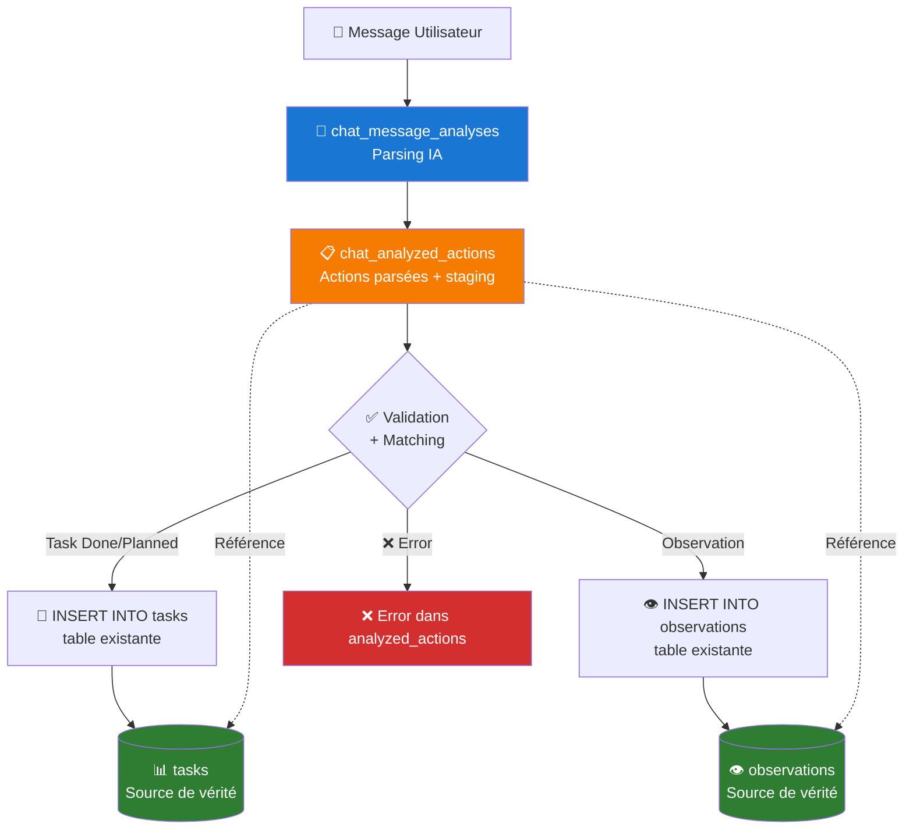

---

### **1.3 Database Architecture - AI Tables**
**Source**: `docs/THOMAS_AGENT_ROADMAP.md`
**Description**: Relationship between AI tables and existing source-of-truth tables

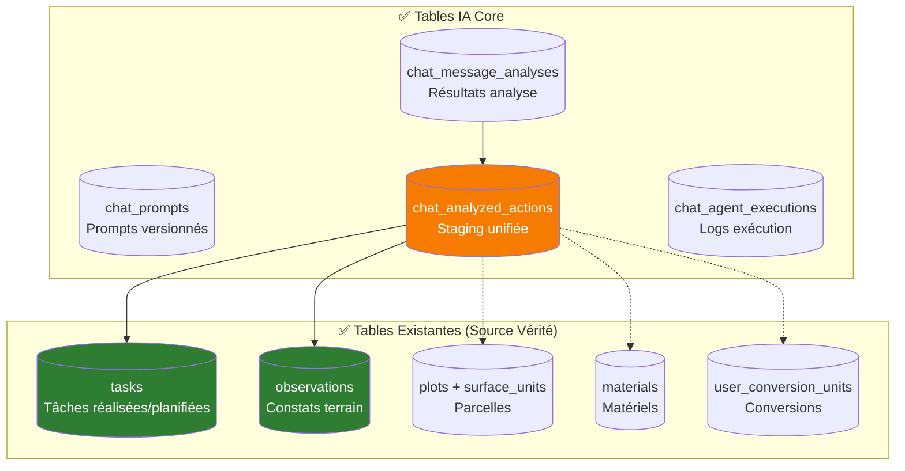

---

### **1.4 Plot Matching Service Algorithm**
**Source**: `docs/THOMAS_AGENT_ROADMAP.md`
**Description**: Detailed algorithm flow for intelligent plot/crop area matching

```mermaid
flowchart TD
    Start([Input: "serre 1", "planche 3 du tunnel"]) --> Extract[Extraction Mentions<br/>Regex patterns français]

    Extract --> Patterns{Types de<br/>patterns?}

    Patterns -->|Type 1| SerrePattern["serre|tunnel N"<br/>+ direction]
    Patterns -->|Type 2| PlanchePattern["planche N du/de la X"]
    Patterns -->|Type 3| CustomPattern[Patterns personnalisés<br/>basés aliases]

    SerrePattern --> FuzzyMatch1[Fuzzy Matching<br/>Levenshtein distance]
    PlanchePattern --> HierarchyMatch[Matching hiérarchique<br/>plot → surface_unit]
    CustomPattern --> ExactMatch[Exact matching<br/>sur aliases]

    FuzzyMatch1 --> Scoring1[Scoring confiance<br/>0.0 → 1.0]
    HierarchyMatch --> Scoring2[Scoring confiance<br/>+ hierarchy bonus]
    ExactMatch --> Scoring3[Scoring confiance<br/>perfect match = 1.0]

    Scoring1 --> Consolidate[Consolidation résultats<br/>tri par confidence]
    Scoring2 --> Consolidate
    Scoring3 --> Consolidate

    Consolidate --> Filter{Confidence ><br/>threshold?}

    Filter -->|❌ < 0.6| NoMatch[Aucun match<br/>return suggestions]
    Filter -->|✅ ≥ 0.6| ValidMatches[Matches valides<br/>ordonnés par score]

    NoMatch --> End([Return PlotMatch[]])
    ValidMatches --> Return([Return PlotMatch[]<br/>avec confidence scores])

    style Start fill:#1976d2,color:#ffffff
    style End fill:#f57c00,color:#ffffff
    style Return fill:#2e7d32,color:#ffffff
    style NoMatch fill:#d32f2f,color:#ffffff
```

---

### **1.5 Matching Services Class Relationships**
**Source**: `docs/THOMAS_AGENT_ROADMAP.md`
**Description**: Class diagram showing relationships between all matching services

```mermaid
classDiagram
    class PlotMatchingService {
        +matchPlots(text, context): Promise~PlotMatch[]~
        -extractPlotMentions(text): PlotMention[]
        -fuzzyMatchPlots(mention, plots): PlotMatch[]
        -resolveHierarchy(matches): PlotMatch[]
    }

    class MaterialMatchingService {
        +matchMaterials(text, context): Promise~MaterialMatch[]~
        -extractMaterialMentions(text): string[]
        -exactMatch(mention, materials): MaterialMatch[]
        -llmKeywordMatch(mention, materials): Promise~MaterialMatch[]~
        -suggestMaterials(mention, materials): MaterialMatch[]
    }

    class ConversionMatchingService {
        +resolveConversions(quantities, context): Promise~ConvertedQuantity[]~
        -findUserConversion(unit, conversions): UserConversion
        -applyConversion(quantity, conversion): ConvertedQuantity
    }

    class PlotMatch {
        +plot: Plot
        +surface_units?: SurfaceUnit[]
        +confidence: number
        +match_type: string
    }

    class MaterialMatch {
        +material: Material
        +confidence: number
        +match_method: string
    }

    class ConvertedQuantity {
        +original: QuantityMention
        +converted: {value: number, unit: string}
        +confidence: number
        +source: string
    }

    PlotMatchingService --> PlotMatch
    MaterialMatchingService --> MaterialMatch
    ConversionMatchingService --> ConvertedQuantity
```

---

### **1.6 Agent Tools Architecture**
**Source**: `docs/THOMAS_AGENT_ROADMAP.md`
**Description**: Complete architecture of all agent tools and their relationships to matching services

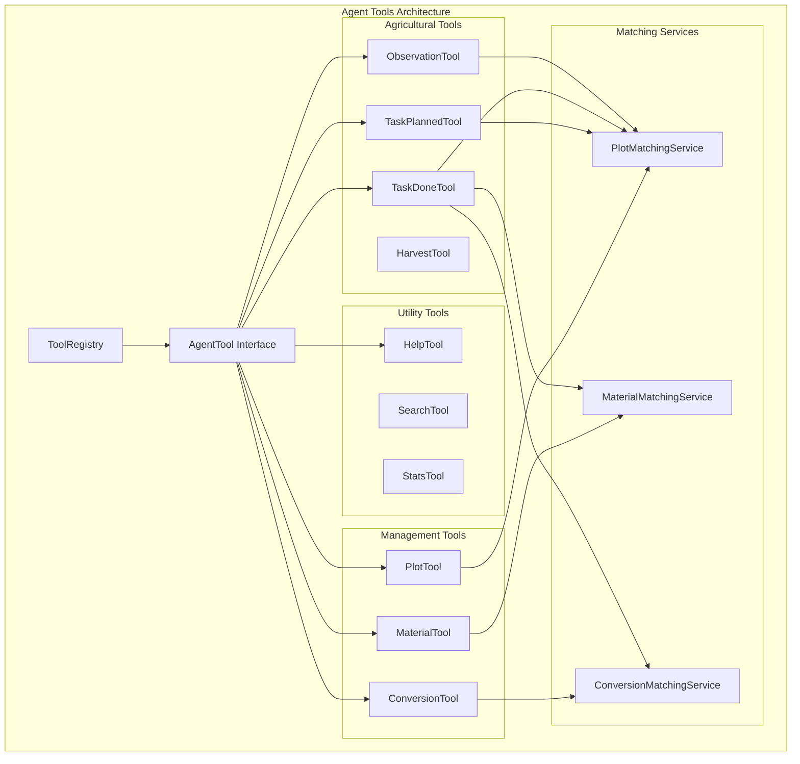

---

### **1.7 ObservationTool Execution Flow**
**Source**: `docs/THOMAS_AGENT_ROADMAP.md`
**Description**: Complete execution flow of the ObservationTool from agent call to database storage

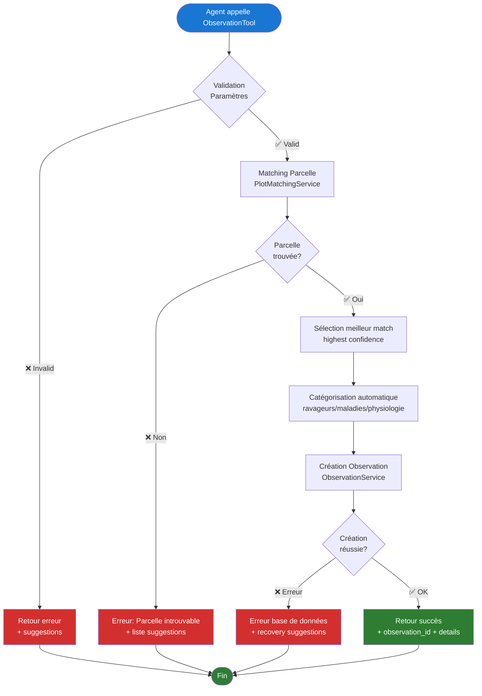

---

### **1.8 ObservationTool Class Structure**
**Source**: `docs/THOMAS_AGENT_ROADMAP.md`
**Description**: Class diagram of the ObservationTool implementation

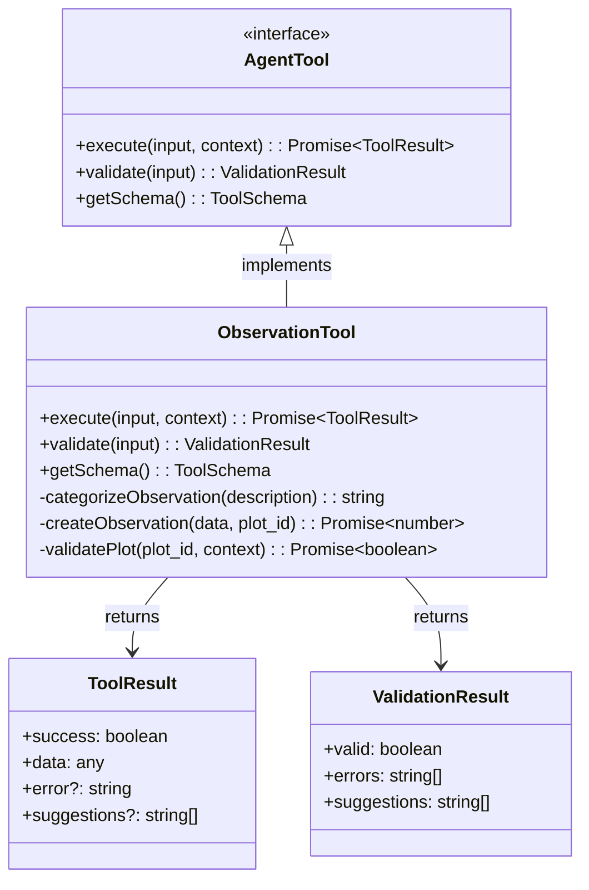

---

## 🤖 AI Analysis & OpenAI Integration Diagrams

### **2.1 AI Analysis Complete Flow**
**Source**: `docs/archive/ARCHITECTURE_ANALYSE_IA.md`
**Description**: Complete end-to-end flow from user message to AI analysis and response

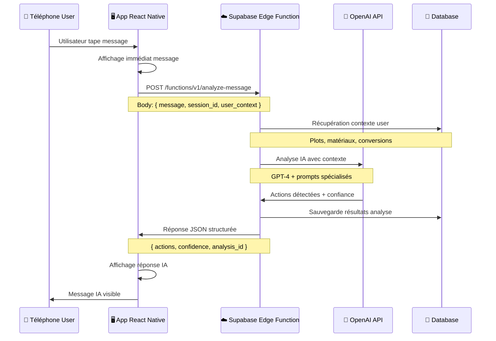

---

### **2.2 OpenAI Integration Architecture**
**Source**: `docs/archive/OPENAI_SUPABASE_ARCHITECTURE.md`
**Description**: How OpenAI API communicates with Supabase Edge Functions

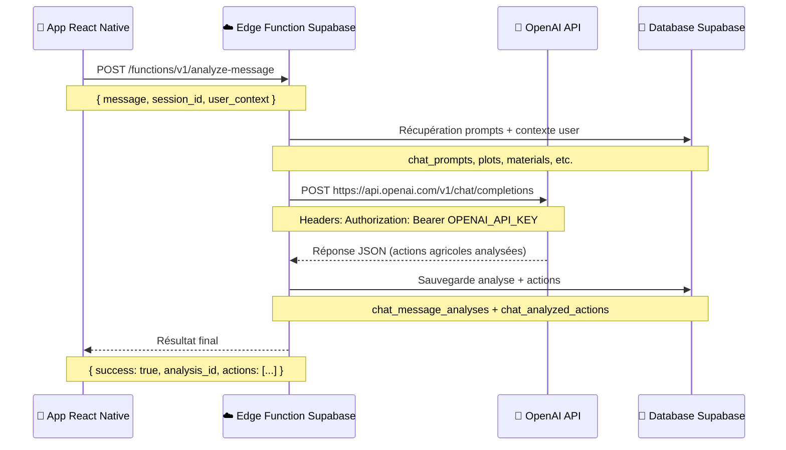

---

## 📝 Prompt Testing & System Diagrams

### **3.1 Prompt Management System Architecture**
**Source**: `docs/PROMPT_TESTING_COMPLETE.md`
**Description**: Complete architecture of the advanced prompt management system

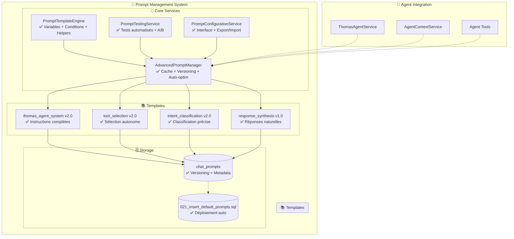

---

### **3.2 Prompt Testing Workflow**
**Source**: `docs/PROMPT_TESTING_COMPLETE.md`
**Description**: Complete workflow for prompt testing and optimization

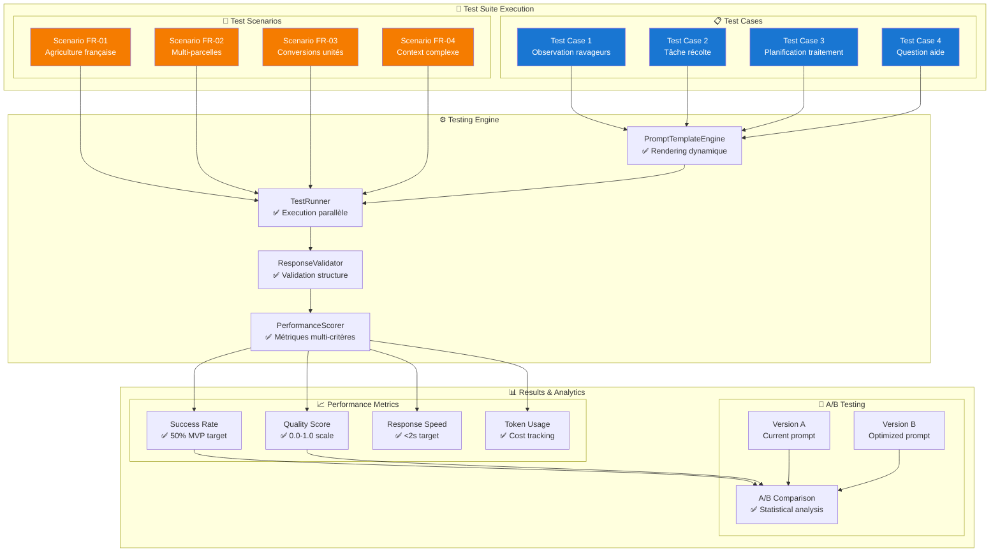

---

### **3.3 Phase 5 Prompt System Architecture**
**Source**: `docs/archive/PHASE5_PROMPT_SYSTEM_COMPLETE.md`
**Description**: Architecture of the Phase 5 advanced prompt system

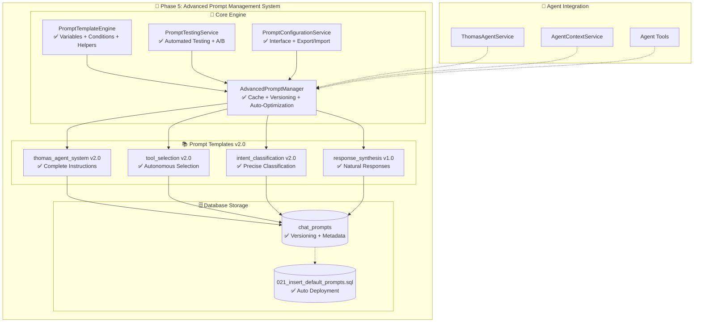

---

### **3.4 Phase 6 Pipeline Complete Architecture**
**Source**: `docs/PHASE6_PIPELINE_COMPLETE.md`
**Description**: Complete Phase 6 pipeline architecture

```mermaid
graph TB
    subgraph "🚀 Phase 6: Complete Agent Pipeline"
        subgraph "📥 Input Processing"
            MessageInput[Message Input<br/>✅ Natural Language]
            ContextBuilder[Context Builder<br/>✅ Farm + User Context]
            IntentClassifier[Intent Classifier<br/>✅ Multi-Intent Detection]
        end

        subgraph "🧠 AI Analysis Engine"
            PromptManager[Prompt Manager<br/>✅ Dynamic Prompt Selection]
            OpenAIIntegration[OpenAI Integration<br/>✅ GPT-4 + Streaming]
            ResponseParser[Response Parser<br/>✅ Structured Action Extraction]
        end

        subgraph "🎯 Tool Execution Pipeline"
            ToolSelector[Tool Selector<br/>✅ Autonomous Tool Choice]
            ParameterMapper[Parameter Mapper<br/>✅ Context-Aware Mapping]
            ToolExecutor[Tool Executor<br/>✅ Parallel/Serial Execution]
        end

        subgraph "📊 Validation & Feedback"
            ResultValidator[Result Validator<br/>✅ Success/Error Detection]
            ConfidenceScorer[Confidence Scorer<br/>✅ Quality Metrics]
            FeedbackCollector[Feedback Collector<br/>✅ User Corrections]
        end

        subgraph "💾 Data Persistence"
            ActionStaging[Action Staging<br/>✅ chat_analyzed_actions]
            EntityResolver[Entity Resolver<br/>✅ Plot/Material Matching]
            DatabaseWriter[Database Writer<br/>✅ ACID Transactions]
        end

        subgraph "🔄 Execution Logging"
            ExecutionLogger[Execution Logger<br/>✅ chat_agent_executions]
            PerformanceMonitor[Performance Monitor<br/>✅ Response Times]
            ErrorTracker[Error Tracker<br/>✅ Failure Analysis]
        end
    end

    MessageInput --> ContextBuilder
    ContextBuilder --> IntentClassifier

    IntentClassifier --> PromptManager
    PromptManager --> OpenAIIntegration
    OpenAIIntegration --> ResponseParser

    ResponseParser --> ToolSelector
    ToolSelector --> ParameterMapper
    ParameterMapper --> ToolExecutor

    ToolExecutor --> ResultValidator
    ResultValidator --> ConfidenceScorer
    ConfidenceScorer --> FeedbackCollector

    FeedbackCollector --> ActionStaging
    ActionStaging --> EntityResolver
    EntityResolver --> DatabaseWriter

    ToolExecutor --> ExecutionLogger
    ResultValidator --> PerformanceMonitor
    ResultValidator --> ErrorTracker

    DatabaseWriter -.-> FeedbackCollector
    ExecutionLogger -.-> PerformanceMonitor
```

---

### **3.5 Phase 6 Pipeline Architecture**
**Source**: `docs/PHASE6_PIPELINE_COMPLETE.md`
**Description**: Complete Phase 6 pipeline architecture with all components


---

### **3.6 AI Chat System Design Flow**
**Source**: `docs/archive/AI_CHAT_SYSTEM_DESIGN.md`
**Description**: Design flow for the AI chat system message processing pipeline

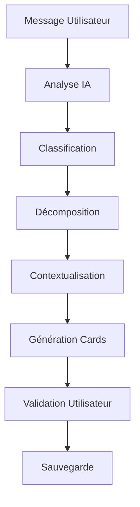

---

## 📋 THOMAS AGENT V2 Complete Architecture

### **4.1 Complete Agent Architecture**
**Source**: `docs/THOMAS_AGENT_V2_COMPLETE.md`
**Description**: Complete architecture diagram for Thomas Agent v2.0

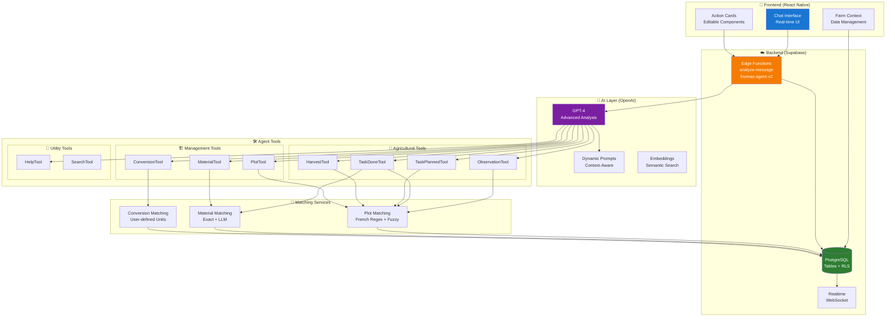

---

## 📋 THOMAS AGENT V2 Complete Architecture

### **4.1 Complete Agent Architecture**
**Source**: `docs/THOMAS_AGENT_V2_COMPLETE.md`
**Description**: Complete architecture diagram for Thomas Agent v2.0

```mermaid
graph TB
    subgraph "📱 Frontend (React Native)"
        ChatUI[Chat Interface<br/>Real-time UI]
        ActionCards[Action Cards<br/>Editable Components]
        FarmContext[Farm Context<br/>Data Management]
    end

    subgraph "☁️ Backend (Supabase)"
        EdgeFunctions[Edge Functions<br/>analyze-message<br/>thomas-agent-v2]
        Database[(PostgreSQL<br/>Tables + RLS)]
        Realtime[Realtime<br/>WebSocket]
    end

    subgraph "🤖 AI Layer (OpenAI)"
        GPT4[GPT-4<br/>Advanced Analysis]
        Prompts[Dynamic Prompts<br/>Context-Aware]
        Embeddings[Embeddings<br/>Semantic Search]
    end

    subgraph "🛠️ Agent Tools"
        subgraph "🌾 Agricultural Tools"
            ObsTool[ObservationTool]
            TaskTool[TaskDoneTool]
            PlanTool[TaskPlannedTool]
            HarvestTool[HarvestTool]
        end

        subgraph "🏗️ Management Tools"
            PlotTool[PlotTool]
            MatTool[MaterialTool]
            ConvTool[ConversionTool]
        end

        subgraph "🔧 Utility Tools"
            HelpTool[HelpTool]
            SearchTool[SearchTool]
        end
    end

    subgraph "🎯 Matching Services"
        PlotMatch[Plot Matching<br/>French Regex + Fuzzy]
        MatMatch[Material Matching<br/>Exact + LLM]
        ConvMatch[Conversion Matching<br/>User-defined Units]
    end

    ChatUI --> EdgeFunctions
    ActionCards --> EdgeFunctions
    FarmContext --> Database

    EdgeFunctions --> GPT4
    GPT4 --> Prompts

    EdgeFunctions --> Database
    Database --> Realtime

    GPT4 --> ObsTool
    GPT4 --> TaskTool
    GPT4 --> PlanTool
    GPT4 --> HarvestTool
    GPT4 --> PlotTool
    GPT4 --> MatTool
    GPT4 --> ConvTool
    GPT4 --> HelpTool

    ObsTool --> PlotMatch
    TaskTool --> PlotMatch
    TaskTool --> MatMatch
    PlanTool --> PlotMatch
    HarvestTool --> PlotMatch

    PlotTool --> PlotMatch
    MatTool --> MatMatch
    ConvTool --> ConvMatch

    PlotMatch --> Database
    MatMatch --> Database
    ConvMatch --> Database

    style ChatUI fill:#1976d2,color:#ffffff
    style EdgeFunctions fill:#f57c00,color:#ffffff
    style GPT4 fill:#7b1fa2,color:#ffffff
    style Database fill:#2e7d32,color:#ffffff
```

---

## 📊 Summary

### **Total Diagrams**: 16 Mermaid diagrams across 9 files

### **Categories**:
- **🤖 AI Agent & Chat**: 8 diagrams (Thomas Agent architecture, matching services, execution flows)
- **🤖 AI Analysis & OpenAI**: 2 diagrams (analysis flows and integration)
- **📝 Prompt Testing & System**: 5 diagrams (prompt management, testing workflows, Phase 5/6 architectures)
- **📋 Complete Architecture**: 1 diagram (Thomas Agent v2.0 full stack)

### **File Sources**:
- `docs/AGENT_TOOLS_CREATED.md`: 1 diagram
- `docs/THOMAS_AGENT_ROADMAP.md`: 7 diagrams
- `docs/PROMPT_TESTING_COMPLETE.md`: 1 diagram
- `docs/PHASE6_PIPELINE_COMPLETE.md`: 1 diagram
- `docs/THOMAS_AGENT_V2_COMPLETE.md`: 1 diagram
- `docs/archive/ARCHITECTURE_ANALYSE_IA.md`: 1 diagram
- `docs/archive/OPENAI_SUPABASE_ARCHITECTURE.md`: 1 diagram
- `docs/archive/PHASE5_PROMPT_SYSTEM_COMPLETE.md`: 1 diagram
- `docs/archive/AI_CHAT_SYSTEM_DESIGN.md`: 1 diagram

This collection provides a comprehensive visual overview of the entire Thomas V2 agricultural AI agent system architecture, from frontend UI to backend database, covering all major components and data flows.
