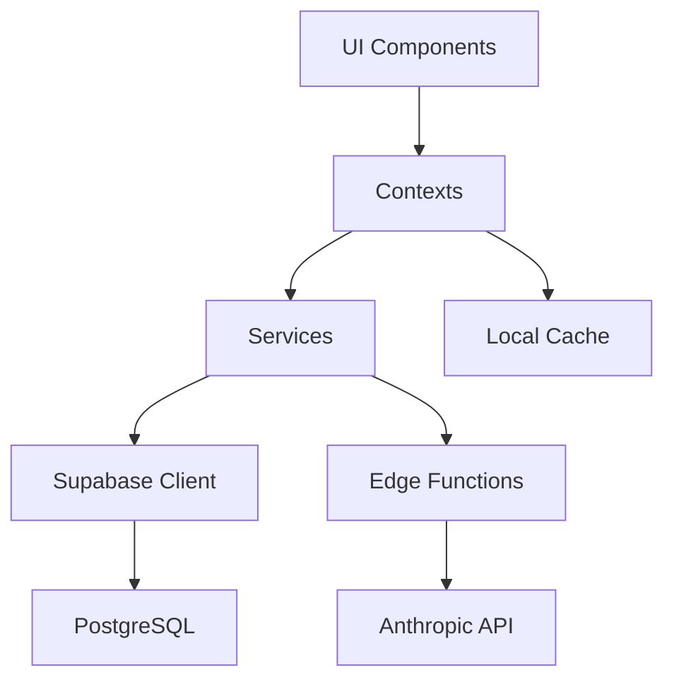

# 🏗️ Architecture & Spécifications

Documentation complète de l'architecture, spécifications techniques, et roadmap du projet Thomas V2.

## 📋 Contenu

### **Architecture Système**
- **ARCHITECTURE_COMPLETE.md** ⭐ - Architecture complète de l'application
- **CLEAN_ARCHITECTURE_FINAL.md** - Architecture clean finale
- **TECHNICAL_SPECIFICATIONS.md** - Spécifications techniques détaillées

### **Planification & Dépendances**
- **ROADMAP_IMPLEMENTATION.md** - Plan d'implémentation 8 phases
- **DEPENDENCIES_MATRIX.md** - Matrice des dépendances entre composants

### **Diagrammes & Visualisation**
- **MERMAID_DIAGRAMS_COLLECTION.md** - Collection de diagrammes Mermaid

## 🎯 Par Où Commencer ?

1. **Vue d'ensemble** → `ARCHITECTURE_COMPLETE.md`
2. **Spécifications** → `TECHNICAL_SPECIFICATIONS.md`
3. **Planification** → `ROADMAP_IMPLEMENTATION.md`

## 🏛️ Architecture Thomas V2

### **Stack Technique**
```
Frontend:
├── React Native (Expo SDK 51)
├── TypeScript
├── React Navigation v6
└── Design System custom (64 composants)

Backend:
├── Supabase (PostgreSQL + Auth + Storage)
├── Edge Functions (Deno)
└── Row Level Security (RLS)

IA:
├── Claude 3.5 Sonnet (Anthropic)
├── GPT-4 (OpenAI - embeddings)
└── RAG (Retrieval Augmented Generation)
```

### **Patterns Architecturaux**
- **Clean Architecture** - Séparation claire des couches
- **Feature-First** - Organisation par fonctionnalité
- **Design System Atomic** - Atoms > Molecules > Organisms > Templates
- **Offline-First** - Cache local + synchronisation
- **Mobile-First** - Conçu d'abord pour mobile

### **Couches Principales**
```
src/
├── design-system/       # Composants UI réutilisables
├── screens/             # Écrans de l'application
├── contexts/            # State management (Context API)
├── services/            # Logique métier & API calls
├── hooks/               # Custom React hooks
├── utils/               # Utilitaires & helpers
└── types/               # TypeScript types & interfaces
```

## 📊 8 Phases d'Implémentation

### **Phase 1: Foundation** ✅
- Setup projet, Supabase, authentification
- Design system de base
- Navigation

### **Phase 2: Core Features** ✅
- Fermes, parcelles, cultures
- Observations & tâches
- Système de photos

### **Phase 3: Documents** ✅
- Upload, gestion, recherche
- Types de documents
- Intégration ferme

### **Phase 4: Agent IA** ✅
- Chat avec Claude
- Prompts spécialisés
- Matching intelligent
- Outils agent

### **Phase 5: Optimizations** ✅
- Cache système
- Offline mode
- Performance

### **Phase 6: Advanced Features** ✅
- Statistiques
- Notifications
- Multi-fermes

### **Phase 7: Polish** 🔄 En cours
- UI/UX refinement
- Tests E2E
- Bug fixes

### **Phase 8: Production** 📅 Janvier 2026
- Build stores
- Monitoring
- Documentation finale

## 🔗 Architecture Détaillée

### **Data Flow**


### **Authentication Flow**
```
User Login
  → Supabase Auth (email/password)
  → JWT Token
  → User Session
  → Farm Selection
  → Context Initialization
  → App Ready
```

### **Agent IA Flow**
```
User Query
  → Semantic Search (embeddings)
  → Prompt Matching
  → Context Building (ferme, culture, etc.)
  → Claude API Call
  → Streaming Response
  → UI Update
```

## 📐 Principes de Conception

### **1. Simplicité**
- Code lisible et maintenable
- Patterns cohérents
- Documentation claire

### **2. Performance**
- Cache agressif
- Lazy loading
- Optimistic updates

### **3. Fiabilité**
- Error boundaries
- Fallbacks
- Offline mode

### **4. Scalabilité**
- Architecture modulaire
- Code réutilisable
- Découplage fort

### **5. UX**
- Feedback immédiat
- États de chargement
- Messages d'erreur clairs

## 🔍 Dépendances Critiques

### **NPM Packages**
```json
{
  "expo": "^51.0.0",
  "react-native": "0.74.5",
  "@supabase/supabase-js": "^2.39.0",
  "@react-navigation/native": "^6.1.9",
  "react-native-reanimated": "^3.6.0"
}
```

### **Services Externes**
- **Supabase** - Backend as a Service
- **Anthropic** - API Claude (agent IA)
- **OpenAI** - Embeddings (matching prompts)
- **Expo** - Build & deployment

## 📚 Ressources

- **Architecture complète** : `ARCHITECTURE_COMPLETE.md`
- **Spécifications techniques** : `TECHNICAL_SPECIFICATIONS.md`
- **Roadmap** : `ROADMAP_IMPLEMENTATION.md`
- **Diagrammes** : `MERMAID_DIAGRAMS_COLLECTION.md`

---

**6 documents** | Architecture, spécifications, planification, diagrammes


