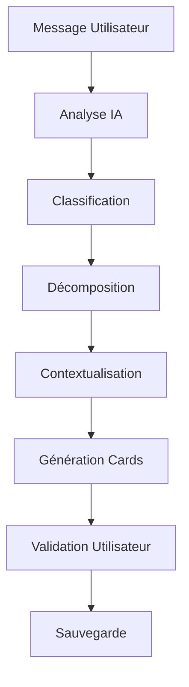

# 🤖 Système de Chat IA Agricole - Document de Conception

## 🎯 Vue d'ensemble

### Objectif Principal
Créer un système de chat intelligent capable d'analyser des messages agricoles complexes et de les décomposer en actions spécifiques exploitables par l'application.

### Exemple de Fonctionnement
```
👤 Utilisateur: "j'ai observé des pucerons sur mes tomates et mes laitues et j'ai récolté 4 kg de betterave."

🤖 IA Analyse:
- Type: Message mixte (2 observations + 1 tâche effectuée)
- Décomposition:
  1. Observation: "J'ai observé des pucerons sur les tomates"
  2. Observation: "J'ai observé des pucerons sur les laitues" 
  3. Tâche effectuée: "J'ai récolté 4 kg de betterave"

📱 Interface: Carousel avec 3 cards éditables
```

## 🏗️ Architecture du Système

### 1. Pipeline de Traitement des Messages



### 2. Composants Core

#### 🧠 **AI Message Analyzer**
- **Rôle**: Analyser et classifier le message
- **Input**: Message utilisateur brut
- **Output**: Structure de données avec actions identifiées

#### 📝 **Message Decomposer** 
- **Rôle**: Décomposer en phrases simples
- **Input**: Message complexe analysé
- **Output**: Liste d'actions simples

#### 🏷️ **Context Enricher**
- **Rôle**: Ajouter contexte (parcelles, matériel, conversions)
- **Input**: Actions simples
- **Output**: Actions contextualisées

#### 🎴 **Card Generator**
- **Rôle**: Générer les cartes d'interface
- **Input**: Actions contextualisées
- **Output**: Components UI (Cards/Carousel)

#### 💾 **Action Processor**
- **Rôle**: Sauvegarder les actions validées
- **Input**: Actions validées par l'utilisateur
- **Output**: Données en base

## 📋 Types d'Actions Supportées

### Actions Actuelles
| ID | Type | Description | Exemple |
|----|------|-------------|---------|
| 0 | **Aide** | Assistance utilisation app | "Comment ajouter une parcelle ?" |
| 1 | **Tâche Effectuée** | Action agricole terminée | "J'ai récolté 4kg de tomates" |
| 2 | **Planification** | Action future à programmer | "Prévoir traitement anti-pucerons" |
| 3 | **Observation** | Constat terrain | "Pucerons sur tomates P1" |
| 4 | **Paramétrage** | Config app (matériel, parcelles, conversions) | "1 caisse = 4kg betteraves" |

### Extensions Futures
- Analyses météo
- Recommandations personnalisées  
- Gestion financière
- Planification saisonnière
- Chats spécialisés par domaine

## 🎮 Interface Utilisateur

### Types de Réponses

#### 📄 **Réponse Simple** (1 action)
```tsx
<ActionCard 
  type="observation"
  content="J'ai observé des pucerons sur les tomates"
  context={{ parcelle: "P1", planche: "A2" }}
  editable={true}
/>
```

#### 🎠 **Carousel** (Plusieurs actions)
```tsx
<ActionCarousel>
  <ActionCard type="observation" content="..." />
  <ActionCard type="observation" content="..." />
  <ActionCard type="task_done" content="..." />
</ActionCarousel>
```

#### 💬 **Réponse Conversationnelle** (Aide)
```tsx
<ChatMessage 
  type="ai_response"
  content="Pour ajouter une parcelle, allez dans..."
/>
```

## 🧮 Gestion des Contextes

### Hiérarchie Spatiale
```
🏡 Exploitation
└── 🌱 Parcelle (ex: "Champ Nord")
    └── 📏 Planche (ex: "A2")
        └── 🌿 Culture (ex: "Tomates")
```

### Matériel & Réglages
```typescript
interface Equipment {
  id: string;
  name: string; // "Pulvérisateur"
  settings?: Record<string, any>; // { "pression": "3 bars" }
}
```

### Conversions Personnalisées  
```typescript
interface Conversion {
  id: string;
  fromUnit: string; // "caisse"
  toUnit: string;   // "kg" 
  factor: number;   // 4
  context?: string; // "betteraves"
}
```

## 🎨 Prompts & IA

### Structure des Prompts

#### 🔍 **Prompt d'Analyse**
```yaml
role: system
content: |
  Tu es un assistant agricole expert. Analyse ce message et identifie:
  1. Le type d'actions (observation, tâche, planification, aide, config)
  2. Les éléments contextuels (cultures, parcelles, quantités)
  3. La complexité (simple ou multiple actions)
  
  Réponds en JSON structuré.

examples:
  - input: "j'ai observé des pucerons sur mes tomates"
    output: {
      "type": "simple",
      "actions": [{
        "category": "observation", 
        "content": "pucerons sur tomates",
        "entities": ["pucerons", "tomates"]
      }]
    }
```

#### ✏️ **Prompt de Décomposition**
```yaml
role: system  
content: |
  Réécris ce message agricole complexe en phrases simples et claires.
  Une phrase = une action.
  Utilise la forme: "J'ai [verbe] [quoi] [où/comment]"
  
examples:
  - input: "observé pucerons tomates et laitues, récolté 4kg betteraves"
    output: [
      "J'ai observé des pucerons sur les tomates",
      "J'ai observé des pucerons sur les laitues", 
      "J'ai récolté 4 kg de betteraves"
    ]
```

### Gestion Dynamique des Prompts
```typescript
interface PromptTemplate {
  id: string;
  version: string;
  role: 'system' | 'user' | 'assistant';
  template: string;
  variables?: string[];
  examples?: Array<{input: string, output: any}>;
  metrics?: {
    accuracy: number;
    usage_count: number;
    last_updated: Date;
  };
}
```

## 💾 Structure de Données

### Message Chat
```typescript
interface ChatMessage {
  id: string;
  chat_id: string;
  user_id: string;
  content: string;
  type: 'user' | 'ai_response' | 'system';
  metadata?: {
    analyzed_actions?: AnalyzedAction[];
    processing_time?: number;
    prompt_version?: string;
  };
  created_at: Date;
}
```

### Action Analysée
```typescript
interface AnalyzedAction {
  id: string;
  message_id: string;
  category: ActionCategory;
  original_text: string;
  decomposed_text: string;
  context: {
    parcelle?: string;
    planche?: string;
    culture?: string;
    equipment?: Equipment;
    quantity?: {value: number, unit: string};
    date?: Date;
  };
  confidence_score: number;
  status: 'pending' | 'validated' | 'rejected' | 'modified';
  user_modifications?: string;
}
```

### Configuration Utilisateur
```typescript
interface UserAIConfig {
  user_id: string;
  default_context: {
    parcelles: Parcelle[];
    equipment: Equipment[];
    conversions: Conversion[];
  };
  preferences: {
    auto_validate_high_confidence: boolean;
    preferred_units: Record<string, string>;
    notification_settings: NotificationConfig;
  };
  prompt_customizations?: Record<string, any>;
}
```

## 🚀 Plan d'Implémentation

### Phase 1: Core MVP (2-3 semaines)
- [ ] Architecture de base
- [ ] Analyse simple (1 action par message)
- [ ] Types d'actions: Observation + Tâche effectuée
- [ ] Cards basiques
- [ ] Prompts de base

### Phase 2: Décomposition (2-3 semaines)  
- [ ] Messages multi-actions
- [ ] Carousel d'actions
- [ ] Système de validation utilisateur
- [ ] Gestion des contextes

### Phase 3: Intelligence Avancée (3-4 semaines)
- [ ] Contextualisation automatique
- [ ] Conversions intelligentes
- [ ] Apprentissage des préférences
- [ ] Métriques et amélioration continue

### Phase 4: Extensions (Ongoing)
- [ ] Nouveaux types d'actions
- [ ] Chats spécialisés
- [ ] Intégrations externes (météo, prix, etc.)

---

## ❓ Questions de Clarification Déploiement

### 🤖 **IA & Prompts**

1. **Quel service IA utiliser ?**
   - OpenAI GPT-4 (payant, performant)
   - Anthropic Claude (alternatif)
   - Service self-hosted (Llama, Mistral)
   - Mix selon les besoins ?

2. **Gestion des coûts IA ?**
   - Budget mensuel alloué ?
   - Stratégie de cache des analyses ?
   - Limitation par utilisateur ?

3. **Données d'entraînement ?**
   - Avez-vous des historiques de messages agricoles ?
   - Souhaitez-vous un système d'apprentissage en continu ?
   - Annotation manuelle des premiers exemples ?

### 📊 **Base de Données**

4. **Stockage des prompts ?**
   - Table dédiée pour versioning ?
   - Fichiers de config ?
   - Interface admin pour modifier ?

5. **Historique des analyses ?**
   - Conserver toutes les versions ?
   - Métriques de performance à tracker ?
   - Durée de rétention ?

### 🎨 **Interface & UX**

6. **Feedback utilisateur ?**
   - Comment l'utilisateur corrige une analyse erronée ?
   - Système de notation des réponses IA ?
   - Apprentissage des corrections ?

7. **Performance temps réel ?**
   - Temps de réponse acceptable (2s, 5s, 10s) ?
   - Indicateur de "typing..." pendant analyse ?
   - Mode offline avec sync différée ?

### 🔧 **Architecture Technique**

8. **Deployment IA ?**
   - Traitement côté serveur (Supabase Functions) ?
   - Edge Functions pour la latence ?
   - Worker dédié pour les analyses lourdes ?

9. **Scalabilité ?**
   - Nombre d'utilisateurs simultanés attendus ?
   - Volume de messages par jour/mois ?
   - Stratégie de mise en cache ?

### 📱 **Expérience Utilisateur**

10. **Onboarding IA ?**
    - Tutorial pour expliquer le chat intelligent ?
    - Exemples de messages types ?
    - Configuration initiale du contexte utilisateur ?

11. **Multilangue ?**
    - Français uniquement pour commencer ?
    - Support d'autres langues prévu ?
    - Régionalismes agricoles locaux ?

### 🔒 **Sécurité & Confidentialité**

12. **Données sensibles ?**
    - Les messages agricoles contiennent-ils des données sensibles ?
    - Chiffrement des conversations ?
    - Conformité RGPD/protection des données ?

---

**Prochaines étapes suggérées:**
1. **Répondre aux questions de clarification**
2. **Choisir le service IA et définir l'architecture**  
3. **Créer les premiers prompts et tester sur des exemples**
4. **Développer le MVP avec analyse simple**
5. **Itérer basé sur les retours utilisateurs**

Quelles sont vos réponses aux questions ci-dessus pour orienter l'implémentation ?
