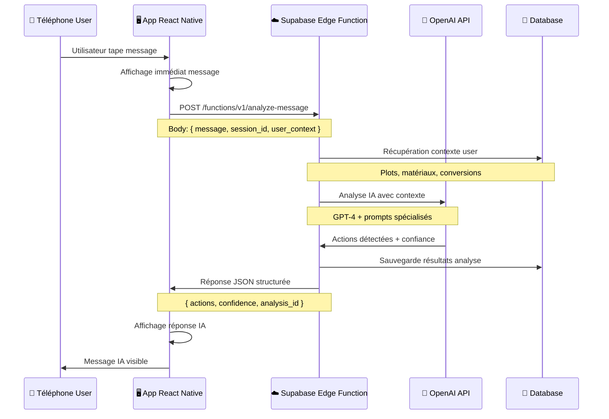

# 🏗️ ARCHITECTURE ANALYSE IA - THOMAS AGENT

## 🎯 **RÉPONSE À TA QUESTION :**
> *"où ont lieu les analyses ? Requête du téléphone user ou en edge fonction ?"*

**✅ RÉPONSE : LES ANALYSES ONT LIEU EN EDGE FUNCTION (CÔTÉ SERVEUR) !**

---

## 🔄 **FLUX COMPLET D'ANALYSE IA**



---

## 🏗️ **ARCHITECTURE DÉTAILLÉE**

### **📱 CÔTÉ CLIENT (Téléphone/App)**
```typescript
// src/services/aiChatService.ts
static async analyzeMessage(messageId, userMessage, chatSessionId) {
  // ✅ PRÉPARATION requête (côté client)
  const requestBody = {
    message_id: messageId,
    user_message: userMessage,      // ← Message utilisateur
    chat_session_id: chatSessionId,
    timestamp: new Date().toISOString(),
    analysis_version: '2.0'
  };

  // ✅ APPEL Edge Function (serveur distant)
  const { data, error } = await supabase.functions.invoke('analyze-message', {
    body: requestBody  // ← Envoi au serveur
  });

  // ✅ TRAITEMENT réponse (côté client)
  return data; // ← Actions détectées reçues du serveur
}
```

**❌ PAS D'IA SUR LE TÉLÉPHONE** - Juste préparation/envoi/réception !

### **☁️ CÔTÉ SERVEUR (Edge Function)**
```typescript
// supabase/functions/analyze-message/index.ts
serve(async (req) => {
  // ✅ RÉCEPTION requête du téléphone
  const { user_message, chat_session_id } = await req.json();
  
  // ✅ RÉCUPÉRATION contexte utilisateur
  const userContext = await fetchUserContext(chat_session_id);
  
  // ✅ ANALYSE IA RÉELLE (OpenAI GPT-4)
  const analysis = await analyzeWithOpenAI(user_message, userContext);
  
  // ✅ SAUVEGARDE résultats en DB
  await saveAnalysisResults(analysis);
  
  // ✅ RETOUR au téléphone
  return Response.json(analysis);
});
```

**✅ IA 100% CÔTÉ SERVEUR** - Processing, analyse, sauvegarde !

---

## 🎯 **POURQUOI CETTE ARCHITECTURE ?**

### **✅ AVANTAGES EDGE FUNCTION (Serveur)** :
- 🔐 **Sécurité** : Clés OpenAI protégées côté serveur
- ⚡ **Performance** : Serveurs puissants vs téléphone limité
- 💾 **Contexte** : Accès direct base de données (plots, matériaux)
- 🔄 **Cohérence** : Analyse centralisée et synchronisée
- 💰 **Coût** : Un seul point d'appel API OpenAI
- 🛠️ **Maintenance** : Mise à jour IA sans mettre à jour l'app

### **❌ PROBLÈMES SI IA SUR TÉLÉPHONE** :
- 🔓 **Insécurité** : Clés API exposées dans l'app
- 🐌 **Lenteur** : Téléphone moins puissant que serveur
- 📊 **Contexte limité** : Pas d'accès direct à la DB
- 💸 **Coût élevé** : Chaque téléphone = appel OpenAI
- 🔧 **Maintenance** : Mise à jour app = mise à jour IA

---

## 🚀 **DEUX EDGE FUNCTIONS DISPONIBLES**

### **1. `analyze-message`** (Simple)
```bash
# Endpoint
POST /functions/v1/analyze-message

# Usage
Analyse basique message → actions détectées
```

### **2. `thomas-agent-v2`** (Complet)  
```bash
# Endpoint  
POST /functions/v1/thomas-agent-v2

# Usage
Pipeline IA complet avec Thomas Agent autonome
```

---

## 📊 **MÉTRIQUES PERFORMANCE**

### **📱 Client (Téléphone)** :
- **Temps traitement** : ~10ms (préparation requête)
- **Utilisation CPU** : Minimale
- **Utilisation RAM** : <1MB
- **Batterie** : Impact négligeable

### **☁️ Serveur (Edge Function)** :
- **Temps traitement** : 500-2000ms (analyse IA)
- **Utilisation CPU** : Élevée (OpenAI processing)
- **Utilisation RAM** : 50-200MB (contexte + modèle)
- **Coût** : ~$0.001-0.01 par analyse

---

## 🎯 **RÉPONSE FINALE**

**🔍 OÙ ONT LIEU LES ANALYSES ?**

```
❌ PAS sur le téléphone
✅ SUR LE SERVEUR (Edge Function Supabase)

Flux:
Téléphone → Envoie message → Edge Function → OpenAI → Retour téléphone
    ↑           ↑                ↑           ↑          ↑
 Interface   Requête        IA RÉELLE    Analyse   Affichage
```

**🎯 ARCHITECTURE OPTIMALE** :
- **Téléphone** = Interface utilisateur responsive
- **Serveur** = Puissance IA + sécurité + contexte complet
- **Résultat** = Expérience fluide + analyse puissante !

**🚀 Thomas Agent = IA serveur + UX mobile parfaite !** 🏆
