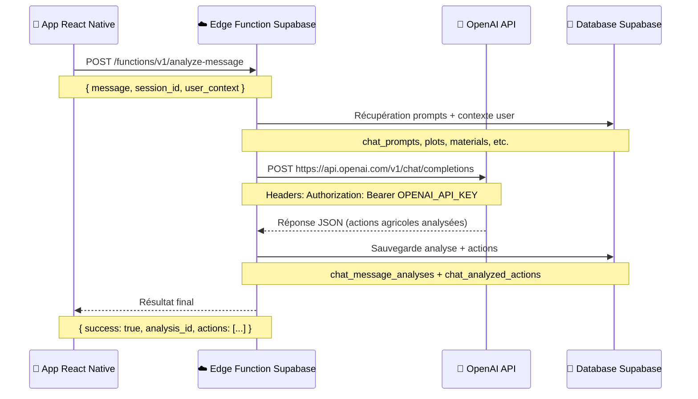

# 🤖 ARCHITECTURE OPENAI ↔ SUPABASE - THOMAS AGENT

## 🎯 **RÉPONSE À TA QUESTION**

> *"comment est communiqué l'API open ai à supabase ?"*

**✅ VIA EDGE FUNCTIONS SUPABASE** - OpenAI est appelée **depuis** les Edge Functions, **pas directement depuis l'app** !

---

## 🏗️ **ARCHITECTURE COMPLÈTE**



---

## 🔧 **CONFIGURATION OPENAI**

### **1. Clé API Stockée dans Supabase**
📍 **Localisation** : Dashboard Supabase → Edge Functions → Settings → Environment Variables  
🔑 **Variable** : `OPENAI_API_KEY=sk-...`

### **2. Appel Direct dans Edge Function**
```typescript
// supabase/functions/analyze-message/index.ts

async function analyzeWithOpenAI(prompt: any, userMessage: string, context: UserContext) {
  const openaiApiKey = Deno.env.get('OPENAI_API_KEY')  // 🔑 Récupération clé
  
  if (!openaiApiKey) {
    throw new Error('Clé API OpenAI non configurée')   // ❌ Erreur si manquante
  }

  const response = await fetch('https://api.openai.com/v1/chat/completions', {
    method: 'POST',
    headers: {
      'Authorization': `Bearer ${openaiApiKey}`,        // 🔐 Authentification
      'Content-Type': 'application/json',
    },
    body: JSON.stringify({
      model: 'gpt-4o-mini',                            // 🤖 Modèle utilisé
      messages: [
        { role: 'system', content: systemPrompt },     // 📋 Prompt système 
        { role: 'user', content: userMessage }         // 💬 Message utilisateur
      ]
    }),
  })

  const data = await response.json()                   // 📥 Réponse OpenAI
  return data.choices[0].message.content               // 🎯 Contenu analysé
}
```

---

## 📊 **FLUX DE DONNÉES DÉTAILLÉ**

### **ÉTAPE 1 : App → Supabase Edge Function**
```javascript
// App React Native
const result = await DirectSupabaseService.directEdgeFunction('analyze-message', {
  message_id: dbMessage.id,           // 🆔 UUID du message DB
  user_message: originalText,         // 💬 "J'ai observé des pucerons"
  chat_session_id: chat.id           // 🏠 Session de chat
});
```

### **ÉTAPE 2 : Edge Function → Base de Données**
```sql
-- Récupération des prompts pour OpenAI
SELECT content FROM chat_prompts WHERE name = 'thomas_agent_system';

-- Récupération contexte utilisateur (parcelles, matériaux, conversions)
SELECT plots.*, materials.*, user_conversion_units.* 
FROM farms WHERE id = farm_id;
```

### **ÉTAPE 3 : Edge Function → OpenAI API**
```typescript
const systemPrompt = `
Tu es Thomas, assistant agricole français...

Contexte exploitation:
- Parcelles: Serre 1, Champ nord, Potager
- Matériaux: Pesticide bio, Engrais NPK 15-15-15
- Conversions: 1 caisse = 5kg tomates
`;

// Payload OpenAI
{
  model: 'gpt-4o-mini',
  messages: [
    { role: 'system', content: systemPrompt },
    { role: 'user', content: "J'ai observé des pucerons sur les laitues" }
  ]
}
```

### **ÉTAPE 4 : OpenAI → Edge Function → Base de Données**
```typescript
// Réponse OpenAI analysée
const analysisResult = {
  actions: [
    {
      type: 'observation',
      data: { crop: 'laitues', problem: 'pucerons', severity: 'medium' },
      confidence: 0.95
    }
  ]
};

// Sauvegarde en DB
INSERT INTO chat_message_analyses (message_id, analysis_result, model_used)
VALUES (message_id, analysisResult, 'gpt-4o-mini');
```

---

## ⚙️ **CONFIGURATION REQUISE**

### **1. Variable d'Environnement Supabase**
🌐 **Dashboard** : https://supabase.com/dashboard/project/kvwzbofifqqytyfertkh  
➡️ **Settings** → **Edge Functions** → **Environment Variables**  
➕ **Ajouter** : 
- **Name** : `OPENAI_API_KEY`
- **Value** : `sk-proj-...` (ta clé OpenAI)

### **2. Prompts en Base de Données**
📋 **Table** : `chat_prompts` doit contenir 4 prompts :
- `thomas_agent_system` - Instructions de base Thomas
- `tool_selection` - Sélection des outils 
- `intent_classification` - Classification des intentions
- `response_synthesis` - Synthèse des réponses

---

## 🚨 **PROBLÈMES FRÉQUENTS**

### **❌ "Clé API OpenAI non configurée"**
**Cause** : Variable `OPENAI_API_KEY` manquante dans Supabase  
**Solution** : Ajouter la variable dans Dashboard → Settings → Environment Variables

### **❌ "Prompt d'analyse introuvable"**  
**Cause** : Table `chat_prompts` vide ou prompts inactifs  
**Solution** : Insérer les 4 prompts requis (voir script SQL)

### **❌ "OpenAI API error: 401 Unauthorized"**
**Cause** : Clé API OpenAI invalide ou expirée  
**Solution** : Renouveler la clé sur https://platform.openai.com/api-keys

### **❌ "sentMessage is not defined"**  
**Cause** : Variable incorrecte dans le code  
**Solution** : Utiliser `dbMessage.id` au lieu de `sentMessage.id` ✅

---

## 💰 **COÛTS & MONITORING**

### **Modèle Utilisé** : `gpt-4o-mini`
- **Prix** : ~$0.15 / 1M tokens input, ~$0.60 / 1M tokens output
- **Performance** : Rapide, économique, adapté aux tâches agricoles

### **Monitoring OpenAI**
📊 **Usage** : https://platform.openai.com/usage  
📈 **Logs** : Dashboard Supabase → Edge Functions → analyze-message → Logs

---

## 🎯 **RÉSUMÉ**

**✅ OpenAI INTÉGRÉ via Edge Functions Supabase**  
**✅ Clé API sécurisée côté serveur**  
**✅ Prompts modulaires en base de données**  
**✅ Contexte utilisateur enrichi automatiquement**  
**✅ Analyse temps réel avec sauvegarde**

**🔧 Reste à faire** : Insérer le prompt `response_synthesis` manquant !
