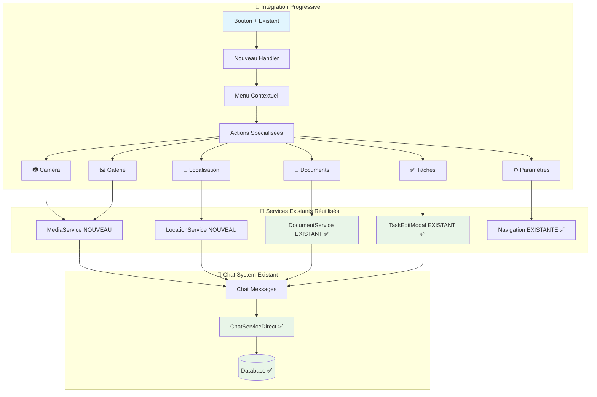
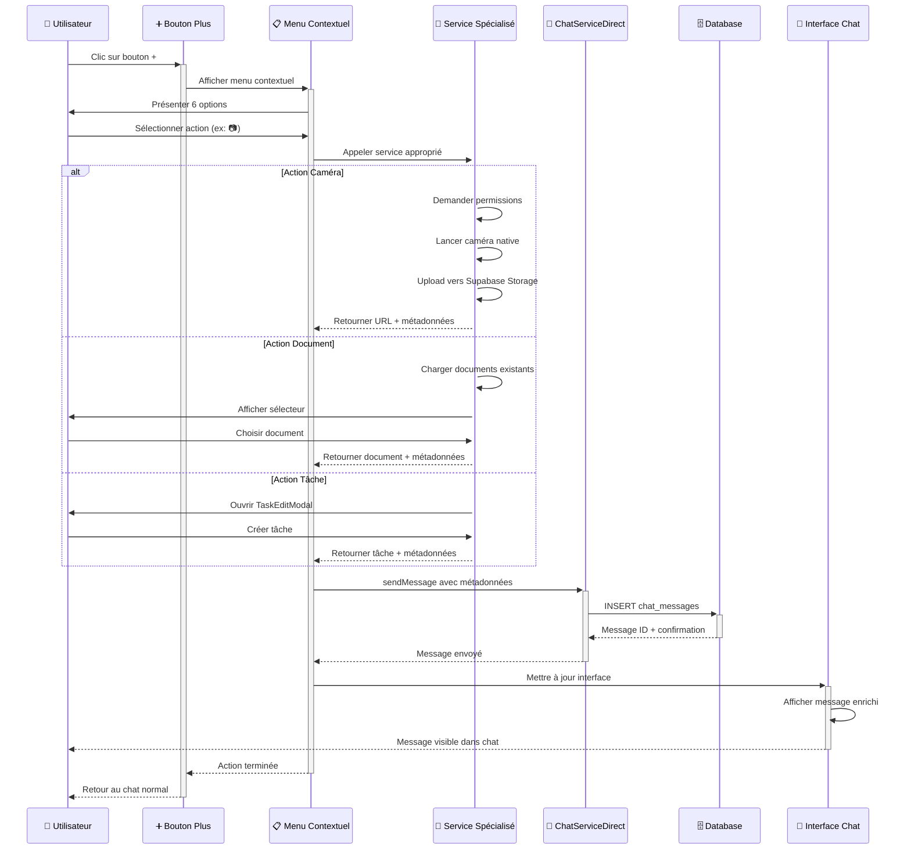

# 🔗 ARCHITECTURE D'INTÉGRATION - Bouton "+" Chat

## 🎯 Vue d'Ensemble

**Objectif**: Assurer une intégration parfaite du bouton "+" avec le système de chat existant de Thomas V2, en respectant l'architecture actuelle et en optimisant les performances.

**Approche**: Intégration progressive sans disruption du système existant, réutilisation maximale des services et composants.

---

## 📊 Analyse du Système Existant

### ✅ **Architecture Chat Actuelle**

#### 🏗️ **Composants Principaux**
```
src/components/
├── ChatConversation.tsx          # Composant principal du chat
├── ChatList.tsx                  # Liste des conversations
└── chat/
    ├── AIMessage.tsx             # Messages de l'IA
    ├── AIResponseWithActions.tsx # Réponses avec actions
    └── TypingIndicator.tsx       # Indicateur de frappe
```

#### 🔧 **Services Existants**
```
src/services/
├── ChatServiceDirect.ts          # Service principal chat
├── aiChatService.ts              # Service IA intégré
├── DocumentService.ts            # Gestion documents (✅ RÉUTILISABLE)
├── auth.ts                       # Authentification
└── DirectSupabaseService.ts      # Service Supabase direct
```

#### 🗄️ **Base de Données**
```sql
-- Tables chat existantes
chat_sessions                     # Sessions de chat
chat_messages                     # Messages avec métadonnées
chat_participants                 # Participants aux chats
chat_message_analyses             # Analyses IA des messages
chat_analyzed_actions             # Actions détectées par l'IA
chat_agent_executions             # Logs d'exécution agent

-- Tables métier réutilisables
documents                         # Documents (✅ INTÉGRABLE)
tasks                            # Tâches (✅ INTÉGRABLE)
farms                            # Fermes (✅ CONTEXTE)
plots                            # Parcelles (✅ CONTEXTE)
```

### 🔍 **Points d'Intégration Identifiés**

#### 1. **Bouton Plus Existant** (Ligne 1008 - ChatConversation.tsx)
```typescript
// EXISTANT - Bouton basique
<TouchableOpacity style={{
  width: 36,
  height: 36,
  borderRadius: 18,
  backgroundColor: '#374151',
  justifyContent: 'center',
  alignItems: 'center',
}}>
  <Ionicons name="add" size={22} color="#ffffff" />
</TouchableOpacity>

// NOUVEAU - Bouton avec menu contextuel
<TouchableOpacity 
  ref={plusButtonRef}
  onPress={handlePlusPress}  // ← NOUVEAU HANDLER
  style={/* styles identiques */}
>
  <Ionicons name="add" size={22} color="#ffffff" />
</TouchableOpacity>
```

#### 2. **Système de Messages** (Ligne 50-69 - ChatConversation.tsx)
```typescript
// EXISTANT - Interface Message
interface Message {
  id: string;
  text: string;
  isUser: boolean;
  timestamp: Date;
  isAI?: boolean;
  metadata?: Record<string, any>; // ← EXTENSIBLE pour nos données
}

// EXTENSION - Nouveaux types de métadonnées
interface ExtendedMetadata {
  type?: 'image' | 'location' | 'document' | 'task';
  image_url?: string;
  image_info?: MediaResult;
  location?: LocationResult;
  document?: Document;
  task?: TaskData;
}
```

#### 3. **Service ChatServiceDirect** (Ligne 316-339)
```typescript
// EXISTANT - Méthode sendMessage
static async sendMessage(data: CreateMessageData): Promise<ChatMessage> {
  // ... code existant
  metadata: data.metadata || {}, // ← SUPPORT MÉTADONNÉES
  // ... 
}

// RÉUTILISATION - Parfaite pour nos nouveaux types de messages
```

---

## 🏗️ Architecture d'Intégration

### 📋 **Stratégie d'Intégration Non-Disruptive**

#### 1. **Extension Progressive**


#### 2. **Réutilisation Maximale**

**Services Existants Réutilisés** :
- ✅ `DocumentService.ts` → Sélection et partage de documents
- ✅ `TaskEditModal.tsx` → Création de tâches depuis le chat
- ✅ `ChatServiceDirect.ts` → Envoi de tous les nouveaux types de messages
- ✅ Navigation existante → Accès aux paramètres
- ✅ Système d'authentification → Contexte utilisateur
- ✅ `FarmContext` → Contexte de la ferme active

**Nouveaux Services Créés** :
- 🆕 `MediaService.ts` → Gestion caméra/galerie/upload
- 🆕 `LocationService.ts` → Géolocalisation GPS
- 🆕 `ChatPlusMenu.tsx` → Menu contextuel du bouton +
- 🆕 `EnrichedMessage.tsx` → Affichage des messages enrichis

### 📡 **Flux de Données Intégré**

#### 🔄 **Workflow Unifié**



---

## 🔧 Modifications Techniques Détaillées

### 1. **ChatConversation.tsx - Modifications Minimales**

#### 📍 **Points de Modification Précis**

```typescript
// LIGNE ~1008 - Remplacement du bouton existant
// AVANT:
<TouchableOpacity style={{...}}>
  <Ionicons name="add" size={22} color="#ffffff" />
</TouchableOpacity>

// APRÈS:
<TouchableOpacity 
  ref={plusButtonRef}
  onPress={handlePlusPress}
  style={{...}} // styles identiques
>
  <Ionicons name="add" size={22} color="#ffffff" />
</TouchableOpacity>

// LIGNE ~82 - Ajout d'états pour le menu
const [showPlusMenu, setShowPlusMenu] = useState(false);
const [plusButtonPosition, setPlusButtonPosition] = useState({ x: 0, y: 0 });
const [showDocumentPicker, setShowDocumentPicker] = useState(false);
const [showTaskModal, setShowTaskModal] = useState(false);

// LIGNE ~350 - Ajout des nouveaux handlers (après sendMessage)
const handlePlusPress = () => { /* ... */ };
const handlePlusAction = async (action: PlusAction) => { /* ... */ };
const handleCameraAction = async () => { /* ... */ };
const handleGalleryAction = async () => { /* ... */ };
// ... autres handlers

// LIGNE ~1079 - Ajout des modals (avant fermeture SafeAreaView)
<ChatPlusMenu
  visible={showPlusMenu}
  onClose={() => setShowPlusMenu(false)}
  onActionSelect={handlePlusAction}
  position={plusButtonPosition}
  activeFarm={activeFarm}
  currentUserId={currentUserId}
/>

<DocumentPickerModal
  visible={showDocumentPicker}
  onClose={() => setShowDocumentPicker(false)}
  onDocumentSelect={handleDocumentSelect}
  farmId={activeFarm?.farm_id || 0}
/>

<TaskEditModal
  visible={showTaskModal}
  onClose={() => setShowTaskModal(false)}
  onSave={handleTaskSave}
  activeFarm={activeFarm}
  selectedDate={new Date()}
/>
```

#### 🔄 **Fonction adaptChatMessageToMessage - Extension**

```typescript
// LIGNE ~50 - Extension de la fonction existante
function adaptChatMessageToMessage(chatMessage: ChatMessage): Message {
  const metadata = chatMessage.metadata as any || {};
  const actions = metadata.actions || [];
  const hasActions = metadata.has_actions || actions.length > 0;
  
  return {
    id: chatMessage.id,
    text: chatMessage.content,
    isUser: chatMessage.role === 'user',
    timestamp: new Date(chatMessage.created_at),
    isAI: chatMessage.role === 'assistant',
    isAnalyzing: false,
    actions: actions,
    hasActions: hasActions,
    confidence: chatMessage.ai_confidence || metadata.confidence,
    analysis_id: metadata.analysis_id,
    // ✅ NOUVEAU - Support des métadonnées enrichies
    metadata: metadata, // Passer toutes les métadonnées pour EnrichedMessage
  };
}
```

### 2. **Gestion des Permissions - app.json**

#### 📱 **Permissions Déjà Configurées**

```json
// EXISTANT dans app.json - Lignes 22-38
{
  "ios": {
    "infoPlist": {
      "NSCameraUsageDescription": "Cette application a besoin d'accéder à la caméra pour prendre des photos.", // ✅ OK
      "NSMicrophoneUsageDescription": "Cette application a besoin d'accéder au microphone pour enregistrer des messages vocaux.", // ✅ OK
      "NSPhotoLibraryUsageDescription": "Cette application a besoin d'accéder à la galerie photo pour sélectionner des images." // ✅ OK
    }
  },
  "android": {
    "permissions": [
      "android.permission.CAMERA", // ✅ OK
      "android.permission.RECORD_AUDIO", // ✅ OK
      "android.permission.READ_EXTERNAL_STORAGE", // ✅ OK
      "android.permission.WRITE_EXTERNAL_STORAGE" // ✅ OK
    ]
  }
}

// AJOUT NÉCESSAIRE - Permissions de géolocalisation
{
  "ios": {
    "infoPlist": {
      // ... permissions existantes
      "NSLocationWhenInUseUsageDescription": "Cette application a besoin d'accéder à votre localisation pour partager votre position dans le chat."
    }
  },
  "android": {
    "permissions": [
      // ... permissions existantes
      "android.permission.ACCESS_FINE_LOCATION",
      "android.permission.ACCESS_COARSE_LOCATION"
    ]
  }
}
```

### 3. **Supabase Storage - Configuration**

#### ☁️ **Buckets Existants et Nouveaux**

```sql
-- EXISTANT - Bucket documents (RÉUTILISABLE)
-- Défini dans SUPABASE_SETUP.md ligne 209
CREATE BUCKET documents (
  public: false,
  file_size_limit: 10MB,
  allowed_mime_types: ['application/pdf', 'image/*']
);

-- NOUVEAU - Bucket photos pour chat
CREATE BUCKET photos (
  public: false,
  file_size_limit: 10MB,
  allowed_mime_types: ['image/jpeg', 'image/png', 'image/webp', 'image/gif']
);

-- Politiques RLS pour photos
CREATE POLICY "Users can upload photos to their farm" ON storage.objects
FOR INSERT WITH CHECK (
  bucket_id = 'photos' AND
  auth.uid()::text = (storage.foldername(name))[2] -- Vérifier user_id dans le path
);

CREATE POLICY "Users can view photos from their farms" ON storage.objects
FOR SELECT USING (
  bucket_id = 'photos' AND
  EXISTS (
    SELECT 1 FROM farm_members fm
    WHERE fm.user_id = auth.uid()
    AND fm.farm_id::text = (storage.foldername(name))[1]
    AND fm.is_active = true
  )
);
```

### 4. **Types TypeScript - Extensions**

#### 🏷️ **Nouveaux Types d'Interface**

```typescript
// src/types/chat.ts - NOUVEAU FICHIER
export type PlusAction = 
  | 'camera'
  | 'gallery' 
  | 'location'
  | 'document'
  | 'task'
  | 'settings';

export interface ExtendedMessageMetadata {
  type?: 'image' | 'location' | 'document' | 'task';
  
  // Métadonnées image
  image_url?: string;
  image_info?: {
    fileName: string;
    fileSize: number;
    mimeType: string;
    width?: number;
    height?: number;
  };
  
  // Métadonnées localisation
  location?: {
    latitude: number;
    longitude: number;
    accuracy: number;
    altitude?: number;
    address?: string;
    timestamp: number;
  };
  maps_url?: string;
  
  // Métadonnées document
  document?: {
    id: string;
    name: string;
    category: string;
    file_name: string;
    file_type: string;
    file_size: number;
    download_url: string;
  };
  
  // Métadonnées tâche
  task?: {
    id: string;
    title: string;
    type: 'completed' | 'planned';
    date: string;
    duration?: number;
    people?: number;
    category?: string;
    crops?: string[];
    plots?: string[];
    notes?: string;
    status?: string;
  };
  
  // Métadonnées communes
  shared_at?: string;
  uploaded_at?: string;
  created_at?: string;
}

// Extension de l'interface Message existante
export interface EnrichedMessage extends Message {
  metadata?: ExtendedMessageMetadata;
}
```

---

## 🔄 Migration et Déploiement

### 📋 **Plan de Migration Progressive**

#### **Phase 1 : Préparation (0.5 jour)**
```bash
# 1. Ajouter les nouvelles dépendances
npm install expo-image-picker expo-location expo-media-library

# 2. Créer les nouveaux services
touch src/services/MediaService.ts
touch src/services/LocationService.ts

# 3. Créer les nouveaux composants
touch src/design-system/components/chat/ChatPlusMenu.tsx
touch src/design-system/components/chat/EnrichedMessage.tsx
touch src/design-system/components/modals/DocumentPickerModal.tsx

# 4. Créer les types
touch src/types/chat.ts
```

#### **Phase 2 : Implémentation Core (2 jours)**
```bash
# 1. Implémenter MediaService et LocationService
# 2. Créer ChatPlusMenu avec menu contextuel
# 3. Modifier ChatConversation.tsx (modifications minimales)
# 4. Tester intégration de base
```

#### **Phase 3 : Fonctionnalités Avancées (2 jours)**
```bash
# 1. Implémenter DocumentPickerModal
# 2. Créer EnrichedMessage pour affichage enrichi
# 3. Intégrer TaskEditModal
# 4. Ajouter navigation vers paramètres
```

#### **Phase 4 : Tests et Optimisation (0.5 jour)**
```bash
# 1. Tests d'intégration complets
# 2. Optimisation performances
# 3. Tests sur iOS et Android
# 4. Documentation finale
```

### 🧪 **Tests de Non-Régression**

```typescript
// Tests critiques pour s'assurer que l'existant fonctionne toujours
describe('Chat Integration - Non-Regression Tests', () => {
  
  test('Existing chat functionality should work', async () => {
    // 1. Envoi de message texte normal
    // 2. Réception de réponse IA
    // 3. Analyse de message agricole
    // 4. Création d'actions par l'IA
    // 5. Archivage de chat
  });

  test('Existing TaskEditModal should work independently', async () => {
    // 1. Ouverture depuis autre écran
    // 2. Création de tâche normale
    // 3. Sauvegarde en base
  });

  test('Existing DocumentService should work normally', async () => {
    // 1. Chargement documents
    // 2. Upload de document
    // 3. Suppression de document
  });

  test('Chat real-time functionality should work', async () => {
    // 1. Subscription temps réel
    // 2. Réception de nouveaux messages
    // 3. Synchronisation multi-device
  });
});
```

---

## 🎯 Avantages de Cette Approche

### 1. **Intégration Sans Disruption**
- ✅ Modifications minimales du code existant
- ✅ Réutilisation maximale des services
- ✅ Pas de régression sur les fonctionnalités existantes
- ✅ Migration progressive possible

### 2. **Architecture Cohérente**
- ✅ Respect des patterns existants
- ✅ Utilisation des mêmes services (Supabase, auth, etc.)
- ✅ Interface utilisateur cohérente
- ✅ Gestion d'erreurs unifiée

### 3. **Performance Optimisée**
- ✅ Chargement à la demande des fonctionnalités
- ✅ Réutilisation du cache existant
- ✅ Upload optimisé vers Supabase Storage
- ✅ Pas de duplication de données

### 4. **Maintenabilité**
- ✅ Code modulaire et découplé
- ✅ Services testables indépendamment
- ✅ Documentation complète
- ✅ Types TypeScript stricts

### 5. **Expérience Utilisateur**
- ✅ Interface familière et intuitive
- ✅ Workflow naturel depuis le chat
- ✅ Feedback immédiat sur les actions
- ✅ Gestion intelligente des permissions

---

## 🚀 Conclusion

Cette architecture d'intégration garantit une **extension harmonieuse** du système de chat existant avec le bouton "+" multifonctionnel, tout en :

- **Préservant** l'existant qui fonctionne
- **Réutilisant** au maximum les services et composants
- **Respectant** l'architecture et les patterns actuels
- **Optimisant** les performances et l'expérience utilisateur

Le résultat sera un **chat enrichi et polyvalent** parfaitement intégré à l'écosystème Thomas V2 existant ! 🌱