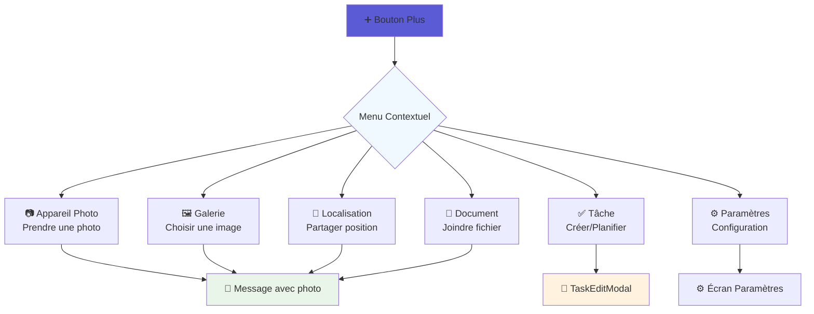

# 🔥 ROADMAP BOUTON "+" CHAT - Fonctionnalités Avancées

## 🎯 Vue d'Ensemble

**Objectif**: Transformer le bouton "+" du chat en hub multifonctionnel permettant d'ajouter images, documents, localisation, créer des tâches et configurer l'application.

**Durée Totale**: 5 jours ouvrés  
**Approche**: Développement modulaire avec intégration progressive au système de chat existant

---

## 📊 État Actuel vs Vision Cible

### ✅ **Existant (Bien implémenté)**
- Système de chat temps réel avec `ChatConversation.tsx`
- Service de documents complet (`DocumentService.ts`)
- Gestion des permissions caméra/microphone (`app.json`)
- Architecture de base de données robuste
- Modal `TaskEditModal.tsx` pour créer/éditer des tâches
- Système d'authentification et de fermes

### ❌ **Manquant (À construire)**
- Interface du bouton "+" avec menu contextuel
- Intégration caméra/galerie pour photos
- Sélecteur de géolocalisation
- Intégration documents dans le chat
- Raccourcis vers les paramètres
- Workflow unifié chat + actions

---

## 🏗️ PHASE 1: Architecture du Bouton "+" 

**Durée**: 1 jour | **Priorité**: Critique

### Étape 1.1: Composant Menu Contextuel

**Fichier**: `src/design-system/components/chat/ChatPlusMenu.tsx`

#### 🎨 **Design du Menu Contextuel**



#### 🏗️ **Structure du Composant**

```typescript
interface ChatPlusMenuProps {
  visible: boolean;
  onClose: () => void;
  onActionSelect: (action: PlusAction) => void;
  position: { x: number; y: number };
  activeFarm?: Farm;
  currentUserId?: string;
}

type PlusAction = 
  | 'camera'
  | 'gallery' 
  | 'location'
  | 'document'
  | 'task'
  | 'settings';

export const ChatPlusMenu: React.FC<ChatPlusMenuProps> = ({
  visible,
  onClose,
  onActionSelect,
  position,
  activeFarm,
  currentUserId,
}) => {
  const menuItems = [
    {
      id: 'camera' as PlusAction,
      icon: 'camera',
      title: 'Appareil Photo',
      subtitle: 'Prendre une photo',
      color: '#ef4444',
      requiresPermission: 'camera',
    },
    {
      id: 'gallery' as PlusAction,
      icon: 'images',
      title: 'Galerie',
      subtitle: 'Choisir une image',
      color: '#8b5cf6',
      requiresPermission: 'photos',
    },
    {
      id: 'location' as PlusAction,
      icon: 'location',
      title: 'Localisation',
      subtitle: 'Partager position',
      color: '#10b981',
      requiresPermission: 'location',
    },
    {
      id: 'document' as PlusAction,
      icon: 'document-text',
      title: 'Document',
      subtitle: 'Joindre fichier',
      color: '#f59e0b',
      requiresPermission: null,
    },
    {
      id: 'task' as PlusAction,
      icon: 'checkmark-circle',
      title: 'Tâche',
      subtitle: 'Créer/Planifier',
      color: '#3b82f6',
      requiresPermission: null,
    },
    {
      id: 'settings' as PlusAction,
      icon: 'settings',
      title: 'Paramètres',
      subtitle: 'Configuration',
      color: '#6b7280',
      requiresPermission: null,
    },
  ];

  return (
    <Modal
      visible={visible}
      transparent
      animationType="fade"
      onRequestClose={onClose}
    >
      <TouchableOpacity 
        style={styles.overlay} 
        activeOpacity={1} 
        onPress={onClose}
      >
        <Animated.View 
          style={[
            styles.menu,
            {
              left: position.x - 150, // Centrer sur le bouton
              bottom: position.y + 60, // Au-dessus du bouton
            }
          ]}
        >
          {menuItems.map((item) => (
            <TouchableOpacity
              key={item.id}
              style={styles.menuItem}
              onPress={() => {
                onActionSelect(item.id);
                onClose();
              }}
            >
              <View style={[styles.iconContainer, { backgroundColor: item.color }]}>
                <Ionicons name={item.icon} size={24} color="#ffffff" />
              </View>
              <View style={styles.textContainer}>
                <Text style={styles.title}>{item.title}</Text>
                <Text style={styles.subtitle}>{item.subtitle}</Text>
              </View>
            </TouchableOpacity>
          ))}
        </Animated.View>
      </TouchableOpacity>
    </Modal>
  );
};
```

### Étape 1.2: Intégration dans ChatConversation

**Modification**: `src/components/ChatConversation.tsx`

#### 🔄 **Modifications du Bouton Plus Existant**

```typescript
// Dans ChatConversation.tsx - ligne 1008
// Remplacer le TouchableOpacity existant par:

const [showPlusMenu, setShowPlusMenu] = useState(false);
const [plusButtonPosition, setPlusButtonPosition] = useState({ x: 0, y: 0 });
const plusButtonRef = useRef<TouchableOpacity>(null);

// Nouveau handler pour le bouton plus
const handlePlusPress = () => {
  // Mesurer la position du bouton pour positionner le menu
  plusButtonRef.current?.measure((fx, fy, width, height, px, py) => {
    setPlusButtonPosition({ x: px + width/2, y: py });
    setShowPlusMenu(true);
  });
};

// Nouveau handler pour les actions du menu
const handlePlusAction = async (action: PlusAction) => {
  switch (action) {
    case 'camera':
      await handleCameraAction();
      break;
    case 'gallery':
      await handleGalleryAction();
      break;
    case 'location':
      await handleLocationAction();
      break;
    case 'document':
      await handleDocumentAction();
      break;
    case 'task':
      handleTaskAction();
      break;
    case 'settings':
      handleSettingsAction();
      break;
  }
};

// Remplacer le bouton plus existant:
<TouchableOpacity 
  ref={plusButtonRef}
  onPress={handlePlusPress}
  style={{
    width: 36,
    height: 36,
    borderRadius: 18,
    backgroundColor: '#374151',
    justifyContent: 'center',
    alignItems: 'center',
  }}
>
  <Ionicons name="add" size={22} color="#ffffff" />
</TouchableOpacity>

// Ajouter le menu contextuel:
<ChatPlusMenu
  visible={showPlusMenu}
  onClose={() => setShowPlusMenu(false)}
  onActionSelect={handlePlusAction}
  position={plusButtonPosition}
  activeFarm={activeFarm}
  currentUserId={currentUserId}
/>
```

---

## 📷 PHASE 2: Fonctionnalités Caméra et Galerie

**Durée**: 1 jour | **Priorité**: Haute

### Étape 2.1: Service de Gestion des Médias

**Fichier**: `src/services/MediaService.ts`

#### 📱 **Service Unifié pour Images**

```typescript
import * as ImagePicker from 'expo-image-picker';
import * as MediaLibrary from 'expo-media-library';
import { Platform, Alert } from 'react-native';

export interface MediaResult {
  uri: string;
  type: 'image' | 'video';
  fileName: string;
  fileSize: number;
  mimeType: string;
  width?: number;
  height?: number;
}

export interface MediaUploadResult {
  success: boolean;
  fileUrl?: string;
  fileName?: string;
  error?: string;
}

class MediaService {
  
  /**
   * Vérifier et demander les permissions nécessaires
   */
  async requestPermissions(): Promise<{
    camera: boolean;
    mediaLibrary: boolean;
  }> {
    try {
      const [cameraResult, mediaResult] = await Promise.all([
        ImagePicker.requestCameraPermissionsAsync(),
        ImagePicker.requestMediaLibraryPermissionsAsync(),
      ]);

      return {
        camera: cameraResult.status === 'granted',
        mediaLibrary: mediaResult.status === 'granted',
      };
    } catch (error) {
      console.error('Erreur lors de la demande de permissions:', error);
      return { camera: false, mediaLibrary: false };
    }
  }

  /**
   * Prendre une photo avec l'appareil photo
   */
  async takePhoto(): Promise<MediaResult | null> {
    try {
      // Vérifier les permissions
      const permissions = await this.requestPermissions();
      if (!permissions.camera) {
        Alert.alert(
          'Permission requise',
          'L\'accès à l\'appareil photo est nécessaire pour prendre des photos.',
          [
            { text: 'Annuler', style: 'cancel' },
            { text: 'Paramètres', onPress: () => this.openAppSettings() }
          ]
        );
        return null;
      }

      // Lancer l'appareil photo
      const result = await ImagePicker.launchCameraAsync({
        mediaTypes: ImagePicker.MediaTypeOptions.Images,
        allowsEditing: true,
        aspect: [4, 3],
        quality: 0.8,
        exif: true, // Inclure métadonnées GPS si disponibles
      });

      if (result.canceled || !result.assets?.[0]) {
        return null;
      }

      const asset = result.assets[0];
      return this.formatMediaResult(asset);
      
    } catch (error) {
      console.error('Erreur lors de la prise de photo:', error);
      Alert.alert('Erreur', 'Impossible de prendre la photo');
      return null;
    }
  }

  /**
   * Sélectionner une image depuis la galerie
   */
  async pickFromGallery(): Promise<MediaResult | null> {
    try {
      // Vérifier les permissions
      const permissions = await this.requestPermissions();
      if (!permissions.mediaLibrary) {
        Alert.alert(
          'Permission requise',
          'L\'accès à la galerie est nécessaire pour sélectionner des photos.',
          [
            { text: 'Annuler', style: 'cancel' },
            { text: 'Paramètres', onPress: () => this.openAppSettings() }
          ]
        );
        return null;
      }

      // Ouvrir la galerie
      const result = await ImagePicker.launchImageLibraryAsync({
        mediaTypes: ImagePicker.MediaTypeOptions.Images,
        allowsEditing: true,
        aspect: [4, 3],
        quality: 0.8,
        exif: true,
      });

      if (result.canceled || !result.assets?.[0]) {
        return null;
      }

      const asset = result.assets[0];
      return this.formatMediaResult(asset);
      
    } catch (error) {
      console.error('Erreur lors de la sélection d\'image:', error);
      Alert.alert('Erreur', 'Impossible de sélectionner l\'image');
      return null;
    }
  }

  /**
   * Uploader une image vers Supabase Storage
   */
  async uploadImage(
    mediaResult: MediaResult, 
    farmId: number,
    category: 'chat' | 'documents' | 'profile' = 'chat'
  ): Promise<MediaUploadResult> {
    try {
      // Générer un nom de fichier unique
      const timestamp = Date.now();
      const extension = this.getFileExtension(mediaResult.fileName || 'image.jpg');
      const fileName = `${category}/${farmId}/${timestamp}_${mediaResult.fileName || `image.${extension}`}`;

      // Préparer le fichier pour upload
      const formData = new FormData();
      formData.append('file', {
        uri: mediaResult.uri,
        type: mediaResult.mimeType,
        name: fileName,
      } as any);

      // Upload vers Supabase Storage
      const { data, error } = await supabase.storage
        .from('photos')
        .upload(fileName, formData, {
          cacheControl: '3600',
          upsert: false,
        });

      if (error) {
        console.error('Erreur upload Supabase:', error);
        return { success: false, error: error.message };
      }

      // Générer l'URL publique
      const { data: urlData } = supabase.storage
        .from('photos')
        .getPublicUrl(data.path);

      return {
        success: true,
        fileUrl: urlData.publicUrl,
        fileName: fileName,
      };
      
    } catch (error) {
      console.error('Erreur lors de l\'upload:', error);
      return { success: false, error: error.message };
    }
  }

  /**
   * Formater le résultat d'ImagePicker
   */
  private formatMediaResult(asset: ImagePicker.ImagePickerAsset): MediaResult {
    return {
      uri: asset.uri,
      type: asset.type || 'image',
      fileName: asset.fileName || `image_${Date.now()}.jpg`,
      fileSize: asset.fileSize || 0,
      mimeType: asset.mimeType || 'image/jpeg',
      width: asset.width,
      height: asset.height,
    };
  }

  /**
   * Extraire l'extension d'un fichier
   */
  private getFileExtension(fileName: string): string {
    return fileName.split('.').pop()?.toLowerCase() || 'jpg';
  }

  /**
   * Ouvrir les paramètres de l'application
   */
  private openAppSettings(): void {
    if (Platform.OS === 'ios') {
      Linking.openURL('app-settings:');
    } else {
      Linking.openSettings();
    }
  }
}

export const mediaService = new MediaService();
```

### Étape 2.2: Intégration Chat avec Images

**Modification**: `src/components/ChatConversation.tsx`

#### 💬 **Handlers pour Caméra et Galerie**

```typescript
// Ajouter les imports nécessaires
import { mediaService, MediaResult } from '../services/MediaService';

// Ajouter les handlers dans ChatConversation
const handleCameraAction = async () => {
  try {
    console.log('📷 [CHAT] Ouverture appareil photo...');
    
    const mediaResult = await mediaService.takePhoto();
    if (!mediaResult) {
      console.log('📷 [CHAT] Prise de photo annulée');
      return;
    }

    // Uploader l'image
    console.log('☁️ [CHAT] Upload de l\'image...');
    const uploadResult = await mediaService.uploadImage(
      mediaResult, 
      activeFarm?.farm_id || 0, 
      'chat'
    );

    if (!uploadResult.success) {
      Alert.alert('Erreur', 'Impossible d\'uploader l\'image');
      return;
    }

    // Envoyer dans le chat avec l'image
    await sendImageMessage(uploadResult.fileUrl!, mediaResult);
    
  } catch (error) {
    console.error('❌ [CHAT] Erreur appareil photo:', error);
    Alert.alert('Erreur', 'Impossible de prendre la photo');
  }
};

const handleGalleryAction = async () => {
  try {
    console.log('🖼️ [CHAT] Ouverture galerie...');
    
    const mediaResult = await mediaService.pickFromGallery();
    if (!mediaResult) {
      console.log('🖼️ [CHAT] Sélection annulée');
      return;
    }

    // Uploader l'image
    console.log('☁️ [CHAT] Upload de l\'image...');
    const uploadResult = await mediaService.uploadImage(
      mediaResult, 
      activeFarm?.farm_id || 0, 
      'chat'
    );

    if (!uploadResult.success) {
      Alert.alert('Erreur', 'Impossible d\'uploader l\'image');
      return;
    }

    // Envoyer dans le chat avec l'image
    await sendImageMessage(uploadResult.fileUrl!, mediaResult);
    
  } catch (error) {
    console.error('❌ [CHAT] Erreur galerie:', error);
    Alert.alert('Erreur', 'Impossible de sélectionner l\'image');
  }
};

// Nouvelle fonction pour envoyer un message avec image
const sendImageMessage = async (imageUrl: string, mediaInfo: MediaResult) => {
  if (!chat) return;

  try {
    // Créer le message avec métadonnées image
    const imageMessage = `📷 Image partagée\n\n[Image: ${mediaInfo.fileName}]`;
    
    const messageMetadata = {
      type: 'image',
      image_url: imageUrl,
      image_info: {
        fileName: mediaInfo.fileName,
        fileSize: mediaInfo.fileSize,
        mimeType: mediaInfo.mimeType,
        width: mediaInfo.width,
        height: mediaInfo.height,
      },
      uploaded_at: new Date().toISOString(),
    };

    // Envoyer le message avec métadonnées
    const dbMessage = await ChatService.sendMessage({
      session_id: chat.id,
      role: 'user',
      content: imageMessage,
      metadata: messageMetadata,
    });

    console.log('✅ [CHAT] Message image envoyé:', dbMessage.id);

    // Mettre à jour l'UI localement
    const adaptedMessage = adaptChatMessageToMessage(dbMessage);
    setMessages(prev => [...prev, adaptedMessage]);

    // Défiler vers le bas
    setTimeout(() => {
      scrollViewRef.current?.scrollToEnd({ animated: true });
    }, 100);

    // Mettre à jour le chat
    onUpdateChat(chat.id, {
      lastMessage: '📷 Image partagée',
      timestamp: new Date(),
      messageCount: messages.length + 1
    });

  } catch (error) {
    console.error('❌ [CHAT] Erreur envoi message image:', error);
    Alert.alert('Erreur', 'Impossible d\'envoyer l\'image');
  }
};
```

---

## 📍 PHASE 3: Fonctionnalité Géolocalisation

**Durée**: 0.5 jour | **Priorité**: Moyenne

### Étape 3.1: Service de Géolocalisation

**Fichier**: `src/services/LocationService.ts`

#### 🗺️ **Service de Localisation**

```typescript
import * as Location from 'expo-location';
import { Platform, Alert, Linking } from 'react-native';

export interface LocationResult {
  latitude: number;
  longitude: number;
  accuracy: number;
  altitude?: number;
  address?: string;
  timestamp: number;
}

export interface LocationPermissionStatus {
  granted: boolean;
  canAskAgain: boolean;
  status: Location.LocationPermissionResponse['status'];
}

class LocationService {
  
  /**
   * Vérifier et demander les permissions de géolocalisation
   */
  async requestLocationPermission(): Promise<LocationPermissionStatus> {
    try {
      // Vérifier les permissions actuelles
      const { status: existingStatus } = await Location.getForegroundPermissionsAsync();
      
      if (existingStatus === 'granted') {
        return { granted: true, canAskAgain: true, status: existingStatus };
      }

      // Demander les permissions
      const { status, canAskAgain } = await Location.requestForegroundPermissionsAsync();
      
      return {
        granted: status === 'granted',
        canAskAgain,
        status,
      };
      
    } catch (error) {
      console.error('Erreur lors de la demande de permission de localisation:', error);
      return { granted: false, canAskAgain: false, status: 'denied' };
    }
  }

  /**
   * Obtenir la position actuelle
   */
  async getCurrentLocation(): Promise<LocationResult | null> {
    try {
      // Vérifier les permissions
      const permission = await this.requestLocationPermission();
      
      if (!permission.granted) {
        Alert.alert(
          'Permission requise',
          'L\'accès à la localisation est nécessaire pour partager votre position.',
          [
            { text: 'Annuler', style: 'cancel' },
            { text: 'Paramètres', onPress: () => this.openLocationSettings() }
          ]
        );
        return null;
      }

      // Obtenir la position
      console.log('📍 [LOCATION] Récupération position...');
      const location = await Location.getCurrentPositionAsync({
        accuracy: Location.Accuracy.Balanced,
        timeInterval: 10000,
        distanceInterval: 10,
      });

      // Géocodage inverse pour obtenir l'adresse
      let address: string | undefined;
      try {
        const [addressResult] = await Location.reverseGeocodeAsync({
          latitude: location.coords.latitude,
          longitude: location.coords.longitude,
        });

        if (addressResult) {
          address = this.formatAddress(addressResult);
        }
      } catch (geocodeError) {
        console.warn('Erreur géocodage inverse:', geocodeError);
        // Continuer sans adresse
      }

      return {
        latitude: location.coords.latitude,
        longitude: location.coords.longitude,
        accuracy: location.coords.accuracy || 0,
        altitude: location.coords.altitude || undefined,
        address,
        timestamp: location.timestamp,
      };
      
    } catch (error) {
      console.error('Erreur lors de l\'obtention de la position:', error);
      Alert.alert('Erreur', 'Impossible d\'obtenir votre position');
      return null;
    }
  }

  /**
   * Formater l'adresse depuis le géocodage inverse
   */
  private formatAddress(addressComponent: Location.LocationGeocodedAddress): string {
    const parts = [];
    
    if (addressComponent.streetNumber && addressComponent.street) {
      parts.push(`${addressComponent.streetNumber} ${addressComponent.street}`);
    } else if (addressComponent.street) {
      parts.push(addressComponent.street);
    }
    
    if (addressComponent.city) {
      parts.push(addressComponent.city);
    }
    
    if (addressComponent.postalCode) {
      parts.push(addressComponent.postalCode);
    }
    
    if (addressComponent.region) {
      parts.push(addressComponent.region);
    }

    return parts.join(', ') || 'Adresse inconnue';
  }

  /**
   * Générer une URL Google Maps pour la position
   */
  generateMapsUrl(latitude: number, longitude: number): string {
    return `https://www.google.com/maps?q=${latitude},${longitude}`;
  }

  /**
   * Ouvrir les paramètres de localisation
   */
  private openLocationSettings(): void {
    if (Platform.OS === 'ios') {
      Linking.openURL('app-settings:');
    } else {
      Linking.openSettings();
    }
  }
}

export const locationService = new LocationService();
```

### Étape 3.2: Intégration Chat avec Localisation

**Modification**: `src/components/ChatConversation.tsx`

#### 📍 **Handler pour Localisation**

```typescript
// Ajouter l'import
import { locationService, LocationResult } from '../services/LocationService';

// Ajouter le handler dans ChatConversation
const handleLocationAction = async () => {
  try {
    console.log('📍 [CHAT] Récupération localisation...');
    
    const locationResult = await locationService.getCurrentLocation();
    if (!locationResult) {
      console.log('📍 [CHAT] Localisation annulée');
      return;
    }

    // Envoyer la localisation dans le chat
    await sendLocationMessage(locationResult);
    
  } catch (error) {
    console.error('❌ [CHAT] Erreur localisation:', error);
    Alert.alert('Erreur', 'Impossible d\'obtenir la localisation');
  }
};

// Fonction pour envoyer un message avec localisation
const sendLocationMessage = async (location: LocationResult) => {
  if (!chat) return;

  try {
    // Créer le message avec informations de localisation
    const mapsUrl = locationService.generateMapsUrl(location.latitude, location.longitude);
    const locationMessage = `📍 Localisation partagée\n\n` +
      `${location.address || 'Position GPS'}\n` +
      `Coordonnées: ${location.latitude.toFixed(6)}, ${location.longitude.toFixed(6)}\n` +
      `Précision: ${Math.round(location.accuracy)}m\n\n` +
      `🗺️ Voir sur Google Maps: ${mapsUrl}`;
    
    const messageMetadata = {
      type: 'location',
      location: {
        latitude: location.latitude,
        longitude: location.longitude,
        accuracy: location.accuracy,
        altitude: location.altitude,
        address: location.address,
        timestamp: location.timestamp,
      },
      maps_url: mapsUrl,
      shared_at: new Date().toISOString(),
    };

    // Envoyer le message avec métadonnées
    const dbMessage = await ChatService.sendMessage({
      session_id: chat.id,
      role: 'user',
      content: locationMessage,
      metadata: messageMetadata,
    });

    console.log('✅ [CHAT] Message localisation envoyé:', dbMessage.id);

    // Mettre à jour l'UI localement
    const adaptedMessage = adaptChatMessageToMessage(dbMessage);
    setMessages(prev => [...prev, adaptedMessage]);

    // Défiler vers le bas
    setTimeout(() => {
      scrollViewRef.current?.scrollToEnd({ animated: true });
    }, 100);

    // Mettre à jour le chat
    onUpdateChat(chat.id, {
      lastMessage: '📍 Localisation partagée',
      timestamp: new Date(),
      messageCount: messages.length + 1
    });

  } catch (error) {
    console.error('❌ [CHAT] Erreur envoi message localisation:', error);
    Alert.alert('Erreur', 'Impossible d\'envoyer la localisation');
  }
};
```

---

## 📄 PHASE 4: Fonctionnalité Documents

**Durée**: 0.5 jour | **Priorité**: Moyenne

### Étape 4.1: Sélecteur de Documents

**Fichier**: `src/design-system/components/modals/DocumentPickerModal.tsx`

#### 📋 **Modal de Sélection de Documents**

```typescript
import React, { useState, useEffect } from 'react';
import { View, ScrollView, TouchableOpacity, Alert } from 'react-native';
import { Modal } from '../Modal';
import { Text } from '../Text';
import { Button } from '../Button';
import { Input } from '../Input';
import { colors } from '../../colors';
import { spacing } from '../../spacing';
import { Ionicons } from '@expo/vector-icons';
import { documentService, Document } from '../../../services/DocumentService';

export interface DocumentPickerModalProps {
  visible: boolean;
  onClose: () => void;
  onDocumentSelect: (document: Document) => void;
  farmId: number;
}

export const DocumentPickerModal: React.FC<DocumentPickerModalProps> = ({
  visible,
  onClose,
  onDocumentSelect,
  farmId,
}) => {
  const [documents, setDocuments] = useState<Document[]>([]);
  const [filteredDocuments, setFilteredDocuments] = useState<Document[]>([]);
  const [searchTerm, setSearchTerm] = useState('');
  const [selectedCategory, setSelectedCategory] = useState<string>('all');
  const [loading, setLoading] = useState(false);

  // Charger les documents au montage
  useEffect(() => {
    if (visible && farmId) {
      loadDocuments();
    }
  }, [visible, farmId]);

  // Filtrer les documents selon la recherche et catégorie
  useEffect(() => {
    let filtered = documents;

    // Filtrer par catégorie
    if (selectedCategory !== 'all') {
      filtered = filtered.filter(doc => doc.category === selectedCategory);
    }

    // Filtrer par terme de recherche
    if (searchTerm.trim()) {
      const term = searchTerm.toLowerCase();
      filtered = filtered.filter(doc => 
        doc.name.toLowerCase().includes(term) ||
        doc.description?.toLowerCase().includes(term) ||
        doc.file_name.toLowerCase().includes(term)
      );
    }

    setFilteredDocuments(filtered);
  }, [documents, searchTerm, selectedCategory]);

  const loadDocuments = async () => {
    try {
      setLoading(true);
      const docs = await documentService.getDocumentsByFarm(farmId);
      setDocuments(docs);
    } catch (error) {
      console.error('Erreur chargement documents:', error);
      Alert.alert('Erreur', 'Impossible de charger les documents');
    } finally {
      setLoading(false);
    }
  };

  const categories = [
    { id: 'all', label: 'Tous', icon: 'folder' },
    { id: 'photos', label: 'Photos', icon: 'camera' },
    { id: 'analyse-sol', label: 'Analyses', icon: 'flask' },
    { id: 'certifications', label: 'Certifications', icon: 'ribbon' },
    { id: 'contrats', label: 'Contrats', icon: 'document-text' },
    { id: 'autre', label: 'Autres', icon: 'ellipsis-horizontal' },
  ];

  const formatFileSize = (bytes: number): string => {
    if (bytes === 0) return '0 B';
    const k = 1024;
    const sizes = ['B', 'KB', 'MB', 'GB'];
    const i = Math.floor(Math.log(bytes) / Math.log(k));
    return parseFloat((bytes / Math.pow(k, i)).toFixed(2)) + ' ' + sizes[i];
  };

  const getDocumentIcon = (fileType: string): string => {
    if (fileType.startsWith('image/')) return 'image';
    if (fileType === 'application/pdf') return 'document-text';
    if (fileType.includes('word')) return 'document';
    if (fileType.includes('excel') || fileType.includes('spreadsheet')) return 'grid';
    return 'document-outline';
  };

  return (
    <Modal
      visible={visible}
      onClose={onClose}
      title="Sélectionner un document"
      size="lg"
    >
      <View style={{ flex: 1 }}>
        
        {/* Barre de recherche */}
        <Input
          placeholder="Rechercher un document..."
          value={searchTerm}
          onChangeText={setSearchTerm}
          leftIcon="search"
          style={{ marginBottom: spacing.md }}
        />

        {/* Filtres par catégorie */}
        <ScrollView 
          horizontal 
          showsHorizontalScrollIndicator={false}
          style={{ marginBottom: spacing.md }}
          contentContainerStyle={{ gap: spacing.sm }}
        >
          {categories.map((category) => (
            <TouchableOpacity
              key={category.id}
              onPress={() => setSelectedCategory(category.id)}
              style={{
                flexDirection: 'row',
                alignItems: 'center',
                paddingHorizontal: spacing.md,
                paddingVertical: spacing.sm,
                borderRadius: 20,
                backgroundColor: selectedCategory === category.id 
                  ? colors.primary[500] 
                  : colors.gray[100],
                gap: spacing.xs,
              }}
            >
              <Ionicons 
                name={category.icon} 
                size={16} 
                color={selectedCategory === category.id ? '#ffffff' : colors.gray[600]} 
              />
              <Text 
                style={{ 
                  color: selectedCategory === category.id ? '#ffffff' : colors.gray[700],
                  fontSize: 14,
                  fontWeight: '500',
                }}
              >
                {category.label}
              </Text>
            </TouchableOpacity>
          ))}
        </ScrollView>

        {/* Liste des documents */}
        <ScrollView style={{ flex: 1 }}>
          {loading ? (
            <View style={{ 
              flex: 1, 
              justifyContent: 'center', 
              alignItems: 'center',
              paddingVertical: spacing.xl,
            }}>
              <Text color={colors.gray[500]}>Chargement des documents...</Text>
            </View>
          ) : filteredDocuments.length === 0 ? (
            <View style={{ 
              flex: 1, 
              justifyContent: 'center', 
              alignItems: 'center',
              paddingVertical: spacing.xl,
            }}>
              <Ionicons name="document-outline" size={48} color={colors.gray[400]} />
              <Text color={colors.gray[500]} style={{ marginTop: spacing.md, textAlign: 'center' }}>
                {searchTerm || selectedCategory !== 'all' 
                  ? 'Aucun document trouvé'
                  : 'Aucun document disponible'
                }
              </Text>
            </View>
          ) : (
            <View style={{ gap: spacing.sm }}>
              {filteredDocuments.map((document) => (
                <TouchableOpacity
                  key={document.id}
                  onPress={() => {
                    onDocumentSelect(document);
                    onClose();
                  }}
                  style={{
                    flexDirection: 'row',
                    alignItems: 'center',
                    padding: spacing.md,
                    backgroundColor: colors.background.secondary,
                    borderRadius: 12,
                    borderWidth: 1,
                    borderColor: colors.border.primary,
                    gap: spacing.md,
                  }}
                >
                  {/* Icône du document */}
                  <View style={{
                    width: 40,
                    height: 40,
                    borderRadius: 8,
                    backgroundColor: colors.primary[100],
                    justifyContent: 'center',
                    alignItems: 'center',
                  }}>
                    <Ionicons 
                      name={getDocumentIcon(document.file_type)} 
                      size={20} 
                      color={colors.primary[600]} 
                    />
                  </View>

                  {/* Informations du document */}
                  <View style={{ flex: 1 }}>
                    <Text 
                      style={{ 
                        fontSize: 16, 
                        fontWeight: '600',
                        color: colors.gray[900],
                        marginBottom: 2,
                      }}
                      numberOfLines={1}
                    >
                      {document.name}
                    </Text>
                    
                    <Text 
                      style={{ 
                        fontSize: 13, 
                        color: colors.gray[600],
                        marginBottom: 4,
                      }}
                      numberOfLines={1}
                    >
                      {document.file_name}
                    </Text>
                    
                    <View style={{ flexDirection: 'row', alignItems: 'center', gap: spacing.sm }}>
                      <Text style={{ fontSize: 12, color: colors.gray[500] }}>
                        {formatFileSize(document.file_size)}
                      </Text>
                      <Text style={{ fontSize: 12, color: colors.gray[500] }}>
                        •
                      </Text>
                      <Text style={{ fontSize: 12, color: colors.gray[500] }}>
                        {new Date(document.created_at).toLocaleDateString('fr-FR')}
                      </Text>
                    </View>
                  </View>

                  {/* Flèche de sélection */}
                  <Ionicons 
                    name="chevron-forward" 
                    size={20} 
                    color={colors.gray[400]} 
                  />
                </TouchableOpacity>
              ))}
            </View>
          )}
        </ScrollView>
      </View>
    </Modal>
  );
};
```

### Étape 4.2: Intégration Chat avec Documents

**Modification**: `src/components/ChatConversation.tsx`

#### 📄 **Handler pour Documents**

```typescript
// Ajouter l'import
import { DocumentPickerModal } from '../design-system/components/modals/DocumentPickerModal';
import { Document } from '../services/DocumentService';

// Ajouter l'état pour le modal de documents
const [showDocumentPicker, setShowDocumentPicker] = useState(false);

// Ajouter le handler dans ChatConversation
const handleDocumentAction = () => {
  console.log('📄 [CHAT] Ouverture sélecteur de documents...');
  setShowDocumentPicker(true);
};

// Handler pour la sélection d'un document
const handleDocumentSelect = async (document: Document) => {
  try {
    console.log('📄 [CHAT] Document sélectionné:', document.name);
    
    // Envoyer le document dans le chat
    await sendDocumentMessage(document);
    
  } catch (error) {
    console.error('❌ [CHAT] Erreur sélection document:', error);
    Alert.alert('Erreur', 'Impossible de partager le document');
  }
};

// Fonction pour envoyer un message avec document
const sendDocumentMessage = async (document: Document) => {
  if (!chat) return;

  try {
    // Générer l'URL de téléchargement du document
    const { data } = supabase.storage
      .from(document.storage_bucket)
      .getPublicUrl(document.file_path);

    // Créer le message avec informations du document
    const documentMessage = `📄 Document partagé\n\n` +
      `📋 ${document.name}\n` +
      `📁 Catégorie: ${document.category}\n` +
      `📊 Taille: ${formatFileSize(document.file_size)}\n` +
      `📅 Créé le: ${new Date(document.created_at).toLocaleDateString('fr-FR')}\n\n` +
      `🔗 Télécharger: ${data.publicUrl}`;
    
    const messageMetadata = {
      type: 'document',
      document: {
        id: document.id,
        name: document.name,
        category: document.category,
        file_name: document.file_name,
        file_type: document.file_type,
        file_size: document.file_size,
        download_url: data.publicUrl,
      },
      shared_at: new Date().toISOString(),
    };

    // Envoyer le message avec métadonnées
    const dbMessage = await ChatService.sendMessage({
      session_id: chat.id,
      role: 'user',
      content: documentMessage,
      metadata: messageMetadata,
    });

    console.log('✅ [CHAT] Message document envoyé:', dbMessage.id);

    // Mettre à jour l'UI localement
    const adaptedMessage = adaptChatMessageToMessage(dbMessage);
    setMessages(prev => [...prev, adaptedMessage]);

    // Défiler vers le bas
    setTimeout(() => {
      scrollViewRef.current?.scrollToEnd({ animated: true });
    }, 100);

    // Mettre à jour le chat
    onUpdateChat(chat.id, {
      lastMessage: `📄 ${document.name}`,
      timestamp: new Date(),
      messageCount: messages.length + 1
    });

  } catch (error) {
    console.error('❌ [CHAT] Erreur envoi message document:', error);
    Alert.alert('Erreur', 'Impossible d\'envoyer le document');
  }
};

// Fonction utilitaire pour formater la taille des fichiers
const formatFileSize = (bytes: number): string => {
  if (bytes === 0) return '0 B';
  const k = 1024;
  const sizes = ['B', 'KB', 'MB', 'GB'];
  const i = Math.floor(Math.log(bytes) / Math.log(k));
  return parseFloat((bytes / Math.pow(k, i)).toFixed(2)) + ' ' + sizes[i];
};

// Ajouter le modal de sélection de documents dans le JSX
// (à la fin du composant, avant la fermeture de SafeAreaView)
<DocumentPickerModal
  visible={showDocumentPicker}
  onClose={() => setShowDocumentPicker(false)}
  onDocumentSelect={handleDocumentSelect}
  farmId={activeFarm?.farm_id || 0}
/>
```

---

## ✅ PHASE 5: Fonctionnalité Tâches et Paramètres

**Durée**: 1 jour | **Priorité**: Haute

### Étape 5.1: Intégration TaskEditModal

**Modification**: `src/components/ChatConversation.tsx`

#### 📝 **Handler pour Création de Tâches**

```typescript
// Ajouter l'import
import { TaskEditModal, TaskData } from '../design-system/components/modals/TaskEditModal';

// Ajouter l'état pour le modal de tâches
const [showTaskModal, setShowTaskModal] = useState(false);

// Ajouter le handler dans ChatConversation
const handleTaskAction = () => {
  console.log('✅ [CHAT] Ouverture création de tâche...');
  setShowTaskModal(true);
};

// Handler pour la sauvegarde d'une tâche
const handleTaskSave = async (taskData: TaskData) => {
  try {
    console.log('✅ [CHAT] Sauvegarde tâche:', taskData.title);
    
    // Ici, vous pouvez intégrer avec votre service de tâches existant
    // Pour l'instant, on simule la création et on envoie dans le chat
    
    // Envoyer la tâche dans le chat
    await sendTaskMessage(taskData);
    
    setShowTaskModal(false);
    
  } catch (error) {
    console.error('❌ [CHAT] Erreur sauvegarde tâche:', error);
    Alert.alert('Erreur', 'Impossible de créer la tâche');
  }
};

// Fonction pour envoyer un message avec tâche créée
const sendTaskMessage = async (task: TaskData) => {
  if (!chat) return;

  try {
    // Créer le message avec informations de la tâche
    const taskMessage = `✅ Tâche ${task.type === 'completed' ? 'effectuée' : 'planifiée'}\n\n` +
      `📋 ${task.title}\n` +
      `📅 Date: ${task.date.toLocaleDateString('fr-FR')}\n` +
      `⏱️ Durée: ${task.duration ? `${task.duration} min` : 'Non spécifiée'}\n` +
      `👥 Personnes: ${task.people || 1}\n` +
      `🏷️ Catégorie: ${task.category}\n` +
      (task.crops?.length ? `🌱 Cultures: ${task.crops.join(', ')}\n` : '') +
      (task.plots?.length ? `📍 Parcelles: ${task.plots.join(', ')}\n` : '') +
      (task.notes ? `📝 Notes: ${task.notes}\n` : '') +
      `\n🎯 Statut: ${task.status}`;
    
    const messageMetadata = {
      type: 'task',
      task: {
        id: task.id,
        title: task.title,
        type: task.type,
        date: task.date.toISOString(),
        duration: task.duration,
        people: task.people,
        category: task.category,
        crops: task.crops,
        plots: task.plots,
        notes: task.notes,
        status: task.status,
      },
      created_at: new Date().toISOString(),
    };

    // Envoyer le message avec métadonnées
    const dbMessage = await ChatService.sendMessage({
      session_id: chat.id,
      role: 'user',
      content: taskMessage,
      metadata: messageMetadata,
    });

    console.log('✅ [CHAT] Message tâche envoyé:', dbMessage.id);

    // Mettre à jour l'UI localement
    const adaptedMessage = adaptChatMessageToMessage(dbMessage);
    setMessages(prev => [...prev, adaptedMessage]);

    // Défiler vers le bas
    setTimeout(() => {
      scrollViewRef.current?.scrollToEnd({ animated: true });
    }, 100);

    // Mettre à jour le chat
    onUpdateChat(chat.id, {
      lastMessage: `✅ ${task.title}`,
      timestamp: new Date(),
      messageCount: messages.length + 1
    });

  } catch (error) {
    console.error('❌ [CHAT] Erreur envoi message tâche:', error);
    Alert.alert('Erreur', 'Impossible d\'envoyer la tâche');
  }
};

// Ajouter le modal de tâches dans le JSX
// (à la fin du composant, avant la fermeture de SafeAreaView)
<TaskEditModal
  visible={showTaskModal}
  onClose={() => setShowTaskModal(false)}
  onSave={handleTaskSave}
  activeFarm={activeFarm}
  selectedDate={new Date()}
/>
```

### Étape 5.2: Navigation vers Paramètres

**Modification**: `src/components/ChatConversation.tsx`

#### ⚙️ **Handler pour Paramètres**

```typescript
// Ajouter l'import pour la navigation
import { useNavigation } from '@react-navigation/native';

// Dans le composant ChatConversation
const navigation = useNavigation();

// Ajouter le handler pour les paramètres
const handleSettingsAction = () => {
  console.log('⚙️ [CHAT] Navigation vers paramètres...');
  
  // Fermer le chat et naviguer vers les paramètres
  if (onGoBack) {
    onGoBack(); // Retour à la liste des chats
  }
  
  // Navigation vers l'écran des paramètres
  // Ajustez selon votre structure de navigation
  setTimeout(() => {
    navigation.navigate('Settings' as never);
  }, 100);
};
```

---

## 🎨 PHASE 6: Amélioration UI/UX

**Durée**: 1 jour | **Priorité**: Moyenne

### Étape 6.1: Composant d'Affichage des Messages Enrichis

**Fichier**: `src/design-system/components/chat/EnrichedMessage.tsx`

#### 💬 **Composant pour Messages avec Médias**

```typescript
import React from 'react';
import { View, TouchableOpacity, Image, Linking } from 'react-native';
import { Text } from '../Text';
import { colors } from '../../colors';
import { spacing } from '../../spacing';
import { Ionicons } from '@expo/vector-icons';

export interface EnrichedMessageProps {
  message: {
    id: string;
    text: string;
    isUser: boolean;
    timestamp: Date;
    metadata?: {
      type?: 'image' | 'location' | 'document' | 'task';
      [key: string]: any;
    };
  };
}

export const EnrichedMessage: React.FC<EnrichedMessageProps> = ({ message }) => {
  const { metadata } = message;

  const handleLocationPress = () => {
    if (metadata?.maps_url) {
      Linking.openURL(metadata.maps_url);
    }
  };

  const handleDocumentPress = () => {
    if (metadata?.document?.download_url) {
      Linking.openURL(metadata.document.download_url);
    }
  };

  const renderEnrichment = () => {
    if (!metadata?.type) return null;

    switch (metadata.type) {
      case 'image':
        return (
          <View style={styles.imageContainer}>
            <Image 
              source={{ uri: metadata.image_url }}
              style={styles.image}
              resizeMode="cover"
            />
            <Text style={styles.imageCaption}>
              📷 {metadata.image_info?.fileName || 'Image'}
            </Text>
          </View>
        );

      case 'location':
        return (
          <TouchableOpacity 
            style={styles.locationContainer}
            onPress={handleLocationPress}
          >
            <View style={styles.locationHeader}>
              <Ionicons name="location" size={20} color={colors.primary[600]} />
              <Text style={styles.locationTitle}>Localisation partagée</Text>
            </View>
            <Text style={styles.locationAddress}>
              {metadata.location?.address || 'Position GPS'}
            </Text>
            <Text style={styles.locationCoords}>
              {metadata.location?.latitude.toFixed(6)}, {metadata.location?.longitude.toFixed(6)}
            </Text>
            <View style={styles.locationAction}>
              <Ionicons name="map" size={16} color={colors.primary[600]} />
              <Text style={styles.locationActionText}>Voir sur Google Maps</Text>
            </View>
          </TouchableOpacity>
        );

      case 'document':
        return (
          <TouchableOpacity 
            style={styles.documentContainer}
            onPress={handleDocumentPress}
          >
            <View style={styles.documentHeader}>
              <Ionicons name="document-text" size={20} color={colors.primary[600]} />
              <Text style={styles.documentTitle}>{metadata.document?.name}</Text>
            </View>
            <Text style={styles.documentInfo}>
              {metadata.document?.file_name} • {formatFileSize(metadata.document?.file_size)}
            </Text>
            <View style={styles.documentAction}>
              <Ionicons name="download" size={16} color={colors.primary[600]} />
              <Text style={styles.documentActionText}>Télécharger</Text>
            </View>
          </TouchableOpacity>
        );

      case 'task':
        return (
          <View style={styles.taskContainer}>
            <View style={styles.taskHeader}>
              <Ionicons 
                name={metadata.task?.type === 'completed' ? 'checkmark-circle' : 'time'} 
                size={20} 
                color={metadata.task?.type === 'completed' ? colors.success[600] : colors.warning[600]} 
              />
              <Text style={styles.taskTitle}>
                {metadata.task?.type === 'completed' ? 'Tâche effectuée' : 'Tâche planifiée'}
              </Text>
            </View>
            <Text style={styles.taskName}>{metadata.task?.title}</Text>
            <Text style={styles.taskDate}>
              📅 {new Date(metadata.task?.date).toLocaleDateString('fr-FR')}
            </Text>
            {metadata.task?.category && (
              <Text style={styles.taskCategory}>
                🏷️ {metadata.task.category}
              </Text>
            )}
          </View>
        );

      default:
        return null;
    }
  };

  const formatFileSize = (bytes: number): string => {
    if (!bytes) return '0 B';
    const k = 1024;
    const sizes = ['B', 'KB', 'MB', 'GB'];
    const i = Math.floor(Math.log(bytes) / Math.log(k));
    return parseFloat((bytes / Math.pow(k, i)).toFixed(2)) + ' ' + sizes[i];
  };

  return (
    <View style={[
      styles.container,
      message.isUser ? styles.userMessage : styles.assistantMessage
    ]}>
      {/* Message texte */}
      <Text style={[
        styles.messageText,
        message.isUser ? styles.userText : styles.assistantText
      ]}>
        {message.text}
      </Text>

      {/* Enrichissement selon le type */}
      {renderEnrichment()}

      {/* Timestamp */}
      <Text style={styles.timestamp}>
        {message.timestamp.toLocaleTimeString('fr-FR', { 
          hour: '2-digit', 
          minute: '2-digit' 
        })}
      </Text>
    </View>
  );
};

const styles = {
  container: {
    marginBottom: spacing.lg,
    maxWidth: '85%',
  },
  userMessage: {
    alignSelf: 'flex-end',
  },
  assistantMessage: {
    alignSelf: 'flex-start',
  },
  messageText: {
    fontSize: 15,
    lineHeight: 22,
    marginBottom: spacing.sm,
  },
  userText: {
    color: '#ffffff',
  },
  assistantText: {
    color: '#374151',
  },
  timestamp: {
    fontSize: 12,
    color: colors.gray[500],
    textAlign: 'right',
    marginTop: spacing.xs,
  },
  
  // Styles pour images
  imageContainer: {
    marginTop: spacing.sm,
    borderRadius: 8,
    overflow: 'hidden',
  },
  image: {
    width: '100%',
    height: 200,
  },
  imageCaption: {
    padding: spacing.sm,
    backgroundColor: colors.gray[100],
    fontSize: 13,
    color: colors.gray[600],
  },
  
  // Styles pour localisation
  locationContainer: {
    marginTop: spacing.sm,
    padding: spacing.md,
    backgroundColor: colors.primary[50],
    borderRadius: 8,
    borderWidth: 1,
    borderColor: colors.primary[200],
  },
  locationHeader: {
    flexDirection: 'row',
    alignItems: 'center',
    marginBottom: spacing.sm,
    gap: spacing.sm,
  },
  locationTitle: {
    fontSize: 14,
    fontWeight: '600',
    color: colors.primary[700],
  },
  locationAddress: {
    fontSize: 14,
    color: colors.gray[700],
    marginBottom: spacing.xs,
  },
  locationCoords: {
    fontSize: 12,
    color: colors.gray[600],
    marginBottom: spacing.sm,
  },
  locationAction: {
    flexDirection: 'row',
    alignItems: 'center',
    gap: spacing.xs,
  },
  locationActionText: {
    fontSize: 13,
    color: colors.primary[600],
    fontWeight: '500',
  },
  
  // Styles pour documents
  documentContainer: {
    marginTop: spacing.sm,
    padding: spacing.md,
    backgroundColor: colors.warning[50],
    borderRadius: 8,
    borderWidth: 1,
    borderColor: colors.warning[200],
  },
  documentHeader: {
    flexDirection: 'row',
    alignItems: 'center',
    marginBottom: spacing.sm,
    gap: spacing.sm,
  },
  documentTitle: {
    fontSize: 14,
    fontWeight: '600',
    color: colors.warning[700],
    flex: 1,
  },
  documentInfo: {
    fontSize: 12,
    color: colors.gray[600],
    marginBottom: spacing.sm,
  },
  documentAction: {
    flexDirection: 'row',
    alignItems: 'center',
    gap: spacing.xs,
  },
  documentActionText: {
    fontSize: 13,
    color: colors.warning[600],
    fontWeight: '500',
  },
  
  // Styles pour tâches
  taskContainer: {
    marginTop: spacing.sm,
    padding: spacing.md,
    backgroundColor: colors.success[50],
    borderRadius: 8,
    borderWidth: 1,
    borderColor: colors.success[200],
  },
  taskHeader: {
    flexDirection: 'row',
    alignItems: 'center',
    marginBottom: spacing.sm,
    gap: spacing.sm,
  },
  taskTitle: {
    fontSize: 14,
    fontWeight: '600',
    color: colors.success[700],
  },
  taskName: {
    fontSize: 14,
    color: colors.gray[700],
    marginBottom: spacing.xs,
    fontWeight: '500',
  },
  taskDate: {
    fontSize: 12,
    color: colors.gray[600],
    marginBottom: spacing.xs,
  },
  taskCategory: {
    fontSize: 12,
    color: colors.gray[600],
  },
};
```

### Étape 6.2: Intégration du Composant Enrichi

**Modification**: `src/components/ChatConversation.tsx`

#### 🎨 **Remplacement de l'Affichage des Messages**

```typescript
// Ajouter l'import
import { EnrichedMessage } from '../design-system/components/chat/EnrichedMessage';

// Dans le rendu des messages (ligne ~769), remplacer les messages utilisateur par:
{messages.map((message) => {
  // Skip les messages d'analyse temporaires
  if (message.isAnalyzing) {
    return null;
  }

  // Messages IA avec actions - design existant
  if (message.isAI && (message.hasActions || (message.actions && message.actions.length > 0))) {
    return (
      <AIResponseWithActions
        key={message.id}
        // ... props existantes
      />
    );
  }

  // Messages utilisateur et assistant - nouveau composant enrichi
  return (
    <EnrichedMessage
      key={message.id}
      message={message}
    />
  );
})}
```

---

## 🔧 PHASE 7: Intégration et Tests

**Durée**: 0.5 jour | **Priorité**: Critique

### Étape 7.1: Tests d'Intégration

#### 🧪 **Scénarios de Test Complets**

```typescript
// Tests pour chaque fonctionnalité du bouton +

describe('Chat Plus Button Integration', () => {
  
  test('Camera integration should work', async () => {
    // 1. Ouvrir le menu plus
    // 2. Sélectionner caméra
    // 3. Vérifier demande de permission
    // 4. Simuler prise de photo
    // 5. Vérifier upload et envoi dans chat
  });

  test('Gallery integration should work', async () => {
    // 1. Ouvrir le menu plus
    // 2. Sélectionner galerie
    // 3. Vérifier sélection d'image
    // 4. Vérifier upload et envoi dans chat
  });

  test('Location sharing should work', async () => {
    // 1. Ouvrir le menu plus
    // 2. Sélectionner localisation
    // 3. Vérifier demande de permission
    // 4. Simuler obtention GPS
    // 5. Vérifier envoi dans chat avec coordonnées
  });

  test('Document sharing should work', async () => {
    // 1. Ouvrir le menu plus
    // 2. Sélectionner document
    // 3. Vérifier ouverture modal sélection
    // 4. Sélectionner un document
    // 5. Vérifier envoi dans chat avec lien
  });

  test('Task creation should work', async () => {
    // 1. Ouvrir le menu plus
    // 2. Sélectionner tâche
    // 3. Vérifier ouverture TaskEditModal
    // 4. Créer une tâche
    // 5. Vérifier envoi dans chat avec détails
  });

  test('Settings navigation should work', async () => {
    // 1. Ouvrir le menu plus
    // 2. Sélectionner paramètres
    // 3. Vérifier navigation vers écran paramètres
  });
});
```

### Étape 7.2: Documentation d'Usage

**Fichier**: `docs/CHAT_PLUS_BUTTON_USAGE.md`

#### 📖 **Guide d'Utilisation**

```markdown
# 🔥 Guide d'Utilisation - Bouton "+" du Chat

## 🎯 Vue d'Ensemble

Le bouton "+" du chat permet d'enrichir vos conversations avec Thomas en ajoutant :
- 📷 Photos (appareil photo ou galerie)
- 📍 Localisation GPS
- 📄 Documents existants
- ✅ Tâches agricoles
- ⚙️ Accès aux paramètres

## 📱 Utilisation

### 1. Accéder au Menu
- Appuyez sur le bouton "+" à côté du champ de saisie
- Le menu contextuel s'affiche avec 6 options

### 2. Partager une Photo
**Appareil Photo :**
- Sélectionnez "Appareil Photo"
- Autorisez l'accès à la caméra si demandé
- Prenez votre photo
- La photo est automatiquement uploadée et partagée dans le chat

**Galerie :**
- Sélectionnez "Galerie"
- Autorisez l'accès aux photos si demandé
- Choisissez une image existante
- L'image est automatiquement uploadée et partagée

### 3. Partager sa Localisation
- Sélectionnez "Localisation"
- Autorisez l'accès à la géolocalisation si demandé
- Votre position GPS est automatiquement partagée avec :
  - Adresse approximative
  - Coordonnées précises
  - Lien vers Google Maps

### 4. Partager un Document
- Sélectionnez "Document"
- Choisissez parmi vos documents existants
- Filtrez par catégorie ou recherchez par nom
- Le document est partagé avec un lien de téléchargement

### 5. Créer une Tâche
- Sélectionnez "Tâche"
- Remplissez le formulaire de création de tâche
- La tâche est créée et résumée dans le chat
- Thomas peut analyser et traiter cette information

### 6. Accéder aux Paramètres
- Sélectionnez "Paramètres"
- Navigation directe vers l'écran de configuration
- Retour automatique au chat après modifications

## 🔒 Permissions Requises

- **Caméra** : Pour prendre des photos
- **Photos** : Pour accéder à la galerie
- **Localisation** : Pour partager sa position GPS

Les permissions sont demandées automatiquement lors du premier usage.

## 💡 Conseils d'Usage

1. **Photos** : Idéales pour documenter problèmes, récoltes, ou état des cultures
2. **Localisation** : Utile pour signaler un problème précis sur l'exploitation
3. **Documents** : Partagez analyses, certificats, ou rapports pertinents
4. **Tâches** : Créez rapidement des tâches depuis la conversation
5. **Intégration IA** : Thomas peut analyser tous ces éléments pour des conseils personnalisés

## 🚀 Intégration avec Thomas IA

Tous les éléments partagés via le bouton "+" sont analysés par Thomas :
- **Photos** : Reconnaissance d'images pour identifier problèmes/cultures
- **Localisation** : Contextualisation géographique des conseils
- **Documents** : Analyse du contenu pour recommandations
- **Tâches** : Intégration dans la planification agricole
```

---

## 🎯 Bénéfices de Cette Architecture

### 1. **Expérience Utilisateur Unifiée**
- Hub central pour toutes les actions depuis le chat
- Interface cohérente avec le design existant
- Workflow naturel et intuitif

### 2. **Intégration Parfaite**
- Réutilisation des services existants (`DocumentService`, `TaskEditModal`)
- Respect de l'architecture actuelle
- Pas de duplication de code

### 3. **Extensibilité**
- Architecture modulaire pour ajouter de nouvelles actions
- Menu contextuel facilement extensible
- Services découplés et réutilisables

### 4. **Performance Optimisée**
- Chargement à la demande des fonctionnalités
- Gestion intelligente des permissions
- Upload optimisé vers Supabase Storage

### 5. **Sécurité et Permissions**
- Gestion native des permissions système
- Upload sécurisé vers Supabase
- Respect des bonnes pratiques de sécurité

---

## 📊 Critères de Succès

### MVP Fonctionnel (Jour 5):
- ✅ Menu contextuel du bouton "+" opérationnel
- ✅ Intégration caméra/galerie avec upload
- ✅ Partage de géolocalisation GPS
- ✅ Sélection et partage de documents existants
- ✅ Création de tâches depuis le chat
- ✅ Navigation vers paramètres
- ✅ Messages enrichis avec médias/données
- ✅ Tests d'intégration complets

### KPIs Techniques:
- **Performance upload** : < 5s pour images < 5MB
- **Précision GPS** : < 10m en conditions normales
- **Taux de succès** : > 95% pour toutes les fonctionnalités
- **Compatibilité** : iOS et Android natifs

---

## 🎉 Conclusion

Cette roadmap transforme le bouton "+" du chat en véritable **hub multifonctionnel** permettant aux agriculteurs d'enrichir leurs conversations avec Thomas de manière naturelle et intuitive.

**L'agriculteur pourra** :
- 📷 Montrer un problème en photo → Thomas analyse et conseille
- 📍 Partager sa position → Thomas contextualise géographiquement  
- 📄 Joindre une analyse de sol → Thomas adapte ses recommandations
- ✅ Créer une tâche rapidement → Thomas l'intègre dans la planification
- ⚙️ Accéder aux paramètres → Configuration simplifiée

**Architecture future-proof** pour devenir la référence des assistants IA agricoles français ! 🌱